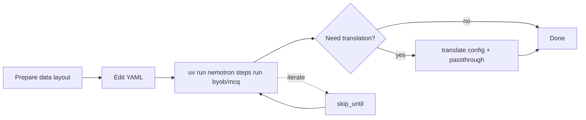

{/* SPDX-FileCopyrightText: Copyright (c) 2026 NVIDIA CORPORATION & AFFILIATES. All rights reserved.
  SPDX-License-Identifier: Apache-2.0 */}

Task-focused guides for `nemotron steps run byob/mcq` with the `mcq` family.

Start with [Getting Started with Building MCQ Benchmarks](/../getting-started) if you have not produced `benchmark.parquet` yet.

## Setup and configuration

<CardGroup cols={2}>
<Card href="/prepare-data" icon="fa-regular fa-file-directory" title="Prepare your data">
Lay out `input_dir`, text or Parquet inputs, and `target_source_mapping`.

---

<Badge intent="info">input_dir</Badge>

</Card>

<Card href="/domain-data" icon="fa-regular fa-database" title="Domain corpus files">
Create per-target directories of `.txt` files and match them to YAML.

---

<Badge intent="info">corpus</Badge>

</Card>

<Card href="/custom-model-endpoints" icon="fa-regular fa-gear" title="Model endpoints">
Configure OpenAI-compatible providers for generation, judgement, expansion, validity, and filters.

---

<Badge intent="info">yaml</Badge>

</Card>

</CardGroup>

## Advanced workflows

<CardGroup cols={2}>
<Card href="/prompt-tuning" icon="fa-regular fa-comment" title="Prompt tuning">
Point `prompt_config` at a YAML file that defines stage templates.

---

<Badge intent="info">prompt</Badge>

</Card>

<Card href="/skip-stages" icon="fa-regular fa-sync" title="Skip stages">
Resume with `skip_until` and cached Parquet files.

---

<Badge intent="info">iteration</Badge>

</Card>

</CardGroup>

## Workflow overview

## Related documentation

- [Concepts](/../explanation/index) — how each stage behaves.

- [Reference](/../reference/index) — full field lists and allowed datasets.
