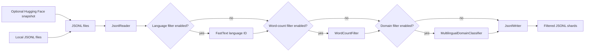

<Anchor id="curate-index"></Anchor>

The `nemotron steps run curate/nemo_curator` command reads JSONL data, optionally materializes a Hugging Face dataset snapshot, applies lightweight NeMo Curator filters, and writes filtered JSONL shards for downstream translation or training data preparation.

Use this step when you already have JSONL records and need a small, repeatable curation pass before a later step such as `translate/nemo_curator`, `data_prep/pretrain_prep`, or `data_prep/sft_packing`.

## When to Use

Use `curate/nemo_curator` when you need:

- A local JSONL reader and writer path using NeMo Curator.

- Optional FastText language identification and language filtering.

- Optional word-count filtering.

- Optional multilingual domain classification and filtering.

- Optional Hugging Face dataset snapshot download before the Curator reader runs.

<Note>
This step is intentionally lightweight.
It does not crawl web pages, extract Common Crawl WARC files, or run large deduplication workflows.
Use a dedicated Curator recipe for those jobs before this step, or add a separate step when that behavior is needed.

</Note>

## Pipeline Summary

## Documentation Series

<CardGroup cols={2}>
<Card href="/getting-started" icon="fa-regular fa-book" title="Tutorial">
Install the Nemotron CLI, run a local tiny JSONL initial curation validation, and inspect output shards.

---

<Badge intent="info">hands-on</Badge>

</Card>

<Card href="/how-to/index" icon="fa-regular fa-tools" title="How-To Guides">
Run local JSONL curation, download a Hugging Face snapshot, and enable optional filters.

---

<Badge intent="info">task-based</Badge>

</Card>

<Card href="/reference/index" icon="fa-regular fa-list-unordered" title="Reference">
YAML parameters, CLI syntax, input/output format, and troubleshooting.

---

<Badge intent="info">lookup</Badge>

</Card>

</CardGroup>

## All Documentation

<Tabs>
  <Tab title="Tutorial">

| Guide | What you do |
| --- | --- |
| [Getting Started With Data Curation](/getting-started) | Run <code>curate/nemo_curator</code> on the packaged tiny JSONL fixture |

  </Tab>
  <Tab title="How-To Guides">

| Guide | Focus |
| --- | --- |
| [Run Curation on Local JSONL](/how-to/run-local-jsonl) | Local JSONL reader/writer path |
| [Use a Hugging Face Snapshot](/how-to/use-huggingface-snapshot) | <code>dataset</code> block and Hugging Face snapshot download |
| [Enable Curation Filters](/how-to/enable-filters) | Language, word-count, and domain filters |

  </Tab>
  <Tab title="Reference">

| Guide | Content |
| --- | --- |
| [curate/nemo_curator Configuration](/reference/curate-config) | YAML field reference |
| [curate/nemo_curator CLI](/reference/cli-curate) | <code>nemotron steps run curate/nemo_curator</code> syntax |
| [Curation Input and Output Format](/reference/io-format) | Input and output shapes |
| [Curation Troubleshooting](/reference/troubleshooting) | Common failures and fixes |

  </Tab>

</Tabs>

## What You Need

- JSONL input with one text field, usually named `text`.

- Optional model assets when filters are enabled, such as a FastText language identification model for `language_codes`.

- A writable output directory for JSONL shards.

## Quick Paths

1. First local run: [Getting Started With Data Curation](/getting-started)

2. Local corpus setup: [Run Curation on Local JSONL](/how-to/run-local-jsonl)

3. Hugging Face snapshot setup: [Use a Hugging Face Snapshot](/how-to/use-huggingface-snapshot)

4. Filter setup: [Enable Curation Filters](/how-to/enable-filters)

5. Lookup flags: [curate/nemo_curator CLI](/reference/cli-curate)
