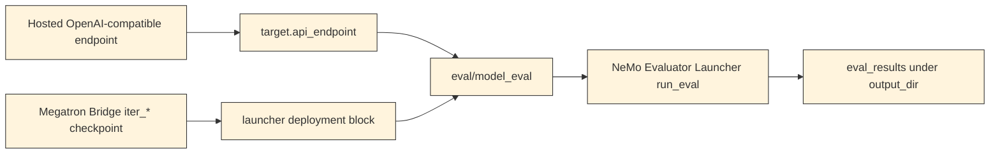

<Anchor id="model-eval-pipeline-overview"></Anchor>

The `eval/model_eval` step is a thin Nemotron wrapper around NeMo Evaluator Launcher.
It does not implement benchmark scoring itself.
It loads a YAML config, applies command-line overrides, saves the launcher config, and calls `run_eval`.

## Architecture

## Runtime Flow

1. `step.py` calls `run_model_eval` from `runtime.py`.

1. The runtime loads the selected config from `config/default.yaml`, `config/tiny_chat.yaml`, or a user-supplied YAML path.

1. Hydra-style dotlist overrides are merged into the config.

1. Nemotron-only keys are removed before launcher dispatch: `dry_run`, `output_dir`, `task_filters`, and `run`.

1. `output_dir` is copied into `execution.output_dir`.

1. The resolved launcher config is saved and printed as `launcher_config`.

1. `nemo_evaluator_launcher.api.functional.run_eval` is called with the launcher config and optional task filters.

## Input Artifacts

The step declares optional `checkpoint_megatron` input.
Hosted endpoint runs do not consume a checkpoint artifact.
Launcher-managed checkpoint runs usually pass a concrete Megatron Bridge `iter_*` directory through `deployment.checkpoint_path`.

## Output Artifact

The step produces `eval_results`.
The exact directory layout and files are owned by NeMo Evaluator Launcher and the selected task implementations.
For result inspection guidance, refer to [Output Artifacts](/../reference/output-artifacts).

## What Is Owned Where

| Owned by Nemotron | Owned by NeMo Evaluator Launcher |
| --- | --- |
| Step discovery, config loading, dotlist overrides, launcher config saving. | Task implementations, endpoint probing, deployment orchestration, and result files. |
| <code>dry_run</code>, <code>output_dir</code>, <code>task_filters</code>, and <code>run</code> preprocessing. | <code>execution</code>, <code>deployment</code>, <code>target</code>, <code>evaluation</code>, <code>tasks</code>, and <code>export</code> semantics after dispatch. |
| The <code>step.toml</code> contract and agent-facing guidance. | Accepted task identifiers and version-specific task behavior. |

## Related Pages

- [Endpoint Types And Task Families](/endpoint-types-and-benchmarks) for endpoint/task pairing.

- [Tokenizer Alignment](/tokenizer-alignment) for why log-probability tasks need a matching tokenizer.

- [Output Artifacts](/../reference/output-artifacts) for result inspection.

- [Discover The Model Evaluation Step](/../how-to/discover-the-step) for reading the step contract before configuring a run.
