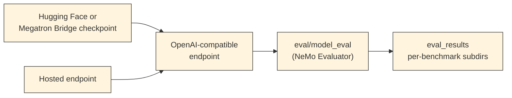

{/* SPDX-FileCopyrightText: Copyright (c) 2026 NVIDIA CORPORATION & AFFILIATES. All rights reserved.
  SPDX-License-Identifier: Apache-2.0 */}

<Anchor id="model-eval-index"></Anchor>

The `eval/model_eval` Nemotron step is a wrapper around NeMo Evaluator Launcher.
It runs launcher tasks against either an existing OpenAI-compatible endpoint or a launcher-managed Megatron Bridge checkpoint deployment, then writes an `eval_results` artifact to disk.

<Tip>
New to model evaluation or the Nemotron CLI?
Read [Use The Model Evaluation Skill With Confidence](/using-skills) for a short guide to productive agent sessions, then start the [Getting Started With Model Evaluation](/getting-started) tutorial to run one benchmark on one sample against a hosted endpoint.

</Tip>

## When To Use

Use `eval/model_eval` when the work matches one of the following.

- Score a trained checkpoint with NeMo Evaluator Launcher tasks.

- Compare a new training run against a baseline by running the same task set against both, with generation parameters and endpoint type held constant.

- Perform a sample run against a hosted endpoint, to confirm the URL, credential, and model id before scaling up.

- Pair this step with a baseline evaluation before training to capture before-and-after measurements around a training change, by following [Comparing Runs](/reference/output-artifacts#model-eval-comparing-runs).

## Pipeline At A Glance

NeMo Evaluator Launcher owns task execution and result files under `output_dir`.
For the contract and the on-disk layout, refer to [Output Artifacts](/reference/output-artifacts).

## How It Works

The runner reads a single YAML document, applies command-line overrides, removes Nemotron-only keys, saves the resolved launcher config, and calls `nemo_evaluator_launcher.api.functional.run_eval`.

The endpoint type must match the benchmark family.
Chat and instruction benchmarks need a *chat* endpoint.
*Log-probability* tasks, such as HellaSwag, need a *completions* endpoint with `logprobs` support and a tokenizer that matches the served model.

The hosted smoke-test config is `tiny_chat.yaml`.
The checkpoint-evaluation config is `default.yaml`.
Generation settings live under `evaluation.nemo_evaluator_config.config.params`.

For the full concept set behind these design rules, refer to [Concepts](/explanation/index).

## Documentation

<CardGroup cols={2}>
<Card href="/getting-started" icon="fa-regular fa-rocket" title="Getting Started">
Run one benchmark on one sample against a hosted endpoint, end to end.

---

<Badge intent="success">15-30 min</Badge> <Badge intent="info">tutorial</Badge>

</Card>

<Card href="/using-skills" icon="fa-regular fa-heart" title="Use The Model Evaluation Skill With Confidence">
Run a productive agent session: opening brief, four required inputs, and how `SKILL.md` keeps the session focused.

---

<Badge intent="success">10 min read</Badge> <Badge intent="info">newcomer</Badge>

</Card>

<Card href="/how-to/index" icon="fa-regular fa-checklist" title="How-To Guides">
Discover the step, run a hosted evaluation, and evaluate a deployed checkpoint.

---

<Badge intent="success">3 guides</Badge> <Badge intent="info">task-focused</Badge>

</Card>

<Card href="/reference/index" icon="fa-regular fa-list-unordered" title="Reference">
YAML schema, command-line flags, output artifact layout, benchmark catalog, and troubleshooting.

---

<Badge intent="success">5 references</Badge> <Badge intent="info">lookup</Badge>

</Card>

<Card href="/explanation/index" icon="fa-regular fa-book" title="Concepts">
Architecture, endpoint and benchmark families, and tokenizer alignment.

---

<Badge intent="success">3 pages</Badge> <Badge intent="info">explanation</Badge>

</Card>

</CardGroup>

## All Documentation

<Tabs>
  <Tab title="Getting Started">

| Guide | What You Will Do | Time |
| --- | --- | --- |
| [Getting Started With Model Evaluation](/getting-started) | Run a one-sample evaluation against a hosted endpoint | 15-30 min |
| [Use The Model Evaluation Skill With Confidence](/using-skills) | Drive <code>eval/model_eval</code> from a coding agent | 10 min read |

  </Tab>
  <Tab title="How-To Guides">

| Guide | What You Will Do |
| --- | --- |
| [Discover The Model Evaluation Step](/how-to/discover-the-step) | List the step, read its contract, and decide whether it applies |
| [Run A Hosted Evaluation](/how-to/run-hosted-evaluation) | Run benchmarks against an already-running endpoint |
| [Evaluate A Deployed Checkpoint](/how-to/evaluate-deployed-checkpoint) | Pick a deployment path, then point the step at the endpoint |

  </Tab>
  <Tab title="Reference">

| Reference | What You Will Find |
| --- | --- |
| [Configuration Reference](/reference/config-schema) | YAML field reference for <code>default.yaml</code> and <code>tiny_chat.yaml</code> |
| [CLI Reference](/reference/cli-reference) | Flags and Hydra overrides for <code>nemotron steps run eval/model_eval</code> |
| [Output Artifacts](/reference/output-artifacts) | <code>eval_results</code> contract and on-disk layout |
| [Tasks Catalog](/reference/benchmarks-catalog) | NeMo Evaluator Launcher task identifiers grouped by family |
| [Troubleshooting](/reference/troubleshooting) | Named error modes from <code>step.toml</code>, with cause and recovery |

  </Tab>
  <Tab title="Concepts">

| Concept | What You Will Learn |
| --- | --- |
| [Concepts](/explanation/index) | Map of the concept pages and how they relate |
| [Pipeline Overview](/explanation/pipeline-overview) | Artifact flow from checkpoint through <code>eval/model_eval</code> into <code>eval_results</code> |
| [Endpoint Types And Task Families](/explanation/endpoint-types-and-benchmarks) | Chat versus completions endpoints, and which benchmark families match each one |
| [Tokenizer Alignment](/explanation/tokenizer-alignment) | Why log-probability benchmarks need a tokenizer that matches the served model |

  </Tab>

</Tabs>

## Before You Start

- The Nemotron repository is synced and `uv sync` is complete.

- A bearer token is exported as the environment variable named in `target.api_endpoint.api_key_name`.
Hosted smoke tests usually use `NVIDIA_API_KEY`.

- A reachable evaluation endpoint URL and a model identifier the endpoint advertises.

- A tokenizer that matches the served model when running log-probability tasks.
The hosted chat smoke test does not require a tokenizer override.

## Limitations And Considerations

- Cost: every benchmark sample issues at least one request to the endpoint, and hosted endpoints incur per-token cost.

- Rate limits: hosted endpoints throttle concurrent requests, so set `evaluation.nemo_evaluator_config.config.params.parallelism` to a value the endpoint can serve.

- Deployment: `tiny_chat.yaml` targets an already-deployed endpoint; `default.yaml` uses launcher-managed deployment for a Megatron Bridge checkpoint.

- Comparability: scores are comparable when the endpoint type, task version, tokenizer, and generation parameters are held constant across runs.
The [Comparing Runs](/reference/output-artifacts#model-eval-comparing-runs) section explains the framing.

## Related Documentation

- The full `step.toml` contract: `src/nemotron/steps/eval/model_eval/step.toml` in the repository.

- The before-and-after evaluation framing: [Comparing Runs](/reference/output-artifacts#model-eval-comparing-runs).

- Upstream NeMo Evaluator quick-start: [https://docs.nvidia.com/nemo/evaluator/latest/get-started/quickstart/launcher.html](https://docs.nvidia.com/nemo/evaluator/latest/get-started/quickstart/launcher.html).
