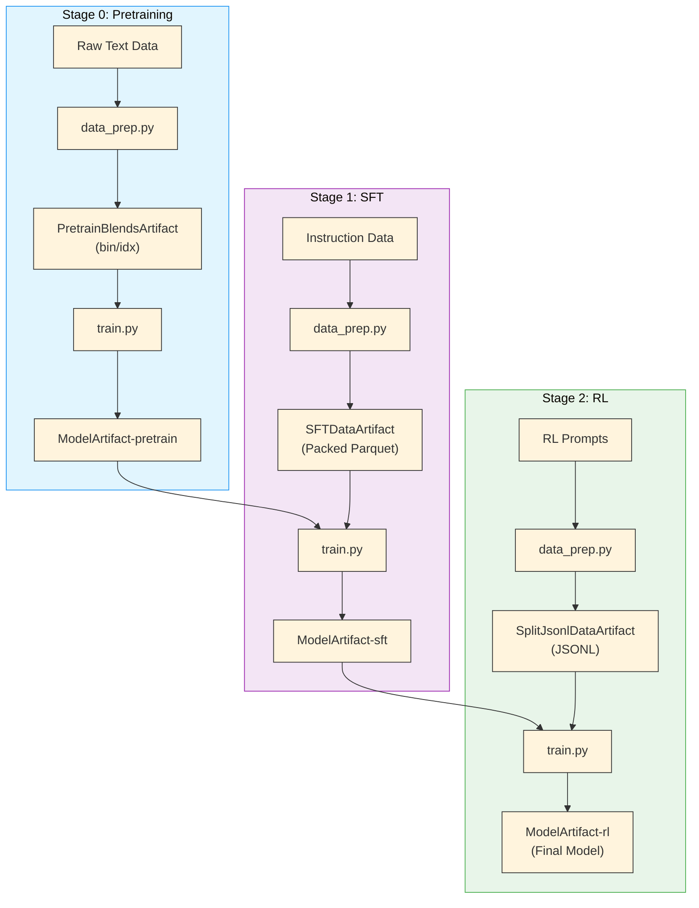

Nemotron uses typed Pydantic artifacts to version data and models across training stages. Each artifact stores its output path plus typed metadata fields that are accessible via `$\{art:NAME,FIELD\}` config resolvers.

> For the tracking infrastructure (manifest + wandb backends, `setup_artifact_tracking`, `log_artifact`, env.toml configuration), see [nemo_runspec artifacts](/../nemo_runspec/artifacts).

## End-to-End Lineage

The training pipeline produces six artifact types across three stages:



## Artifact Types

| Artifact | Stage | Format | Description |
| --- | --- | --- | --- |
| <code>PretrainBlendsArtifact</code> | [0](/nano3/pretrain) | bin/idx | Tokenized pretraining data in Megatron format |
| <code>ModelArtifact</code> | 0, 1, 2 | checkpoint | Model checkpoints (pretrain, sft, rl) |
| <code>SFTDataArtifact</code> | [1](/nano3/sft) | Packed Parquet | Packed SFT sequences with loss masks |
| <code>SplitJsonlDataArtifact</code> | [2](/nano3/rl) | JSONL | RL prompts for [NeMo-RL](/nvidia-stack#nemo-rl) |

## Artifact Naming

| Concept | Example | Where Used |
| --- | --- | --- |
| **Python class** | <code>PretrainBlendsArtifact</code> | Code imports (<code>from nemotron.kit import ...</code>) |
| **Registered name** | <code>super3-pretrain-data-tiny</code> | W&B artifact names, manifest directories |
| **Config reference** | <code>super3-pretrain-data-tiny:latest</code> | YAML configs (<code>run.data</code>), CLI overrides |

## Using Artifacts in Configs

### Semantic URIs

```default
art://super3-pretrain-data-tiny:latest    # Latest version
art://ModelArtifact-sft:v3                # Specific version
```

### Config Resolvers

```yaml
run:
  data: super3-pretrain-data-tiny:latest

recipe:
  per_split_data_args_path: ${art:data,path}/blend.json
  seq_length: ${art:data,pack_size}
```

The `$\{art:data,FIELD\}` resolver reads typed fields from the artifact’s `metadata.json`.

### CLI Overrides

```bash
uv run nemotron nano3 pretrain run.data=PretrainBlendsArtifact-tiny:v2
uv run nemotron nano3 sft run.model=my-custom-pretrain:latest
```

## Creating Custom Artifacts

Subclass `Artifact` to create typed artifacts. Fields are automatically synced to `metadata.json` and available via resolvers.

```python
from pathlib import Path
from typing import Annotated
from pydantic import Field
from nemotron.kit.artifacts.base import Artifact

class MyDataArtifact(Artifact):
    """Custom data artifact with typed metadata."""

    num_samples: Annotated[int, Field(ge=0, description="Number of samples")]
    source_url: Annotated[str | None, Field(default=None)]
```

### Saving

```python
from nemo_runspec.artifacts import setup_artifact_tracking, log_artifact

tracking = setup_artifact_tracking(config)

artifact = MyDataArtifact(path=Path("/output/data"), num_samples=10000)
log_artifact(artifact, tracking, name="my-data")
```

### Loading

```python
artifact = MyDataArtifact.from_uri("art://my-data:latest")
print(artifact.path)         # /output/data
print(artifact.num_samples)  # 10000 — IDE autocomplete works
```

### Input Lineage

Track dependencies by overriding `get_input_uris()`:

```python
class ProcessedDataArtifact(Artifact):
    source_artifact: str

    def get_input_uris(self) -> list[str]:
        return [self.source_artifact]
```

## Importing External Assets

### Model Import

```bash
uv run nemotron nano3 model import pretrain /path/to/checkpoint --step 50000
uv run nemotron nano3 model import sft /path/to/sft_model --step 10000
```

### Data Import

```bash
uv run nemotron nano3 data import pretrain /path/to/blend.json
uv run nemotron nano3 data import sft /path/to/sft_data/
```

See [Importing Models & Data](/nano3/import) for detailed directory structures.

## Further Reading

- [Artifact Tracking](/../nemo_runspec/artifacts) – tracking infrastructure, manifest backend, env.toml config

- [Nemotron Kit](/kit) – kit internals

- [OmegaConf Configuration](/../nemo_runspec/omegaconf) – `$\{art:...\}` resolver details

- [W&B Integration](/wandb) – credentials and configuration
