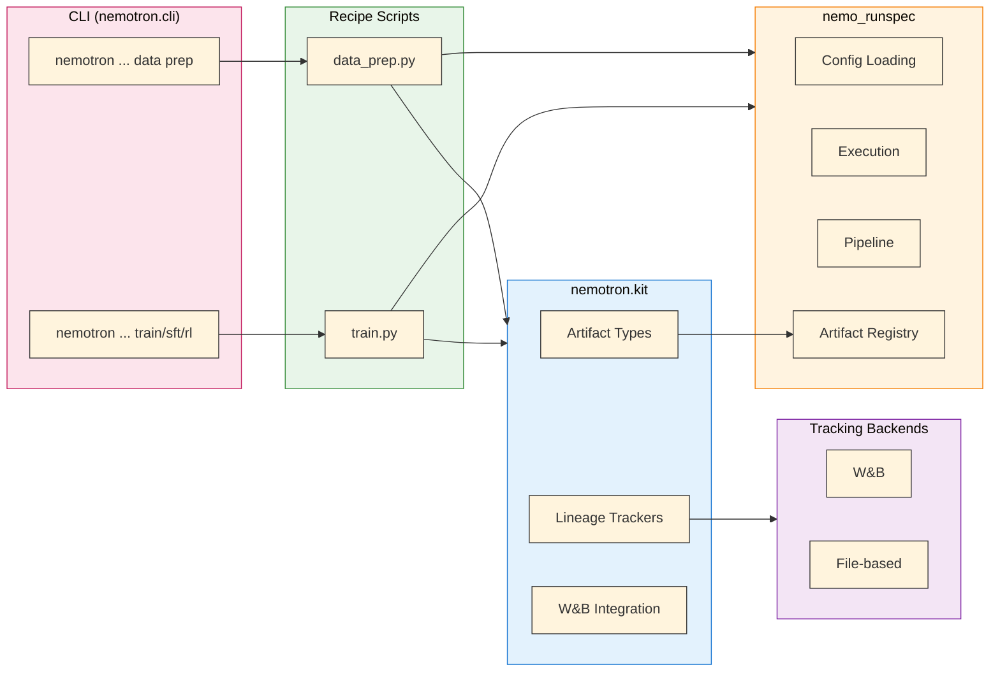

The `nemotron.kit` module provides artifact type definitions, lineage trackers, and W&B integration for Nemotron training recipes.

> **Focused by Design**: Kit owns the artifact *types* (data classes like `PretrainBlendsArtifact`, `ModelArtifact`) and *tracking behavior* (W&B/file-based lineage). The underlying artifact *registry* and *resolution* (`art://` URIs, fsspec/wandb storage backends) live in [`nemo_runspec`](/../nemo_runspec/package-readme). CLI, configuration, and execution also live in `nemo_runspec`. All heavy-lifting training is done by the [NVIDIA AI Stack](/nvidia-stack): [Megatron-Core](https://github.com/NVIDIA/Megatron-LM) for distributed training primitives, [Megatron-Bridge](https://github.com/NVIDIA-NeMo/Megatron-Bridge) for model training, and [NeMo-RL](https://github.com/NVIDIA/NeMo-RL) for reinforcement learning.

## Overview

Kit handles three core responsibilities:

| Component | What kit owns | What nemo_runspec owns |
| --- | --- | --- |
| **[Artifacts](/artifacts)** | Type definitions (<code>PretrainBlendsArtifact</code>, <code>ModelArtifact</code>, etc.) | Registry, <code>art://</code> resolution, fsspec/wandb storage backends |
| **[Lineage Tracking](/artifacts)** | Trackers (<code>WandbTracker</code>, <code>FileTracker</code>) | <code>$&#123;art:...&#125;</code> OmegaConf resolvers, distributed coordination |
| **[W&B Integration](/wandb)** | Init, credential handling, monkey patches, tag management | Env var injection (<code>build_env_vars</code>), <code>[wandb]</code> config loading |

For CLI infrastructure, config loading, execution, and packaging, see [`nemo_runspec`](/../nemo_runspec/package-readme).

## Architecture



## Quick Example

```python
from nemotron.kit import PretrainBlendsArtifact, ModelArtifact
from pathlib import Path

# Load data artifact
data = PretrainBlendsArtifact.load(Path("/output/data"))
print(f"Training on {data.total_tokens:,} tokens")

# ... training code ...

# Save model artifact with lineage
model = ModelArtifact(path=Path("/output/checkpoint"), step=10000, loss=2.5)
model.save(name="ModelArtifact-pretrain")
```

## Concepts

### Artifacts

Artifacts are path-centric objects with typed metadata. The core field is always `path` – the filesystem location of the data. See [Artifact Lineage](/artifacts) for details.

```python
from nemotron.kit import PretrainBlendsArtifact

# Load from semantic URI
artifact = PretrainBlendsArtifact.from_uri("art://PretrainBlendsArtifact:latest")
print(f"Path: {artifact.path}")
print(f"Tokens: {artifact.total_tokens:,}")
```

### Lineage Tracking

Kit tracks artifact lineage through pluggable backends. The `WandbTracker` logs to W&B; the `FileTracker` writes to local filesystem. See [W&B Integration](/wandb) for credential handling and [Artifact Lineage](/artifacts) for the lineage graph.

```python
from nemotron.kit import set_lineage_tracker, WandbTracker

# Use W&B for tracking
set_lineage_tracker(WandbTracker())
```

### W&B Integration

```python
from nemotron.kit import WandbConfig, init_wandb_if_configured, add_run_tags

# Initialize W&B from config
wandb_cfg = WandbConfig(entity="nvidia", project="nemotron")
init_wandb_if_configured(wandb_cfg)

# Add tags to the run
add_run_tags(["pretrain", "nano3"])
```

## Module Structure

```default
src/nemotron/kit/
├── __init__.py          # Public API exports + kit.init()
├── artifact.py          # Artifact base class, ArtifactInput, display helpers
├── artifacts/           # Artifact type definitions (base, model, data blends, etc.)
├── trackers.py          # LineageTracker, WandbTracker, FileTracker, NoOpTracker
├── wandb_kit.py         # WandbConfig, init_wandb_if_configured, add_run_tags, monkey patches
├── train_script.py      # Training script utilities (init_wandb_from_env, config parsing)
├── recipe_loader.py     # Recipe loading utilities
└── megatron_stub.py     # Megatron stub for testing
```

## API Reference

### Artifacts

| Export | Description |
| --- | --- |
| <code>Artifact</code> | Base artifact class |
| <code>PretrainBlendsArtifact</code> | Pretrain data with train/valid/test splits |
| <code>PretrainDataArtifact</code> | Raw pretrain data |
| <code>SFTDataArtifact</code> | Packed SFT sequences |
| <code>SplitJsonlDataArtifact</code> | RL JSONL data |
| <code>DataBlendsArtifact</code> | Generic data blends |
| <code>ModelArtifact</code> | Model checkpoints |
| <code>TrackingInfo</code> | Tracking metadata for artifacts |

### Tracking

| Export | Description |
| --- | --- |
| <code>LineageTracker</code> | Abstract base for lineage tracking |
| <code>WandbTracker</code> | W&B-backed lineage tracker |
| <code>FileTracker</code> | File-based lineage tracker |
| <code>NoOpTracker</code> | No-op tracker (for testing) |
| <code>set_lineage_tracker()</code> | Set the global lineage tracker |
| <code>get_lineage_tracker()</code> | Get the current lineage tracker |
| <code>to_wandb_uri()</code> | Convert artifact to W&B URI |
| <code>tokenizer_to_uri()</code> | Convert tokenizer to URI |

### W&B

| Export | Description |
| --- | --- |
| <code>WandbConfig</code> | W&B configuration dataclass |
| <code>init_wandb_if_configured()</code> | Conditional W&B initialization |
| <code>add_run_tags()</code> | Add tags to W&B runs |

### Kit Initialization

| Export | Description |
| --- | --- |
| <code>init()</code> | Initialize kit with storage backend (fsspec or wandb) |
| <code>is_initialized()</code> | Check if kit has been initialized |

## Further Reading

- [`nemo_runspec` Package](/../nemo_runspec/package-readme) – CLI toolkit, config loading, execution, packaging

- [NVIDIA AI Stack](/nvidia-stack) – Megatron-Core, Megatron-Bridge, NeMo-RL

- [OmegaConf Configuration](/../nemo_runspec/omegaconf) – artifact interpolations and unified W&B logging

- [Artifact Lineage](/artifacts) – artifact versioning and W&B lineage

- [W&B Integration](/wandb) – credential handling

- [Execution through NeMo-Run](/../nemo_runspec/nemo-run) – execution profiles and packagers

- [CLI Framework](/cli) – building recipe CLIs

- [Data Preparation](/data-prep) – data prep module
