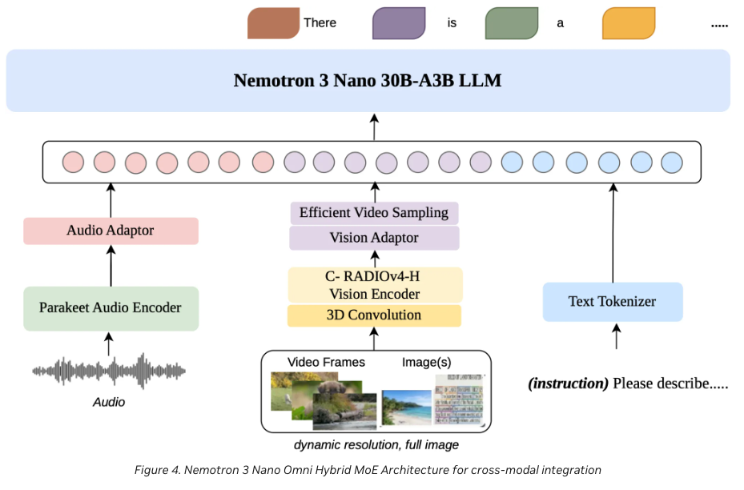
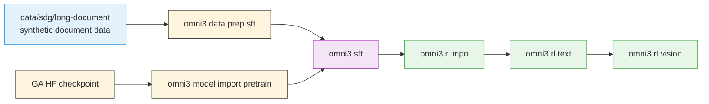

Multimodal post-training pipeline for **Nemotron 3 Nano Omni**, NVIDIA’s
30B-A3B hybrid mixture-of-experts model. Unlike Nano3 and Super3,
Omni starts from a GA checkpoint and owns its stage-local container
builds.

## Read the blog?

Quick navigation for developers landing here from the [release blog](https://developer.nvidia.com/blog/nvidia-nemotron-3-nano-omni-powers-multimodal-agent-reasoning-in-a-single-efficient-open-model/):

| You want… | Go to |
| --- | --- |
| Architecture deep-dive (Mamba+transformer, EVS, NemoClaw) | [<code>architecture.md</code>](/architecture) |
| Inference engines, quantization, cloud platforms, providers | [<code>inference.md</code>](/inference) |
| Reproduce training | [§Quick Start](#quick-start) below |
| SFT details | [<code>sft.md</code>](/sft) |
| RL details | [<code>rl.md</code>](/rl) · [<code>rl/data-prep.md</code>](/rl/data-prep) |

## Model Overview



| Property | Value |
| --- | --- |
| Architecture | Hybrid MoE — Mamba layers (sequence/memory efficiency) + transformer layers (reasoning), with a unified text decoder ([details](/architecture#hybrid-moe-decoder)) |
| Total / active parameters | 30B / 3B (A3B MoE) |
| Native modalities | Text, image, video, audio |
| Max context length | 262K tokens |
| Training context schedule | 16K → 49K → 262K (progressive scaling, see [§Progressive context scaling](/architecture#progressive-context-scaling)) |
| Vision encoder | [C-RADIOv4-H](/architecture#vision-encoder-c-radiov4-h) |
| Audio encoder | [NVIDIA Parakeet (extended via Granary, Music Flamingo)](/architecture#audio-encoder-parakeet-extended) |
| Video pipeline | [3D convolutions + Efficient Video Sampling (EVS)](/architecture#video-pipeline-3d-convolutions-efficient-video-sampling-evs) |
| GA checkpoint | [<code>nvidia/Nemotron-3-Nano-Omni-30B-A3B-Reasoning-BF16</code>](https://huggingface.co/nvidia/Nemotron-3-Nano-Omni-30B-A3B-Reasoning-BF16) |
| License | [NVIDIA Nemotron Open Model License](https://huggingface.co/nvidia/Nemotron-3-Nano-Omni-30B-A3B-Reasoning-BF16) (enterprise-friendly, on-prem and any deployment) |

For the full architectural deep-dive — including why EVS drives the throughput numbers, the perception-sub-agent framing, and the released training-data scale (127B / 124M / 20×25 / 11.4M) — see [`architecture.md`](/architecture).

### Capabilities (released benchmarks)

- Best-in-class on [MMlongbench-Doc](https://github.com/mayubo2333/MMLongBench-Doc) and [OCRBenchV2](https://github.com/Yuliang-Liu/MultimodalOCR) (document intelligence)

- Leading on [WorldSense](https://huggingface.co/datasets/honglyhly/WorldSense), [DailyOmni](https://lliar-liar.github.io/Daily-Omni/#leaderboard), [VoiceBench](https://huggingface.co/datasets/hlt-lab/voicebench) (video / audio understanding)

- **~9.2×** greater effective system capacity on video reasoning, **~7.4×** on multi-document workloads vs. comparable open omni models

- “Highest throughput across every task” in MediaPerf; “lowest inference cost for video-level tagging”

- See [`inference.md`](/inference) for engines, quantization paths, hardware support, and deployment

### Use cases

Designed as a **multimodal perception sub-agent** for agentic AI — finance, healthcare, scientific discovery, media/entertainment, ad-tech. Especially strong on long-horizon reasoning over complex documents and large video batches. The [NemoClaw sandbox](/inference#nemoclaw-privacy-first-video-processing) provides privacy-first video processing for compliance-bounded workloads.

### Upstream training recipes

This recipe folder is the cookbook view; upstream sources are:

| Stage | Upstream guide | Branch root |
| --- | --- | --- |
| SFT (Megatron-Bridge) | [<code>nemotron_3_omni</code> README](https://github.com/NVIDIA-NeMo/Megatron-Bridge/blob/nemotron_3_omni/examples/models/vlm/nemotron_3_omni/README.md) | [<code>Megatron-Bridge</code> <code>nemotron_3_omni</code>](https://github.com/NVIDIA-NeMo/Megatron-Bridge/tree/nemotron_3_omni) |
| RL (NeMo-RL) | [<code>nano-v3-omni</code> Nemotron 3 Nano Omni guide](https://github.com/NVIDIA-NeMo/RL/blob/nano-v3-omni/docs/guides/nemotron-3-nano-omni.md) | [<code>NeMo-RL</code> <code>nano-v3-omni</code>](https://github.com/NVIDIA-NeMo/RL/tree/nano-v3-omni) |
| Evaluation | Same Megatron-Bridge path | (above) |
| Image training data | — | [<code>huggingface.co/datasets/nvidia/Nemotron-Image-Training-v3</code>](https://huggingface.co/datasets/nvidia/Nemotron-Image-Training-v3) |
| Long-document SDG | [Long-document SDG guide](/../data/sdg/long-document) | [<code>src/nemotron/recipes/data/sdg/long-document/</code>](https://github.com/NVIDIA-NeMo/Nemotron/tree/main/src/nemotron/recipes/data/sdg/long-document) (structure released; bodies port at upstream release) |

## Current Limitations

The recipe structure, CLI, Dockerfiles, and configs are all in place, but some pieces still depend on upstream work or internal-only data:

- **Evaluation stage not yet included — coming soon.** The omni3 CLI doesn’t have an `eval` subcommand today. Multimodal sanity checks against a trained checkpoint run via `nemotron omni3 model eval`; see [SFT guide §Model lifecycle](/sft). A dedicated eval stage that compiles a benchmark task list and submits through `nemo-evaluator-launcher` will land in a follow-up release.

- **SFT default uses CORD-v2 (open); Valor32k is an opt-in.** `default.yaml` pulls [CORD-v2](https://huggingface.co/datasets/naver-clova-ix/cord-v2) from HuggingFace via the `vlm-hf` loader — no local shard building required. `-c valor32k` switches to the full audio-visual-language flow, but requires internal access to a prepared Valor32k-AVQA Energon dataset (the raw-shard builder is internal-only at release). `data_prep.py` validates the Energon path or emits a manifest for HF — it does not assemble shards.

- **Long-document SDG pipeline is a scaffold.** `src/nemotron/recipes/data/sdg/long-document/` has 9 numbered scripts with their argparse surfaces and a thorough README, but the script bodies raise `NotImplementedError` — port bodies from upstream at release time. See `designs/long-document-sdg-pipeline.md`.

- **Pinned to release branches.** The SFT Dockerfile pulls `github.com/NVIDIA-NeMo/Megatron-Bridge @ nemotron_3_omni` (and `github.com/NVIDIA/Megatron-LM @ nemotron_3_omni` as a recursive submodule fetch); the RL flow uses `github.com/NVIDIA/NeMo-RL @ nano-v3-omni`. These are the active release branches for Nemotron 3 Omni — bump to a versioned tag (or `main`) once these changes merge upstream.

The linked stage guides (SFT / RL / Evaluate) call out each stage’s specific limitations.

## Quick Start

### Prerequisites

- **Slurm cluster** with GPU nodes for SFT, RL, and evaluation — see [Execution through NeMo-Run](/../../nemo_runspec/nemo-run)

- **[Weights & Biases](/../wandb)** for experiment tracking and [artifact lineage](/../artifacts)

- **Build-capable execution profile** for `nemotron omni3 build <stage>` jobs

- **GA checkpoint**: [nvidia/Nemotron-3-Nano-Omni-30B-A3B-Reasoning-BF16](https://huggingface.co/nvidia/Nemotron-3-Nano-Omni-30B-A3B-Reasoning-BF16) (BF16 weights). FP8 and NVFP4 quantization paths are supported by the inference engines listed in [`inference.md`](/inference#inference-engines).

### Installation

```bash
git clone https://github.com/NVIDIA/nemotron
cd nemotron
uv sync
```

### Configuration

Create an `env.toml` profile with both training and build settings:

```toml
[wandb]
project = "nemotron"
entity = "YOUR-TEAM"

[YOUR-CLUSTER]
executor = "slurm"
account = "YOUR-ACCOUNT"
partition = "batch"
run_partition = "interactive"
# Build-context overrides — used by `omni3 build sft|rl` only. The build
# is CPU-only and writes its OCI archive to `build_cache_dir`, which
# must be a cluster-visible (e.g. Lustre) path because the dispatcher
# mounts it into the build container.
build_partition = "cpu"
build_time = "02:00:00"
build_cache_dir = "/lustre/.../users/YOUR-USER/.cache/nemotron"
nodes = 1
ntasks_per_node = 8
gpus_per_node = 8
mounts = ["/lustre:/lustre"]
```

> See [How container builds authenticate](/../../nemo_runspec/nemo-run#how-the-build-container-authenticates-with-private-registries)
for how the dispatcher reuses your existing
`~/.config/enroot/.credentials` to pull `nvcr.io` images inside the
build container — no separate podman login required.

### Run the Pipeline

<div class="termy">
```console
// Stage 0: SFT
$ uv run nemotron omni3 build sft --run YOUR-CLUSTER
$ uv run nemotron omni3 data prep sft --run YOUR-CLUSTER
$ uv run nemotron omni3 model import pretrain --run YOUR-CLUSTER \
    --hf-model nvidia/Nemotron-3-Nano-Omni-30B-A3B-Reasoning-BF16 \
    --megatron-path /checkpoints/nemotron_omni
$ uv run nemotron omni3 sft --run YOUR-CLUSTER

// Stage 1.1: RL MPO
$ uv run nemotron omni3 build rl --run YOUR-CLUSTER
$ uv run nemotron omni3 data prep rl -c mpo --run YOUR-CLUSTER
$ uv run nemotron omni3 rl mpo --run YOUR-CLUSTER

// Stage 1.2: RL text
$ uv run nemotron omni3 data prep rl -c text --run YOUR-CLUSTER
$ uv run nemotron omni3 rl text --run YOUR-CLUSTER

// Stage 1.3: RL vision
$ uv run nemotron omni3 data prep rl -c vision --run YOUR-CLUSTER
$ uv run nemotron omni3 rl vision --run YOUR-CLUSTER

```

</div>
> **Note**: `omni3 build` submits a short CPU-only container build job through [NeMo-Run](/../../nemo_runspec/nemo-run). The build produces `$\{build_cache_dir\}/containers/omni3-\{sft,rl\}.sqsh` (squashfs) which pyxis mounts directly at training time — no per-job `enroot import`.

## Resources

- **Model checkpoint**: [nvidia/Nemotron-3-Nano-Omni-30B-A3B-Reasoning-BF16](https://huggingface.co/nvidia/Nemotron-3-Nano-Omni-30B-A3B-Reasoning-BF16)

- **Release blog**: [NVIDIA Nemotron 3 Nano Omni — multimodal agent reasoning](https://developer.nvidia.com/blog/nvidia-nemotron-3-nano-omni-powers-multimodal-agent-reasoning-in-a-single-efficient-open-model/)

- **SFT recipe**: [Stage 0: SFT](/sft)

- **RL recipe**: [Stage 1: RL](/rl)

- **Image training data**: [`nvidia/Nemotron-Image-Training-v3`](https://huggingface.co/datasets/nvidia/Nemotron-Image-Training-v3)

## Training Pipeline

| Stage | Name | Purpose | Guide |
| --- | --- | --- | --- |
| 0 | [SFT](/sft) | Fine-tune the GA checkpoint on Valor32k and related multimodal variants | [sft.md](/sft) |
| 1 | [RL](/rl) | Multi-stage Omni RL: MPO → text RL → vision RL | [rl.md](/rl) |

> An evaluation stage (`nemotron omni3 eval`) is on the roadmap; until it lands, run benchmarks via `nemotron omni3 model eval` (see [SFT guide §Model lifecycle](/sft)).

## Pipeline Overview



The upstream synthetic-data pipeline lives outside the family tree under `src/nemotron/recipes/data/sdg/long-document/`. That keeps the recipe split explicit:

- **`src/nemotron/recipes/data/curation/`** — filter, dedup, and curate existing corpora (for example [Nemotron-CC](/../data/curation/nemotron-cc))

- **`src/nemotron/recipes/data/sdg/`** — generate new datasets, including the long-document SDG pipeline consumed by Omni SFT

- **`src/nemotron/recipes/omni3/`** — family-specific training, RL, and evaluation stages

## Stage Summaries

### Stage 0: SFT

Omni SFT owns its own `Dockerfile`, `data_prep.py`, and `train.py` (built via the `nemotron omni3 build sft` dispatcher). The stage ports the Valor32k flow plus LoRA/PEFT variants for image-text and audio-text tuning. The released open-data configs target shorter sequence lengths; the upstream 16K → 49K → 262K progressive schedule is documented in [`architecture.md`](/architecture#progressive-context-scaling).

→ [SFT Guide](/sft)

### Stage 1: RL

The RL stack uses one shared NeMo-RL container and three sub-stages, mirroring the upstream [`nano-v3-omni` flow](https://github.com/NVIDIA-NeMo/RL/tree/nano-v3-omni):

1. **MPO** — multimodal preference optimization on the public MMPR dataset (~83K-row preference triples per subset)

2. **Text RL** — GRPO continuation of alignment on `nvidia/Nemotron-3-Nano-RL-Training-Blend`

3. **Vision RL** — GRPO on MMPR-Tiny (data prep ready; training launcher pending upstream)

The 20 RL datasets / 25 environments / ~2.3M rollouts referenced in the [release blog](https://developer.nvidia.com/blog/nvidia-nemotron-3-nano-omni-powers-multimodal-agent-reasoning-in-a-single-efficient-open-model/) compose the full upstream alignment corpus; this recipe surfaces the public/open-source subset.

→ [RL Guide](/rl) · [RL Data Prep](/rl/data-prep)

## Execution Options

All Omni commands support [NeMo-Run](/../../nemo_runspec/nemo-run) execution modes:

| Option | Behavior | Use Case |
| --- | --- | --- |
| <code>--run &lt;profile&gt;</code> | Attached—submits job and streams logs | Interactive development |
| <code>--batch &lt;profile&gt;</code> | Detached—submits and exits immediately | Long-running jobs |
| <code>--dry-run</code> | Preview resolved config or build plan | Validation |

## CLI Reference

<div class="termy">
```console
$ uv run nemotron omni3 --help
Usage: nemotron omni3 [OPTIONS] COMMAND [ARGS]...

 Omni3 training recipe

╭─ Infrastructure ─────────────────────────────────────────────────────────╮
│ build      Build an Omni3 stage container via podman on the cluster.     │
╰───────────────────────────────────────────────────────────────────────────╯
╭─ Commands ────────────────────────────────────────────────────────────────╮
│ data       Data preparation commands                                      │
│ model      Model import/export/eval commands                              │
│ rl         Reinforcement learning sub-stages                              │
╰───────────────────────────────────────────────────────────────────────────╯
╭─ Training Stages ─────────────────────────────────────────────────────────╮
│ sft        Run omni3 supervised fine-tuning.                              │
╰───────────────────────────────────────────────────────────────────────────╯
```

</div>
## Further Reading

- [Stage 0: SFT](/sft)

- [Stage 1: RL](/rl)

- [Architecture](/architecture)

- [Inference & Deployment](/inference)

- [Artifact Lineage](/../artifacts)

- [Execution through NeMo-Run](/../../nemo_runspec/nemo-run)

- [W&B Integration](/../wandb)
