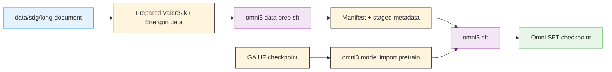

Omni starts from the GA [`nvidia/Nemotron-3-Nano-Omni-30B-A3B-Reasoning-BF16`](https://huggingface.co/nvidia/Nemotron-3-Nano-Omni-30B-A3B-Reasoning-BF16) checkpoint (30B-A3B hybrid Mamba-transformer MoE) and fine-tunes it with the Valor32k multimodal recipe family using [Megatron-Bridge](/../nvidia-stack#megatron-bridge). SFT teaches the perception-sub-agent surface — instruction-following over multimodal inputs — that downstream RL alignment and agentic systems consume. The released configs target the open-data subset; see [`architecture.md` §Progressive context scaling](/architecture#progressive-context-scaling) for how the open configs relate to the upstream 16K → 49K → 262K training schedule.

> **Container-first stage**: Omni does not ship with a pre-baked image. This stage owns the `Dockerfile` that the `nemotron omni3 build sft` dispatcher turns into `omni3-sft.sqsh`, which all later SFT/eval commands reuse via the per-cluster `build_cache_dir`.

> **Defaults** — the shipped `default.yaml` uses [CORD-v2](https://huggingface.co/datasets/naver-clova-ix/cord-v2) from HuggingFace via Megatron-Bridge’s `vlm-hf` loader, so `nemotron omni3 sft --run <profile>` works out of the box with no internal data access. `-c valor32k` switches to the full audio-visual-language Energon flow but requires the internal Valor32k-AVQA dataset (see [Config Variants](#config-variants)).

> **Current limitations** (also summarized in the [family README](/README#current-limitations)):

- **Open-dataset default trains projector only.** CORD-v2 plus `freeze_language_model: true` fits on a single 8-GPU node (per QA guide §5.2.2). For full-model SFT, switch to `-c image_text_peft` (LoRA on CORD-v2) or prepare your own Energon dataset and point `dataset.path` at it.

- `nemotron omni3 data prep sft` with `-c valor32k` validates a **prepared** Energon dataset; the raw-shard builder is internal-only. With the default (HF) flow the command is a no-op manifest writer — the training container pulls from the Hub on demand.

- The `omni3-sft` Dockerfile clones `NVIDIA-NeMo/Megatron-Bridge @ nemotron_3_omni` (with `NVIDIA/Megatron-LM @ nemotron_3_omni` as a recursive submodule fetch). These are the active release branches for Nemotron 3 Omni; bump to a versioned tag (or `main`) once these changes merge upstream.

---

## Stage Overview

The stage directory is `src/nemotron/recipes/omni3/stage0_sft/` and contains:

| File | Purpose |
| --- | --- |
| <code>Dockerfile</code> | Builds the Megatron-Bridge <code>nemotron_3_omni</code> environment |

| `data_prep.py` | Validates or stages a prepared Valor32k Energon dataset |
| `train.py` | Runs `scripts/training/run_recipe.py` with the selected recipe |
| `config/*.yaml` | Full SFT, PEFT, audio-text, and tiny variants |

## Container Build

Build the SFT container on-cluster:

```bash
uv run nemotron omni3 build sft --run YOUR-CLUSTER
```

The canonical archive path is:

```text
$\{build_cache_dir\}/containers/omni3-sft.sqsh
```

`build_cache_dir` is set per profile in `env.toml` and is mounted into
the build container at `/nemotron-cache`. The dispatcher also pulls
your `nvcr.io` credentials out of `~/.config/enroot/.credentials` and
exposes them to the build container as a docker-format `auth.json`,
so `FROM nvcr.io/nvidian/nemo:<tag>` resolves without a separate
podman login. See [How container builds authenticate](/../../nemo_runspec/nemo-run#how-the-build-container-authenticates-with-private-registries)
for the full mechanism + how to extend the registry allowlist.

For local iteration, you can build the same stage directly from the Dockerfile:

```bash
cd src/nemotron/recipes/omni3/stage0_sft
docker build -t nemotron/omni3-sft:latest -f Dockerfile .
# or
podman build -t nemotron/omni3-sft:latest -f Dockerfile .
```

## Valor32k and SDG Data Flow



The public CLI does not build Valor32k shards from scratch yet. Instead, `data_prep.py` gives the recipe a concrete staging hook by:

- validating `dataset_path`

- optionally running a site-local `builder_command`

- writing `manifest.json` under `metadata_dir`

- optionally refreshing a convenience symlink with `link_path`

Run it with:

```bash
uv run nemotron omni3 data prep sft --run YOUR-CLUSTER
```

## Quick Start

<div class="termy">
```console
// 1. Build the container
$ uv run nemotron omni3 build sft --run YOUR-CLUSTER

// 2. Stage or validate the Valor32k Energon dataset
$ uv run nemotron omni3 data prep sft --run YOUR-CLUSTER

// 3. Convert the GA Hugging Face checkpoint to Megatron format
$ uv run nemotron omni3 model import pretrain --run YOUR-CLUSTER \
    --hf-model nvidia/Nemotron-3-Nano-Omni-30B-A3B-Reasoning-BF16 \
    --megatron-path /checkpoints/nemotron_omni

// 4. Launch SFT
$ uv run nemotron omni3 sft --run YOUR-CLUSTER
```

</div>
## Config Variants

The stage ports the QA-guide variants into explicit YAML files:

| Config | Purpose |
| --- | --- |
| <code>default.yaml</code> | Full Valor32k SFT |
| <code>image_text_sft.yaml</code> | Image-text projector SFT |
| <code>image_text_peft.yaml</code> | Image-text LoRA / PEFT |
| <code>audio_text.yaml</code> | Audio-text SFT |
| <code>peft_valor32k.yaml</code> | Valor32k LoRA / PEFT |
| <code>tiny.yaml</code> | Small smoke-test config |

Select a variant with `-c`:

```bash
uv run nemotron omni3 sft -c image_text_peft --run YOUR-CLUSTER
```

## LoRA and PEFT Variants

The two PEFT-oriented configs are:

- `image_text_peft.yaml`

- `peft_valor32k.yaml`

They keep the same stage-local execution path as full SFT but swap in LoRA-oriented training settings. After training, the family also exposes the related model lifecycle commands:

- `uv run nemotron omni3 model lora-merge --run YOUR-CLUSTER ...`

- `uv run nemotron omni3 model adapter-export --run YOUR-CLUSTER ...`

- `uv run nemotron omni3 model export pretrain --run YOUR-CLUSTER ...`

## Training Configuration Notes

The default Omni SFT config currently uses:

| Setting | Value |
| --- | --- |
| <code>nproc_per_node</code> | 8 |
| <code>tensor_model_parallel_size</code> | 4 |
| <code>expert_model_parallel_size</code> | 4 |
| <code>seq_length</code> | 4096 |
| <code>global_batch_size</code> | 128 |
| <code>micro_batch_size</code> | 1 |

The model checkpoint and staged dataset are passed through the artifact system or environment overrides:

```yaml
checkpoint:
  pretrained_checkpoint: ${oc.env:OMNI3_MEGATRON_CHECKPOINT,/checkpoints/nemotron_omni}

dataset:
  path: ${oc.env:OMNI3_VALOR32K_ENERGON_PATH,/datasets/valor32k/energon}
```

## Infrastructure

This stage uses:

| Component | Role | Documentation |
| --- | --- | --- |
| [Megatron-Core](/../nvidia-stack#megatron-core) | Distributed TP/EP training primitives | [GitHub](https://github.com/NVIDIA/Megatron-LM) |
| [Megatron-Bridge](/../nvidia-stack#megatron-bridge) | Recipe execution and checkpoint conversion | [Docs](https://docs.nvidia.com/nemo/megatron-bridge/latest/) |

## Next Steps

After SFT completes, proceed to [Stage 1: RL](/rl).

## Upstream

This stage is the cookbook view of the upstream Megatron-Bridge omni
SFT flow. For the canonical recipe (hyperparameters, config tables,
model-level training notes), see the **[Megatron-Bridge `nemotron_3_omni`
README](https://github.com/NVIDIA-NeMo/Megatron-Bridge/blob/nemotron_3_omni/examples/models/vlm/nemotron_3_omni/README.md)**.
The Dockerfile in this stage pins `NVIDIA-NeMo/Megatron-Bridge @ nemotron_3_omni` (and `NVIDIA/Megatron-LM @ nemotron_3_omni` as a recursive submodule fetch); bump those branches once they merge to a versioned tag.

## Reference

- **Recipe source:** [`src/nemotron/recipes/omni3/stage0_sft/`](https://github.com/NVIDIA-NeMo/Nemotron/tree/main/src/nemotron/recipes/omni3/stage0_sft) ([README](https://github.com/NVIDIA-NeMo/Nemotron/blob/main/src/nemotron/recipes/omni3/stage0_sft/README.md))

- **Upstream**: [Megatron-Bridge omni SFT recipe](https://github.com/NVIDIA-NeMo/Megatron-Bridge/blob/nemotron_3_omni/examples/models/vlm/nemotron_3_omni/README.md)

- [Architecture deep-dive](/architecture)

- [Inference & deployment](/inference)

- [Back to Overview](/README)

- [Execution through NeMo-Run](/../../nemo_runspec/nemo-run)
