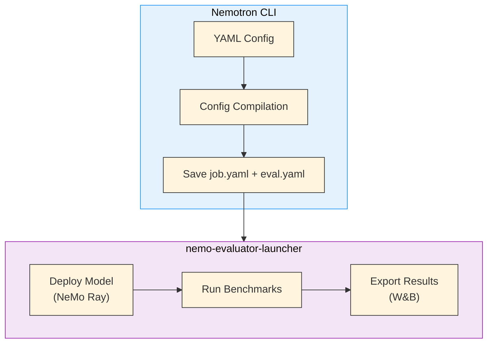
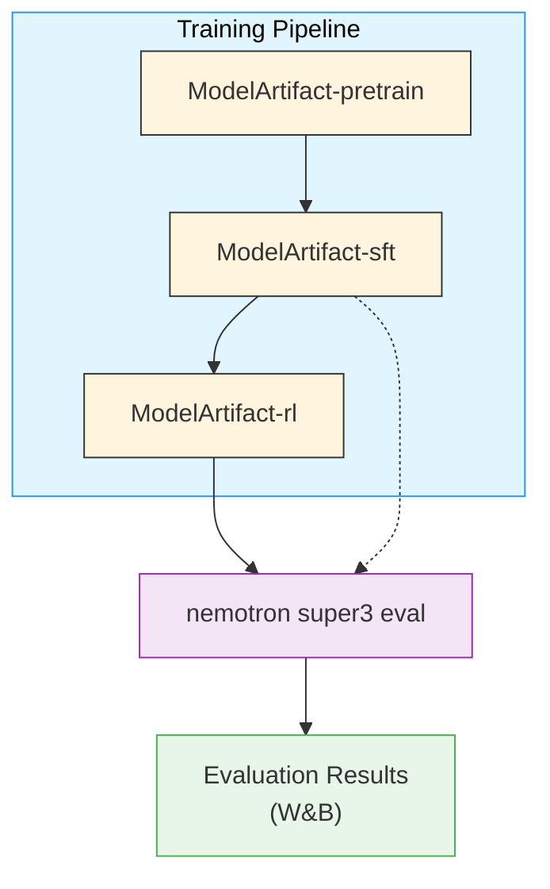

Evaluate trained Nemotron 3 Super models against standard benchmarks using [NeMo Evaluator](https://github.com/NVIDIA-NeMo/Evaluator).

The evaluation recipe here covers a subset of the benchmarks used in the full tech report — enough to validate training quality during development. For the complete benchmark suite and reproduction instructions, see the [Nemotron 3 Super reproducibility doc](https://github.com/NVIDIA-NeMo/Evaluator/blob/main/packages/nemo-evaluator-launcher/examples/nemotron/nemotron-3-super/reproducibility.md) in the NeMo Evaluator repo.

> **Different execution pattern**: Unlike training stages that submit Python scripts via NeMo-Run, evaluation compiles the YAML config and passes it directly to [nemo-evaluator-launcher](https://github.com/NVIDIA-NeMo/Evaluator). There is no recipe script—the CLI handles config compilation and artifact resolution, then delegates to the launcher.

---

## How Evaluation Works

The eval command resolves model artifacts from W&B lineage and uses NeMo Framework’s Ray-based in-framework deployment. It defaults to evaluating the latest RL stage output.



### Deployment

The model checkpoint (HuggingFace format) is converted to [Megatron-Bridge](/../nvidia-stack#megatron-bridge) format and deployed with Ray as an OpenAI API-compatible endpoint. The evaluator launcher handles deployment, benchmark execution, and result export in a single command.

| Setting | Value | Notes |
| --- | --- | --- |
| Deployment backend | MBridge + Ray | In-framework NeMo deployment |
| Minimum GPUs | 8 (1 node) | Expert parallelism requires 8 GPUs |
| Tensor parallelism (TP) | 1 | Single-GPU tensor parallelism |
| Expert parallelism (EP) | 8 | One expert shard per GPU |

---

## Benchmark Suite

The evaluation covers six categories of benchmarks, matching the tech report evaluation protocol:

### General Knowledge

| Benchmark | Description |
| --- | --- |
| MMLU-Pro | Massive Multitask Language Understanding (Professional) |

### Reasoning

| Benchmark | Description |
| --- | --- |
| AIME25 | American Invitational Mathematics Examination 2025 (no tools / with tools) |
| HMMT | Harvard-MIT Mathematics Tournament (no tools) |
| GPQA | Graduate-Level Google-Proof QA (no tools / with tools) |
| LiveCodeBench v5 | Live competitive coding (2024-08 to 2025-05) |
| SciCode | Scientific coding (subtask) |
| HLE | Humanity’s Last Exam (no tools / with tools) |

### Agentic

| Benchmark | Description |
| --- | --- |
| TerminalBench | Terminal use (hard subset + v2.0) |
| SWE-Bench | Software engineering (OpenHands, OpenCode, Codex harnesses + Multilingual) |
| TauBench V2 | Conversational tool use (Airline, Retail, Telecom) |
| BrowseComp | Web browsing comprehension |
| BIRD Bench | Text-to-SQL (dev set, SQLite, execution accuracy) |

### Chat & Instruction Following

| Benchmark | Description |
| --- | --- |
| IFBench | Instruction following (prompt-level) |
| Multi-Challenge | Complex multi-constraint instructions |
| Arena-Hard-V2 | Hard prompt evaluation |

### Long Context

| Benchmark | Description |
| --- | --- |
| AA-LCR | Long-context reasoning |
| RULER-100 | Retrieval tasks at 256K, 512K, and 1M context |

### Multilingual

| Benchmark | Description |
| --- | --- |
| MMLU-ProX | Multilingual MMLU-Pro (averaged over languages) |
| WMT24++ | Machine translation (en→xx) |

---

## Post-Trained Model Results

Comparison against Qwen3.5-122B-A10B and GPT-OSS-120B (officially reported numbers are used when available; otherwise scores are computed using official evaluation settings):

| Benchmark | N-3-Super | Qwen3.5-122B-A10B | GPT-OSS-120B |
| --- | --- | --- | --- |
| **General Knowledge** |  |  |  |
| MMLU-Pro | 83.73 | 86.70 | 81.00 |
| **Reasoning** |  |  |  |
| AIME25 (no tools) | 90.21 | 90.36 | 92.50 |
| HMMT (no tools) | 93.67 | 91.67 | 92.33 |
| GPQA (no tools) | 79.23 | 86.60 | 80.10 |
| GPQA (with tools) | 82.70 | — | 80.09 |
| LiveCodeBench v5 | 78.73 | 78.93 | 88.00 |
| SciCode (subtask) | 42.05 | 42.00 | 39.00 |
| HLE (no tools) | 18.26 | 25.30 | 14.90 |
| HLE (with tools) | 22.82 | — | 19.00 |
| **Agentic** |  |  |  |
| TerminalBench (hard) | 22.30 | 26.80 | 24.00 |
| TerminalBench 2.0 | 31.00 | 37.50 | 18.70 |
| SWE-Bench (OpenHands) | 60.47 | 66.40 | 41.90 |
| SWE-Bench (OpenCode) | 59.20 | 67.40 | — |
| SWE-Bench (Codex) | 53.73 | 61.20 | — |
| SWE-Bench Multilingual | 45.78 | — | 30.80 |
| TauBench V2 Airline | 66.20 | 66.00 | 49.20 |
| TauBench V2 Retail | 62.80 | 62.60 | 67.80 |
| TauBench V2 Telecom | 64.91 | 95.00 | 66.00 |
| TauBench V2 Average | 64.64 | 74.53 | 61.00 |
| BrowseComp | 31.28 | TBD | 33.89 |
| BIRD Bench | 41.80 | — | 38.25 |
| **Chat & IF** |  |  |  |
| IFBench (prompt) | 75.03 | 76.10 | 65.00 |
| Multi-Challenge | 55.23 | 61.50 | 58.29 |
| Arena-Hard-V2 | 73.88 | 75.15 | 90.26 |
| **Long Context** |  |  |  |
| AA-LCR | 59.67 | 66.90 | 51.00 |
| RULER-100 @ 256k | 96.30 | TBD | 52.30 |
| RULER-100 @ 512k | 95.67 | TBD | 46.70 |
| RULER-100 @ 1M | 91.75 | TBD | 22.30 |
| **Multilingual** |  |  |  |
| MMLU-ProX (avg) | 80.00 | 82.20 | 75.90 |
| WMT24++ (en→xx) | 87.30 | 78.30 | 87.80 |

### Base Model Validation Results

The following table validates the MBridge deployment by comparing accuracy against research team numbers on the base (pretrained) model:

| Benchmark | MBridge Deployment | Research Team | Delta |
| --- | --- | --- | --- |
| MMLU (5-shot) | 85.86 | 85.89 | -0.03 |
| ARC-Challenge (25-shot) | 95.82 | 95.65 | +0.17 |
| Winogrande (5-shot) | 78.37 | 78.69 | -0.32 |
| HellaSwag (10-shot) | 88.96 | 88.99 | -0.03 |
| OpenBookQA (0-shot) | 48.80 | 50.20 | -1.40 |

---

## Recipe Execution

### Quick Start

<div class="termy">
```console
// Evaluate the latest RL model from the pipeline
$ uv run nemotron super3 eval --run YOUR-CLUSTER

// Evaluate a specific model artifact
$ uv run nemotron super3 eval --run YOUR-CLUSTER run.model=sft:v2

// Filter to specific benchmarks
$ uv run nemotron super3 eval --run YOUR-CLUSTER -t adlr_mmlu -t hellaswag

// Dry run: preview the resolved config without executing
$ uv run nemotron super3 eval --dry-run
```

</div>
> **Note**: The `--run YOUR-CLUSTER` flag submits jobs via [NeMo-Run](/../../nemo_runspec/nemo-run). See [Execution through NeMo-Run](/../../nemo_runspec/nemo-run) for setup.

### Prerequisites

- **[NeMo Evaluator](https://github.com/NVIDIA-NeMo/Evaluator)**: Install with `pip install "nemotron[evaluator]"` or ensure `nemo-evaluator-launcher` is available

- **`HF_TOKEN`**: Required for gated models and some benchmark datasets

- **[Weights & Biases](/../wandb)**: For result export (optional but recommended)

- **Slurm cluster**: For remote execution

### Configuration

| File | Purpose |
| --- | --- |
| <code>config/default.yaml</code> | Evaluation config with deployment and benchmark tasks |

### Default Evaluation Tasks

The recipe config ships with the following default benchmarks:

| Task | Benchmark | Shots |
| --- | --- | --- |
| <code>adlr_mmlu</code> | MMLU | 5-shot |
| <code>adlr_arc_challenge_llama_25_shot</code> | ARC-Challenge | 25-shot |
| <code>hellaswag</code> | HellaSwag | 10-shot |
| <code>openbookqa</code> | OpenBookQA | 0-shot |
| <code>adlr_winogrande_5_shot</code> | Winogrande | 5-shot |

### Artifact Resolution

The default config uses `$\{art:model,path\}` for the model checkpoint:

```yaml
run:
  model: rl:latest  # Resolve latest RL artifact

deployment:
  checkpoint_path: ${art:model,path}  # Resolved at runtime
```

Override the model artifact on the command line:

```bash
# Evaluate the SFT model instead of RL
uv run nemotron super3 eval --run YOUR-CLUSTER run.model=sft:latest

# Evaluate a specific version
uv run nemotron super3 eval --run YOUR-CLUSTER run.model=sft:v2

# Use an explicit path (bypasses artifact resolution)
uv run nemotron super3 eval --run YOUR-CLUSTER deployment.checkpoint_path=/path/to/checkpoint
```

### Task Filtering

Use `-t`/`--task` flags to run a subset of benchmarks:

```bash
# Single task
uv run nemotron super3 eval --run YOUR-CLUSTER -t adlr_mmlu

# Multiple tasks
uv run nemotron super3 eval --run YOUR-CLUSTER -t adlr_mmlu -t hellaswag -t arc_challenge
```

### Direct Evaluation with nemo-evaluator-launcher

You can run evaluation standalone without the `nemotron` CLI by using `nemo-evaluator-launcher` directly. This is useful for custom setups or when integrating into existing pipelines.

> **Upstream reproducibility guide**: For full reproduction instructions (including config files and expected scores), see the [Nemotron 3 Super reproducibility doc](https://github.com/NVIDIA-NeMo/Evaluator/blob/main/packages/nemo-evaluator-launcher/examples/nemotron/nemotron-3-super/reproducibility.md) in the NeMo Evaluator repo.

**1. Create a virtual environment and install:**

```bash
python -m venv eval-venv
source eval-venv/bin/activate
pip install "nemo-evaluator-launcher[all]"
```

**2. Set your HuggingFace token** (required for gated models and some benchmarks):

```bash
export HF_TOKEN=\<your-hf-token>
```

**3. Run evaluation:**

```bash
nemo-evaluator-launcher run --config /path/to/config.yaml
```

The config file follows the same schema as `config/default.yaml`. The launcher handles model deployment (MBridge + Ray), benchmark execution, and result export.

### Running with NeMo-Run

Configure execution profiles in `env.toml`:

```toml
[wandb]
project = "nemotron"
entity = "YOUR-TEAM"

[YOUR-CLUSTER]
executor = "slurm"
account = "YOUR-ACCOUNT"
partition = "batch"
nodes = 1
ntasks_per_node = 8
gpus_per_node = 8
mounts = ["/lustre:/lustre"]
```

See [Execution through NeMo-Run](/../../nemo_runspec/nemo-run) for complete configuration options.

### W&B Integration

Results are automatically exported to W&B when configured:

1. **Auto-detection**: The CLI detects your local `wandb login` and propagates `WANDB_API_KEY` to evaluation containers

2. **env.toml config**: `WANDB_PROJECT` and `WANDB_ENTITY` are loaded from `env.toml`

3. **Auto-export**: Results are exported after evaluation completes

See [W&B Integration](/../wandb) for setup.

### Artifact Lineage



> [Artifact Lineage & W&B Integration](/../../nemo_runspec/artifacts)

---

## Infrastructure

This stage uses the following components:

| Component | Role | Documentation |
| --- | --- | --- |
| [NeMo Evaluator](https://github.com/NVIDIA-NeMo/Evaluator) | Benchmark evaluation framework and launcher | [GitHub](https://github.com/NVIDIA-NeMo/Evaluator) |
| [NeMo Framework](/../nvidia-stack) | Ray-based in-framework model deployment | [Docs](https://docs.nvidia.com/nemo/) |

### Parallelism Configuration

| Setting | Value | Purpose |
| --- | --- | --- |
| <code>tensor_parallel_size</code> | 1 | Tensor parallelism per GPU |
| <code>expert_model_parallel_size</code> | 8 | Expert parallelism for MoE layers |
| <code>num_gpus</code> | 8 | Total GPUs per node |

---

## Troubleshooting

| Problem | Solution |
| --- | --- |
| <code>nemo-evaluator-launcher</code> not found | Install with <code>pip install "nemotron[evaluator]"</code> |
| W&B authentication fails | Run <code>wandb login</code>. See [W&B Integration](/../wandb) |
| Model deployment fails | Check parallelism settings match GPU config (TP=1, EP=8 for Super3) |
| Artifact resolution fails | Verify artifact exists in W&B. Use <code>deployment.checkpoint_path=/explicit/path</code> to bypass |
| Task not found | List available tasks with <code>nemo-evaluator-launcher ls tasks</code> |

---

## Previous Stages

- [Stage 0: Pretraining](/pretrain) — Pretrain the base model

- [Stage 1: SFT](/sft) — Instruction tuning

- [Stage 2: RL](/rl/index) — Reinforcement learning alignment

- [Stage 3: Quantization](/quantization) — Post-training quantization

## Reference

- [NeMo Evaluator](https://github.com/NVIDIA-NeMo/Evaluator) — Upstream evaluation framework

- [Nemotron 3 Super Reproducibility Guide](https://github.com/NVIDIA-NeMo/Evaluator/blob/main/packages/nemo-evaluator-launcher/examples/nemotron/nemotron-3-super/reproducibility.md) — Full reproduction instructions with configs and expected scores

- [Artifact Lineage](/../../nemo_runspec/artifacts) — W&B artifact system

- [Execution through NeMo-Run](/../../nemo_runspec/nemo-run) — Cluster configuration

- [W&B Integration](/../wandb) — Credentials and export setup

- **Recipe Source:** `src/nemotron/recipes/super3/stage3_eval/`

- [Back to Overview](/README)
