This stage aligns the instruction-tuned model using GRPO (Group Relative Policy Optimization) with [NeMo-RL](/../../nvidia-stack#nemo-rl).

> **Open-Source Data Only**: This recipe uses exclusively open-sourced RL data, which is a subset of the full data used to train the released model. Results will differ from the benchmarks in the tech report. Use this recipe as a reference implementation to apply the methodology with your own data.

---

## Training Methodology

> **Training Framework**: RL alignment is implemented using [NeMo-RL](https://docs.nvidia.com/nemo/rl/latest/) with Ray for distributed actor coordination and vLLM for fast rollout generation. The Megatron backend handles distributed policy training with tensor, pipeline, context, and expert parallelism. See [NeMo-RL Documentation](https://docs.nvidia.com/nemo/rl/latest/) for implementation details.

For complete methodology, see the [Nemotron 3 Super Tech Report](https://research.nvidia.com/labs/nemotron/files/NVIDIA-Nemotron-3-Super-Technical-Report.pdf).

### RL Pipeline Overview

The RL pipeline consists of three main stages with 6 total sub-stages, each targeting a different alignment objective:

1. **[Multi-Environment RLVR](/rlvr)** (3 sub-stages) — Unified training across 21 environments with verifiable rewards

   -    RL Phase 1.1: RLVR 1 — Initial RL training from SFT checkpoint

   -    RL Phase 1.2: RLVR 2 — Continued training with second data blend

   -    RL Phase 1.3: RLVR 3 — Final RLVR with third data blend

2. **[SWE-RL](/swe)** (2 sub-stages) — End-to-end reinforcement learning for software engineering tasks

   -    RL Phase 2.1: SWE 1 — SWE-pivot training

   -    RL Phase 2.2: SWE 2 — SWE-bench training with isolated sandbox environments

3. **[RLHF](/rlhf)** (1 sub-stage) — Principle-following generative reward model-based alignment

> **Note on numbering**: The RL sub-stage numbering (Phases 1.1–3) is internal to Stage 2 of the overall pipeline. See the [pipeline overview](/../README) for the top-level stage numbering.

Each sub-stage uses a different data blend and takes the output checkpoint of the previous sub-stage as input. The RLVR sub-stages share the same config (`stage1_rlvr.yaml`) with different data paths.

```mermaid
%%{init: {'theme': 'base', 'themeVariables': { 'primaryBorderColor': '#333333', 'lineColor': '#333333', 'primaryTextColor': '#333333'}}}%%
flowchart LR
    sft["SFT<br/>Checkpoint"] --> rlvr1["RLVR 1<br/>(109 nodes)"]
    rlvr1 --> rlvr2["RLVR 2<br/>(109 nodes)"]
    rlvr2 --> rlvr3["RLVR 3<br/>(109 nodes)"]
    rlvr3 --> swe1["SWE 1<br/>(64 nodes)"]
    swe1 --> swe2["SWE 2<br/>(64 nodes)"]
    swe2 --> rlhf["RLHF<br/>(72 nodes)"]
    rlhf --> final["Final<br/>Model"]

    style sft fill:#f3e5f5,stroke:#9c27b0
    style rlvr1 fill:#e1f5fe,stroke:#2196f3
    style rlvr2 fill:#e1f5fe,stroke:#2196f3
    style rlvr3 fill:#e1f5fe,stroke:#2196f3
    style swe1 fill:#e8f5e9,stroke:#4caf50
    style swe2 fill:#e8f5e9,stroke:#4caf50
    style rlhf fill:#fff3e0,stroke:#ff9800
    style final fill:#f3e5f5,stroke:#9c27b0
```



Multi-environment RLVR is the primary stage, training on all environments simultaneously to keep RL updates informed by the full environment mix and prevent accuracy drops across tasks. SWE-RL is handled separately because its rollouts take substantially longer and require longer context lengths. RLHF runs as a final stage to improve model behavior and interaction quality.

### Per-Stage Parameters

|  | RLVR (1.1–1.3) | SWE 1 (2.1) | SWE 2 (2.2) | RLHF (3) |
| --- | --- | --- | --- | --- |
| **Nodes** | 109 | 64 | 64 | 72 |
| **Prompts/step** | 256 | 64 | 16 | 128 |
| **Gens/prompt** | 16 | 16 | 32 | 16 |
| **Batch size** | 4096 | 1024 | 512 | 2048 |
| **Max seq len** | 65K | 131K | 196K | 49K |
| **Learning rate** | 3e-6 | 1e-6 | 1e-6 | 1e-6 |
| **KL penalty** | 0 | 0 | 0 | 1e-4 |
| **Overlong filter** | false | true | true | false |
| **Config** | <code>stage1_rlvr.yaml</code> | <code>stage2_swe1.yaml</code> | <code>stage2_swe2.yaml</code> | <code>stage3_rlhf.yaml</code> |

Node counts assume B200 nodes with 8 GPUs each and may need adjustment for other GPU types.

### GRPO Algorithm

GRPO (Group Relative Policy Optimization) optimizes the policy using group-relative advantages:

1. **Generate responses** from the current policy using vLLM

2. **Evaluate** responses using NeMo-Gym reward environments

3. **Compute group-relative advantages** across response groups per prompt

4. **Update the policy** to favor higher-reward responses with clipped gradients

All stages use **asynchronous GRPO** where training and inference are decoupled across separate GPU devices. See [RLVR](/rlvr#algorithm) for full algorithm details.

---

## Quick Start

### Prerequisites

- **NeMo-RL repo**: Clone the `super-v3` branch

- **Sandbox container**: Required for code execution environments

- **SWE container**: Required for SWE stages 2.1 and 2.2 (pre-fetched venvs) — see [SWE container build](#swe-container) below

- **SIF images**: Required for Stage 2.2 only (SWE-bench sandbox environments (Apptainer `.sif` on SLURM, or Docker/Podman))

### Using nemotron CLI (Recommended)

```bash
# 1. Prepare data for each sub-stage
uv run nemotron super3 data prep rl rlvr --run YOUR-CLUSTER
uv run nemotron super3 data prep rl swe1 --run YOUR-CLUSTER
uv run nemotron super3 data prep rl swe2 --run YOUR-CLUSTER
uv run nemotron super3 data prep rl rlhf --run YOUR-CLUSTER

# 2. Run RL training stages sequentially
# Stage 1.1–1.3: RLVR (uses base container)
uv run nemotron super3 rl rlvr -c rlvr1 --run YOUR-CLUSTER
uv run nemotron super3 rl rlvr -c rlvr2 --run YOUR-CLUSTER
uv run nemotron super3 rl rlvr -c rlvr3 --run YOUR-CLUSTER

# Stage 2.1: SWE pivot (requires SWE container)
uv run nemotron super3 rl swe1 --run YOUR-CLUSTER

# Stage 2.2: SWE-bench (requires SWE container + Apptainer SIF images)
uv run nemotron super3 rl swe2 --run YOUR-CLUSTER

# Stage 3: RLHF (uses base container)
uv run nemotron super3 rl rlhf --run YOUR-CLUSTER

# Quick test (single GPU, validates RL infrastructure)
uv run nemotron super3 rl rlvr -c test --run YOUR-CLUSTER
```

> **`--run YOUR-CLUSTER`** refers to a profile defined in your `env.toml` file,
which configures SLURM account, partition, mounts, and other cluster settings.
See the [env.toml setup guide](/../README#configuration) for details.

### Using super_launch.sh (Direct)

Alternatively, run directly inside the NeMo-RL repo:

```bash
# Clone NeMo-RL
git clone --recursive -b super-v3 https://github.com/NVIDIA-NeMo/RL.git
cd RL
```

#### Prepare Data

```bash
# Download RL data blends (rlvr1, rlvr2, rlvr3, swe1, swe2, rlhf)
uvx --from huggingface-hub hf download nvidia/Nemotron-3-Super-RL-Training-Blends \
    --repo-type dataset --local-dir=data_with_placeholders

# Fill in placeholders in data blends
chmod +x data_with_placeholders/fill_placeholders.py
./data_with_placeholders/fill_placeholders.py \
    --input-dir data_with_placeholders --output-dir data_filled

# Create train/val splits for each data blend (last 100 rows held out for validation)
for f in data_filled/*.jsonl; do
  name=$(basename "$f" .jsonl)
  mkdir -p "data/$name"
  head -n -100 "$f" > "data/$name/train-split.jsonl"
  tail -n 100 "$f" > "data/$name/val-split.jsonl"
done
```

#### Run Training

Set these environment variables before launching each stage:

| Variable | Description |
| --- | --- |
| <code>DATA_DIR</code> | Path to the <code>data/</code> directory produced above |
| <code>SANDBOX_CONTAINER</code> | Sandbox container image (<code>.sqsh</code> path or registry URI) |
| <code>PERSISTENT_CACHE</code> | Directory for vLLM and FlashInfer caches |
| <code>EXTRA_MOUNTS</code> | Comma-separated <code>host:container</code> mount pairs for shared filesystems |
| <code>SIF_DIR</code> | *(Stage 2.2 only)* Directory containing Apptainer <code>.sif</code> images |
| <code>SLURM_PARTITION</code> | Slurm partition |
| <code>SLURM_ACCOUNT</code> | Slurm account |

Then launch each stage sequentially. `MODEL_PATH` is the input checkpoint — Stage 1.1 starts from SFT; every subsequent stage takes the output of the previous one.

```bash
# Stage 1.1 — RLVR 1 (109 nodes)
EXP_NAME=stage1.1-rlvr1 \
CONFIG_PATH=examples/configs/super/stage1_rlvr.yaml \
MODEL_PATH=/path/to/sft_checkpoint \
TRAIN_PATH=$DATA_DIR/rlvr1/train-split.jsonl \
VAL_PATH=$DATA_DIR/rlvr1/val-split.jsonl \
CONTAINER=nvcr.io/nvidia/nemo-rl:v0.5.0.nemotron_3_super \
SANDBOX_CONTAINER=$SANDBOX_CONTAINER \
PERSISTENT_CACHE=$PERSISTENT_CACHE \
EXTRA_MOUNTS=$EXTRA_MOUNTS \
SLURM_PARTITION=$SLURM_PARTITION \
SLURM_ACCOUNT=$SLURM_ACCOUNT \
bash super_launch.sh
```

See [RLVR](/rlvr), [SWE-RL](/swe), and [RLHF](/rlhf) for complete launch commands for each stage.

---

## Configuration

### Config Files

| File | Purpose | Details |
| --- | --- | --- |
| <code>stage1_rlvr.yaml</code> | RLVR stages 1.1–1.3 (109 nodes, 21 environments) | [RLVR](/rlvr) |
| <code>stage2_swe1.yaml</code> | SWE stage 2.1 — SWE-pivot (64 nodes) | [SWE-RL](/swe#stage-2-1-swe-1-64-nodes) |
| <code>stage2_swe2.yaml</code> | SWE stage 2.2 — SWE-bench with sandbox containers (64 nodes) | [SWE-RL](/swe#stage-2-2-swe-2-64-nodes) |
| <code>stage3_rlhf.yaml</code> | RLHF stage (72 nodes, GenRM reward) | [RLHF](/rlhf) |
| <code>small_*.yaml</code> | Reduced-scale variants for testing |  |
| <code>default.yaml</code> | Base GRPO configuration |  |
| <code>tiny.yaml</code> | Testing variant (1 node) |  |

### Data Preparation

The `data_prep.py` script downloads `nvidia/Nemotron-3-Super-RL-Training-Blends` from HuggingFace, resolves placeholder entries, and produces 6 data blends. See [Data Preparation](/data-prep) for details.

---

## Infrastructure

This stage uses the following components from the [NVIDIA AI Stack](/../../nvidia-stack):

| Component | Role | Documentation |
| --- | --- | --- |
| [NeMo-RL](/../../nvidia-stack#nemo-rl) | Async GRPO algorithm, policy training, reward computation | [Docs](https://docs.nvidia.com/nemo/rl/latest/) |
| [NeMo-Gym](https://github.com/NVIDIA-NeMo/Gym) | Multi-environment reward evaluation (21+ environments) | [GitHub](https://github.com/NVIDIA-NeMo/Gym) |
| [Megatron-Core](/../../nvidia-stack#megatron-core) | Distributed training primitives (TP, PP, CP, EP) | [GitHub](https://github.com/NVIDIA/Megatron-LM) |
| [Ray](https://ray.io/) | Distributed actor coordination and resource management | [Docs](https://docs.ray.io/) |
| vLLM | Fast rollout generation | [GitHub](https://github.com/vllm-project/vllm) |

### Container

All RL stages use the base NeMo-RL container:

```default
nvcr.io/nvidia/nemo-rl:v0.5.0.nemotron_3_super
```

To build the container yourself, such as for ARM64, refer to [Build Docker Images](https://docs.nvidia.com/nemo/rl/0.5.0/docker.html) in the RL documentation.

#### SWE Container

SWE stages (2.1, 2.2) need pre-fetched Python virtual environments that are not
included in the base image. Build the SWE container once (from within the
[NeMo-RL](https://github.com/NVIDIA-NeMo/RL) repo):

```text
docker buildx build \
  -t your-registry/nemo-rl:v0.5.0.nemotron_3_super_swe \
  --push \
  -f- . \<\<'EOF'
FROM nvcr.io/nvidia/nemo-rl:v0.5.0.nemotron_3_super

RUN \<\<'RUNEOF'
set -euxo pipefail
UV_TORCH_BACKEND=$(uv run python -c "import tomllib,pathlib; \
  indexes=tomllib.loads(pathlib.Path('pyproject.toml').read_text())['tool']['uv']['index']; \
  print(next(i['name'].removeprefix('pytorch-') for i in indexes if i['name'].startswith('pytorch-')))") \
UV_LINK_MODE=hardlink uv run python examples/nemo_gym/prefetch_venvs.py \
    examples/configs/super/stage2_swe1.yaml \
    examples/configs/super/stage2_swe2.yaml
RUNEOF
EOF
```

SWE2 additionally requires Apptainer `.sif` images — see [SWE-RL Stage 2.2](/swe#prerequisites).

---

## Next Steps

After RL completes, the aligned model can be [quantized](/../quantization) for efficient deployment or [evaluated](/../evaluate) against standard benchmarks.

## Reference

- [Nemotron 3 Super Tech Report](https://research.nvidia.com/labs/nemotron/files/NVIDIA-Nemotron-3-Super-Technical-Report.pdf) — RL methodology

- [NeMo-RL Documentation](https://docs.nvidia.com/nemo/rl/latest/) — GRPO, DPO, environments

- [NVIDIA AI Stack](/../../nvidia-stack) — NeMo-RL, Megatron-Core documentation

- [Artifact Lineage](/../../../nemo_runspec/artifacts) — W&B artifact system

- **Recipe Source**: `src/nemotron/recipes/super3/stage2_rl/` — Implementation details

- [Back to Overview](/../README)
