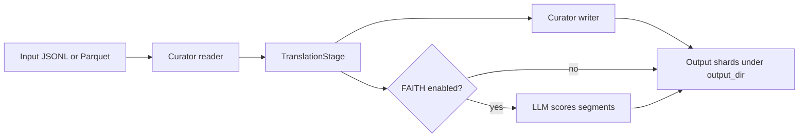

<Anchor id="translation-index"></Anchor>

The `nemotron steps run translate/nemo_curator` command translates selected fields in JSONL or Apache Parquet files.
You can use a large language model (LLM) with an OpenAI-compatible endpoint, a neural machine translation (NMT) HTTP server, Google Cloud Translation, or Amazon Translate.
Optionally, you can also run *FAITH* evaluation with an LLM after translation to score translation quality.

<Tip>
New here? Read [Tips for Translation With Agents](/using-skills) if you plan to drive the work from a coding agent, then start [Getting Started With Translation](/getting-started) and use this page as the map to deeper topics.

</Tip>

## When to Use

Use `nemotron steps run translate/nemo_curator` when you need:

- Localized training or synthetic corpora from translating natural-language fields while preserving structured payloads such as chat turns, tool payloads, and fenced code blocks.
Field paths, `output_mode`, and segmentation interact with that behavior; see [Configure Fields and Output](/how-to/configure-fields-and-output) and [Segmentation](/explanation/segmentation).

- Optional FAITH evaluation with configurable thresholds and filtering, without a separate evaluation CLI.

- Repeatable configuration by using the checked-in `default.yaml` plus CLI overrides.

## Pipeline Summary

## Documentation Series

<CardGroup cols={2}>
<Card href="/getting-started" icon="fa-regular fa-book" title="Tutorial">
Run `nemotron steps run translate/nemo_curator` end-to-end using `default.yaml` and a sample chat JSONL file.

---

<Badge intent="info">hands-on</Badge>

</Card>

<Card href="/using-skills" icon="fa-regular fa-comment-discussion" title="Use translation with an agent">
Copy-paste session prompts for supervised fine-tuning (SFT) data or exploratory FAITH scoring, plus habits for a short chat.

---

<Badge intent="info">newcomer</Badge>

</Card>

<Card href="/how-to/index" icon="fa-regular fa-tools" title="How-to guides">
Backends, fields and outputs, segmentation, FAITH tuning.

---

<Badge intent="info">task-based</Badge>

</Card>

<Card href="/explanation/index" icon="fa-regular fa-light-bulb" title="Concepts">
Pipeline architecture, segmentation, FAITH behavior.

---

<Badge intent="info">learn</Badge>

</Card>

<Card href="/reference/index" icon="fa-regular fa-list-unordered" title="Reference">
YAML parameters and `nemotron steps run translate/nemo_curator` CLI.

---

<Badge intent="info">lookup</Badge>

</Card>

</CardGroup>

## All Documentation

<Tabs>
  <Tab title="Tutorial">

| Guide | What you do |
| --- | --- |
| [Tips for Translation With Agents](/using-skills) | Paste starter prompts for an agent and keep a translation session on the rails |
| [Getting Started With Translation](/getting-started) | Run translation and FAITH using <code>default.yaml</code> and sample JSONL |

  </Tab>
  <Tab title="How-to guides">

| Guide | Focus |
| --- | --- |
| [Run LLM Translation](/how-to/run-llm-translation) | <code>backend: llm</code> |
| [Run NMT Translation](/how-to/run-nmt-translation) | <code>backend: nmt</code> |
| [Run Google or AWS Translation](/how-to/run-google-aws-translation) | <code>backend: google</code> / <code>aws</code> |
| [Configure Fields and Output](/how-to/configure-fields-and-output) | Field paths and <code>output_mode</code> |
| [Use Fine Segmentation](/how-to/use-fine-segmentation) | <code>segmentation_mode</code> |
| [Run FAITH Evaluation](/how-to/run-faith-evaluation) | <code>faith_eval</code> block |

  </Tab>
  <Tab title="Concepts">

| Guide | Topic |
| --- | --- |
| [Pipeline Overview](/explanation/pipeline-overview) | End-to-end flow |
| [Segmentation](/explanation/segmentation) | Coarse versus fine |
| [FAITH Evaluation Inside Translation](/explanation/faith-evaluation) | FAITH semantics |

  </Tab>
  <Tab title="Reference">

| Guide | Content |
| --- | --- |
| [Translation YAML Reference](/reference/translate-config) | <code>default.yaml</code> field reference |
| [CLI Reference for Translation](/reference/cli-translation) | <code>nemotron steps run translate/nemo_curator</code> syntax |
| [Input and Output Format](/reference/io-format) | Input and output shapes |

  </Tab>

</Tabs>

## Limitations and Considerations

- Cost and rate limits: Hosted and cloud LLM backends incur usage; throttle with `max_concurrent_requests` and your provider’s guidance.

- Remote execution: use `--run <profile>` or `--batch <profile>` with an environment profile such as `lepton_translate`.

- Overrides: Use `key=value` dotlist syntax after global flags, not passthrough script arguments.

- Mixed folders: Do not point `input_path` at one directory that contains both `.jsonl` and `.parquet` shards unless you split formats first.

## Quick Paths

1. Agent-first prompts: [Tips for Translation With Agents](/using-skills)

2. First run: [Getting Started With Translation](/getting-started)

3. Swap backend: [How-To Guides](/how-to/index)

4. Lookup flags: [CLI Reference for Translation](/reference/cli-translation)
