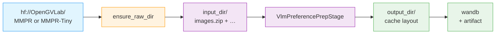

# RL Data Preparation

The omni3 RL pipeline has three sub-stages (MPO, text RL, vision RL),
each backed by its own dataset and prep flow. The CLI dispatches by
`-c {mpo|text|vision}` and routes through a single shared
`data_prep.py` driver.

| Sub-stage | Source | Cache shape | Backed by |
|-----------|--------|-------------|-----------|
| `mpo` | `hf://OpenGVLab/MMPR` (full preference dataset) | `MMPR/images/` + `MMPR/annotations/` + `meta_public.json` | Vendored `scripts/prepare_public_mmpr_for_mpo.py` (subprocess inside a Xenna stage) |
| `text` | `hf://nvidia/Nemotron-3-Nano-RL-Training-Blend` | per-blend train/val JSONL with `responses_create_params` schema | Shared with Nano3's text-RL recipe (`run_rl_resolve_pipeline`) |
| `vision` | `hf://OpenGVLab/MMPR-Tiny` | `MMPR-Tiny/images/` + `mmpr_tiny.parquet` + preview JSONL | In-tree `VlmPreferencePrepStage(flavor="tiny")` (no shell-out) |

All three flows go through the same shared dispatcher
(`src/nemotron/cli/commands/omni3/data/prep/rl.py`) so they share
artifact tracking, run-hash caching, receipts, and W&B lineage.

## Pipeline (vision and mpo)



`ensure_raw_dir` is a precondition step: when the per-stage YAML's
`source_uri` is set and `input_dir` is empty/incomplete, it fetches
the HF snapshot into `input_dir` before the prep stage runs. Operators
who pre-stage data manually (or set `OMNI3_MMPR_PUBLIC_RAW` /
`OMNI3_MMPR_TINY_RAW`) bypass the download — `ensure_raw_dir` is a
no-op when the required files are already present.

## Quick start

```bash
# All three substages run on the prep profile (CPU-only, single-node).
uv run nemotron --batch prep omni3 data prep rl -c mpo
uv run nemotron --batch prep omni3 data prep rl -c text
uv run nemotron --batch prep omni3 data prep rl -c vision
```

Each command:

1. Resolves the per-stage YAML
   (`src/nemotron/recipes/omni3/stage1_rl/config/data_prep/{mpo,text,vision}.yaml`)
   merged with your env profile.
2. Downloads inputs from `source_uri` into `input_dir` if missing
   (vision/mpo only; text uses `run_rl_resolve_pipeline` which downloads
   directly from HF as part of the recipe).
3. Runs the prep stage (Xenna single-worker pipeline) with run-hash
   caching, receipts, and W&B lineage.
4. Registers the result as an artifact under `omni3/rl/{stage}/data`.

> **Submitting in parallel:** safe — sibling RL configs (mpo / text /
> vision) get unique job names from `_make_job_name` (PID + random
> token), so the local config-staging file and the remote Ray code dir
> never collide between concurrent invocations. Earlier versions raced
> on a wall-clock-second timestamp; that's fixed.

## Auto-download via `source_uri`

Both `vision.yaml` and `mpo.yaml` carry a `source_uri:` field:

```yaml
# vision.yaml
stage: vision
dataset_name: mmpr_tiny
source_uri: hf://OpenGVLab/MMPR-Tiny
input_dir: ${oc.env:OMNI3_MMPR_TINY_RAW,data/mmpr_tiny/raw}
```

```yaml
# mpo.yaml
stage: mpo
dataset_name: mmpr_public
source_uri: hf://OpenGVLab/MMPR
input_dir: ${oc.env:OMNI3_MMPR_PUBLIC_RAW,data/mmpr_public/raw}
```

When the dispatcher runs:

- If `input_dir` already contains the required files
  (`images.zip`, `mmpr_tiny.parquet` for tiny; *any* non-empty content
  for mpo, since the upstream layout isn't fully declarative), it
  skips the download.
- Otherwise, if `source_uri` is set, it calls
  `huggingface_hub.snapshot_download(repo_id=…, repo_type="dataset",
  local_dir=input_dir)` and proceeds.
- If `input_dir` is missing required files *and* `source_uri` is
  unset/empty, it fails fast with the exact list of missing files
  and a remediation hint.

The download lands in whatever you set `input_dir` to. Default is
`data/<dataset>/raw` (relative to `cwd` of the Ray worker, which is
the rsync'd repo root); override per environment by exporting
`OMNI3_MMPR_TINY_RAW` / `OMNI3_MMPR_PUBLIC_RAW`.

## What each substage produces

### `mpo`

Cache rooted at
`<output_dir>/MMPR-v1.2/` (where `output_dir` defaults to
`<NEMO_RUN_DIR>/stage1_rl/data_prep/mpo/MMPR-v1.2`):

```
MMPR-v1.2/
├── meta_public.json                          # rewritten meta with relative paths
├── MMPR/
│   ├── images/<subset>/...                   # extracted images.zip
│   └── annotations/<subset>.jsonl            # extracted annotations.zip
├── mmpr_public_preview.jsonl                 # 2 sampled rows per subset
├── prepare_public_mmpr_for_mpo_summary.json  # per-run summary
└── .mmpr_ready                               # sentinel for trainer-side discovery
```

The `meta_public.json` rewrite strips the upstream `/mnt/petrelfs/...`
absolute paths and replaces them with `MMPR/annotations/<basename>.jsonl`
relative-from-cache-root paths. The trainer-side loader is expected to
resolve them under the cache root; if your loader prefers absolute
paths, swap `_relpath_for_meta` in
`scripts/prepare_public_mmpr_for_mpo.py`.

### `text`

Per-blend train/val JSONL split, identical schema to Nano3's
`stage2_rl` recipe. Shared with Nano3 because the source dataset
(`nvidia/Nemotron-3-Nano-RL-Training-Blend`) and output schema
(`responses_create_params`-shaped JSONL) are the same.

### `vision`

Cache rooted at `<output_dir>/` (defaults to
`<NEMO_RUN_DIR>/stage1_rl/data_prep/vision`):

```
vision/
├── MMPR-Tiny/images/...                                    # extracted images.zip
├── mmpr_tiny.parquet                                       # source records, copied through
├── mmpr_tiny_preview.jsonl                                 # row-validated preview
├── prepare_mmpr_tiny_for_vision_rl_summary.json
└── .mmpr_ready
```

## Helper scripts

Two standalone scripts live under `scripts/` at the repo root for
operators who want to run the prep by hand or debug it outside the
dispatcher:

| Script | Equivalent dispatcher path | When to invoke directly |
|--------|---------------------------|------------------------|
| `scripts/prepare_mmpr_tiny_for_vision_rl.py` | `omni3 data prep rl -c vision` | Iterating on the tiny prep logic; reproducing a cache shape outside Ray; CI dry-runs. |
| `scripts/prepare_public_mmpr_for_mpo.py` | `omni3 data prep rl -c mpo` | Iterating on MMPR-Public layout; testing meta-rewrite changes; bisecting subset-extraction issues. |

Both take the same `--input-dir` / `--output-dir` shape and produce
the cache layout above. The dispatcher invokes the *MMPR-Public* script
through `mpo.yaml`'s `builder_command`; the *MMPR-Tiny* logic is also
vendored inline in `nemotron.data_prep.stages.vlm_preference_prep._run_tiny`,
so the dispatcher does not currently shell out for the tiny flavor.
The standalone tiny script is for ad-hoc / reproducible-by-hand use.


## Output artifact registration

Each successful run emits an artifact:

- `art://omni3/rl/mpo/data` → `<output_dir>/MMPR-v1.2/meta_public.json`
- `art://omni3/rl/text/data` → `<output_dir>/manifest.json`
- `art://omni3/rl/vision/data` → `<output_dir>/`

Artifact metadata captures `elapsed_sec`, `run_hash`, and (for vision)
`row_stats`. W&B lineage links the input HF dataset URIs to the output.

## Resource profile

All three substages declare
`resources: nodes=1, gpus_per_node=0` so they fit on the prep / CPU
partition. MMPR-Public's images.zip is ~14 GB so first-run takes
~5–10 min on Lustre; subsequent runs short-circuit via run-hash cache.

---

**Recipe sources**:

- Dispatcher: `src/nemotron/cli/commands/omni3/data/prep/rl.py`
- Driver: `src/nemotron/recipes/omni3/stage1_rl/_data_prep_base.py`
- Stage logic: `src/nemotron/data_prep/stages/vlm_preference_prep.py`
- Auto-download: `src/nemotron/data_prep/recipes/rl_omni.py::ensure_raw_dir`
- Standalone scripts: `scripts/prepare_*.py`
