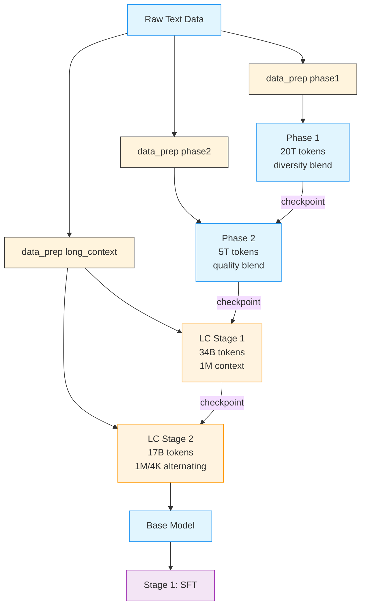

# Stage 0: Pretraining

This stage trains the base Nemotron 3 Super model using [Megatron-Bridge](../nvidia-stack.md#megatron-bridge).

Nemotron 3 Super is a **hybrid Mamba-Transformer-MoE** model with multi-token prediction (MTP) and LatentMoE, combining state-space models for efficiency, attention for global context, LatentMoE for hardware-aware sparse scaling, and MTP for improved training signal and inference acceleration.

---

## Training Methodology

> **Training Framework**: Pretraining is implemented using [Megatron-Bridge](https://docs.nvidia.com/nemo/megatron-bridge/latest/)'s `pretrain()` entry point. See [Training Entry Points](https://docs.nvidia.com/nemo/megatron-bridge/latest/training/entry-points.html) for implementation details.

### Model Architecture

Nemotron 3 Super extends the hybrid Mamba-Transformer MoE design from Nemotron 3 Nano to **120.6B total parameters** with a constrained active budget of **12.7B parameters** (12.1B excluding embeddings) per forward pass. The architecture is defined by three core pillars:

#### Architecture Dimensions

| Configuration | Value |
|---------------|-------|
| **Total Layers** | 88 |
| **Model Dimension** | 4096 |
| **Q-Heads** | 32 |
| **KV-Heads** | 2 |
| **Head Dimension** | 128 |
| **Mamba State Dimension** | 128 |
| **Mamba Groups** | 8 |
| **Mamba Heads** | 128 |
| **Mamba Head Dimension** | 64 |
| **Expert Hidden Dimension** | 2688 |
| **Shared Expert Intermediate Size** | 5376 |
| **Total Experts per Layer** | 512 |
| **Top-k (Activated Experts)** | 22 |
| **MoE Latent Size** | 1024 |
| **MTP Layers (shared weight)** | 2 |

#### LatentMoE: Hardware-Aware Expert Design

Nemotron 3 Super is the first model to scale sparsely using **LatentMoE** rather than standard MoE layers. In LatentMoE, input tokens are projected from the hidden dimension $d$ into a smaller latent dimension $\ell$ (1024) for routing and expert computation, reducing routed parameter loads and all-to-all traffic by a factor of $d/\ell$.

These savings are used to increase both the total number of experts (to 512) and the top-k active experts per token (to 22), improving model accuracy at approximately constant inference cost. All non-routed computations—including the routing gate, shared expert computation, and non-expert layers—remain in the full hidden dimension $d$.

**Key design principles:**
- Reducing hidden dimension $d$ for routed computation relieves memory bandwidth and communication bottlenecks
- Increasing both total experts $N$ and active experts $K$ improves quality by exponentially expanding the space of expert combinations
- Shared experts provide additional knowledge sharing across tokens

The MoE blocks employ squared ReLU activations, a sigmoid router with expert biasing, and aux-loss-free load balancing (update rate $10^{-3}$) paired with standard load balancing loss (coefficient $10^{-4}$).

#### Multi-Token Prediction (MTP)

MTP optimizes the model to predict multiple future tokens at each position, improving both training quality and inference efficiency:

- **Quality improvement**: Encourages representations that capture multi-step dependencies and longer-range structure
- **Inference acceleration**: MTP heads function as a native speculative decoding engine, generating candidate continuations verified by the main model in a single forward pass

**Shared-weight design for robust autoregressive drafting:** Unlike standard MTP with $N$ independent heads, Nemotron 3 Super shares parameters across MTP heads during training. This yields a unified prediction head that can be applied recursively at inference to generate longer drafts with stable acceptance behavior. The model achieves the highest overall average acceptance length (3.45 on SPEED-Bench) across all domains compared to DeepSeek-R1 (2.70) and is competitive with Qwen3-Next (3.33).

#### Hybrid Interleaving Pattern


The 88-layer stack follows a periodic interleaving pattern where MoE layers are paired with Mamba-2 blocks. A limited number of self-attention layers are strategically inserted as global "anchors" to enable full-token interaction and long-range information routing. The attention layers employ Grouped-Query Attention (GQA) with 32 query heads and 2 KV heads. Consistent with the Nemotron family, the model omits positional embeddings, dropout, and bias terms in linear layers, uses RMSNorm for normalization, and maintains un-tied embedding and output weights.

This synergy enables up to **6.4x higher inference throughput** compared to similarly-sized Transformer MoEs (e.g., GPT-OSS-120B) under 8K input / 16K output workloads.

> For implementation details, see [Megatron-Bridge Nemotron 3 Super](https://github.com/NVIDIA-NeMo/Megatron-Bridge/blob/super-v3/docs/models/llm/nemotron3-super.md).

### Pretraining Data

#### New Synthetic Datasets

Several new datasets were added for Super3, released as [Nemotron-Pretraining-Specialized-v1.1](https://huggingface.co/datasets/nvidia/Nemotron-Pretraining-Specialized-v1.1):

| Dataset | Description | Scale |
|---------|-------------|-------|
| **Synthetic Code Concepts** | Python problems and solutions generated using concept taxonomy from HumanEval | ~15M problem-solution pairs |
| **Synthetic Algorithmic** | Algorithmic Python problems with edge cases and unit tests | ~0.2B tokens |
| **Synthetic Economics** | Economics MCQs across microeconomics, macroeconomics, econometrics | TBD |
| **Synthetic Formal Logic** | Formal logic problems: natural language ↔ predicate logic, truth tables | TBD |
| **Synthetic MCQ** | MMLU-style MCQs bootstrapped from MMLU auxiliary training set using Qwen3-235B for question generation and DeepSeek-V3 for solution generation with majority voting | ~3.5M samples (~1.6B tokens) |

#### Data Mixture and Ordering

The pretraining corpus spans **16 high-level categories** including web crawl data (5 quality tiers following Nemotron-CC taxonomy), math, Wikipedia, code, Nemotron-CC-Code, academic text, Crawl++ (OpenWebText, BigScience, Reddit), multilingual data, finepdfs, and synthetic SFT-style datasets. Reasoning-focused datasets are incorporated into pretraining following prior findings on their effectiveness.

**Two-phase curriculum:**

| Phase | Internal Scale | Focus | Proportion |
|-------|----------------|-------|------------|
| Phase 1 | 20T (80%) | Data diversity — broad coverage and generalization | Higher weight on crawl data |
| Phase 2 | 5T (20%) | High-quality sources — refined model performance | Higher weight on Wikipedia, curated sources |

<details>
<summary>Phase 1 blend distribution (click to expand)</summary>


</details>

<details>
<summary>Phase 2 blend distribution (click to expand)</summary>


</details>

> **Open-source data coverage**: The released datasets cover an estimated 8–10T tokens
> (~40–50% of the internal 25T blend). Missing categories include code (~14% of blend),
> nemotron-cc-code (~2%), crawl++ (~2%), and academic text (~2%). Users should supplement
> with their own data for these categories and adjust `train_iters` accordingly.

### Hyperparameters

| Parameter | Value |
|-----------|-------|
| **Total Training Tokens** | 25 trillion |
| **Batch Size** | 3,072 sequences (~25.17M tokens/batch) |
| **Sequence Length** | 8,192 tokens |
| **Peak Learning Rate** | 4.5e-4 |
| **Minimum Learning Rate** | 4.5e-6 |
| **Optimizer** | AdamW (beta1=0.9, beta2=0.95) |
| **Weight Decay** | 0.1 |
| **LR Schedule** | WSD (Warmup-Stable-Decay) |
| **LR Warmup** | 200B tokens |
| **LR Decay** | minus-sqrt schedule over final 5T tokens |
| **MTP Loss Scaling** | 0.3 |
| **Precision** | BF16 mixed (NVFP4 mixed for B200) |

### NVFP4 Pretraining

Nemotron 3 Super was trained with NVFP4 precision on B200 GPUs for the entire 25T token horizon, demonstrating stable and accurate low-precision pretraining at scale.

| Layer Type | Format | Rationale |
|------------|--------|-----------|
| All Linear Layers (default) | NVFP4 | — |
| Final 15% of Network | BF16 | Training stability at scale |
| Latent Projections | BF16 | Negligible step-time impact |
| MTP Layers | BF16 | Preserves MTP capabilities |
| QKV & Attention Projections | BF16 | Maintains fidelity of attention layers |
| Mamba Output Projection | MXFP8 | Mitigates underflows observed at smaller scales |
| Embedding Layers | BF16 | — |

Testing showed that switching all tensors to MXFP8 before LR annealing improved the loss trajectory but yielded no gains in downstream task accuracy, confirming the NVFP4 recipe achieves accuracy parity throughout the full token horizon.

### Checkpoint Merging

During the stable phase of the WSD learning rate schedule, individual checkpoints exhibit noisy benchmark performance. Following recent work on weight-space merging, checkpoint merging (weighted averaging over a sliding window of recent checkpoints) produces stronger readouts of model quality without requiring dedicated learning rate decay runs.

| Metric | Value |
|--------|-------|
| **Improvement** | 2–4 points on 12-benchmark average during stable LR phase |
| **FLOP Savings** | ~16% of total pretraining budget (eliminates ~4T tokens of decay-run compute) |
| **Merge Schedule** | minus-sqrt decay emulation |
| **Checkpoint Interval** | Every 2,000 iterations (~50B tokens) |
| **Merge Windows Evaluated** | 125B, 250B, 500B tokens |

The final base model checkpoint selected for downstream alignment was a 500B merge.

### Long-Context Extension

A long-context phase (LC-Phase) at the end of pretraining extends the model to **1M token context**:

| Parameter | Value |
|-----------|-------|
| **Context Length** | 1,048,576 (1M) tokens |
| **Learning Rate** | 4.5e-6 (constant) |
| **Global Batch Size** | 16 |
| **Context Parallelism** | 64-way |
| **Tensor Parallelism** | 2-way |
| **Expert Parallelism** | 64-way |
| **Hardware** | GB200 GPUs |

> **Note**: The long-context phase uses different parallelism settings (TP=2, CP=64, EP=64) than the main pretraining phase (TP=4, EP=8).

| **Phase 1** | 34B tokens on 1M context |
| **Phase 2** | 17B tokens alternating 1M and 4K sequences (mitigates math benchmark impact) |

Data blend: 20% document QA data (reused from Nemotron 2 & 3 Nano), 80% downscaled Phase 2 data.

### Base Model Evaluations


| Task | N-Super-3 Base | Ling-flash Base-2.0 | GLM-4.5 Air-Base |
|------|----------------|---------------------|-------------------|
| **General** | | | |
| MMLU | **85.89** | 81.0 | 81.0 |
| MMLU-Pro 5-shot | **74.65** | 62.1 | 58.2 |
| AGIEval English CoT | **77.45** | 61.7 | 59.4 |
| **Math** | | | |
| GSM8K CoT | **91.05** | 90.4 | 82.6 |
| MATH | **84.68** | 62.4 | 49.6 |
| MATH Level 5 | **70.00** | 39.8 | 26.3 |
| AIME 2024 pass@32 | **53.33** | 30.0 | 20.0 |
| **Code** | | | |
| HumanEval+ avg@32 | **79.40** | 70.1 | 76.3 |
| MBPP+ avg@32 | 77.60 | 77.3 | **77.5** |
| **Commonsense** | | | |
| ARC Challenge | **95.65** | 94.8 | 93.9 |
| HellaSwag | **88.99** | 84.5 | 87.7 |
| OpenBookQA | **50.20** | 47.0 | 47.8 |
| PIQA | **85.31** | — | 84.0 |
| WinoGrande | 78.69 | 77.4 | **83.2** |

#### Multilingual Base Model Evaluations

| Task | N-Super-3 Base | Ling-flash Base-2.0 | GLM-4.5 Air-Base |
|------|----------------|---------------------|-------------------|
| **Global-MMLU-Lite** | | | |
| German | **87.50** | 75.8 | 78.0 |
| Spanish | **88.50** | 78.0 | 81.3 |
| French | **85.75** | 76.8 | 79.3 |
| Italian | **87.75** | 78.3 | 79.3 |
| Japanese | **84.25** | 68.3 | 77.5 |
| Korean | **83.00** | 66.0 | 75.8 |
| Portuguese | **86.25** | 79.3 | 82.8 |
| Chinese | **84.00** | 76.0 | 77.8 |
| Average | **85.88** | 74.81 | 79.00 |
| **Multilingual Math (MGSM)** | | | |
| Spanish | **90.40** | — | 85.6 |
| German | **89.60** | — | 80.8 |
| French | **86.40** | — | 80.8 |
| Chinese | **82.00** | — | 78.4 |
| Japanese | **81.20** | — | 68.8 |
| Russian | **89.60** | — | 83.6 |
| Average | **86.53** | — | 79.67 |

---

## Recipe Execution

### Quick Start

Pretraining follows a **4-phase curriculum**:

<div class="termy">

```console
// 1. Prepare data for each phase
$ uv run nemotron super3 data prep pretrain -c phase1 --run YOUR-CLUSTER
$ uv run nemotron super3 data prep pretrain -c phase2 --run YOUR-CLUSTER
$ uv run nemotron super3 data prep pretrain -c long_context --run YOUR-CLUSTER

// 2. Run pretraining phases sequentially
$ uv run nemotron super3 pretrain -c phase1 --run YOUR-CLUSTER        # 20T tokens, diversity blend
$ uv run nemotron super3 pretrain -c phase2 --run YOUR-CLUSTER        # 5T tokens, quality blend
$ uv run nemotron super3 pretrain -c long_context_1m --run YOUR-CLUSTER   # 34B tokens, 1M context
$ uv run nemotron super3 pretrain -c long_context_mixed --run YOUR-CLUSTER # 17B tokens, 1M/4K alternating
```

</div>

Each phase resumes from the previous phase's checkpoint automatically.

> **Note**: The `--run YOUR-CLUSTER` flag submits jobs via [NeMo-Run](../../nemo_runspec/nemo-run.md). See [Execution through NeMo-Run](../../nemo_runspec/nemo-run.md) for setup.

#### Direct Script Execution (Megatron-Bridge)

For direct execution outside this CLI, use the scripts in the [Megatron-Bridge](https://github.com/NVIDIA-NeMo/Megatron-Bridge) repository:

```bash
# Clone the repository and checkout the super-v3 branch
git clone https://github.com/NVIDIA-NeMo/Megatron-Bridge.git
cd Megatron-Bridge
git checkout super-v3

# Run pretraining with real data (inside container on compute node)
torchrun --nproc-per-node=8 examples/models/nemotron_3/pretrain_nemotron_3_super.py \
    --per-split-data-args-path=/path/to/blend.json \
    logger.wandb_project=your_project \
    logger.wandb_entity=nvidia \
    checkpoint.save=/path/to/checkpoints \
    checkpoint.load=/path/to/checkpoints

# Run pretraining with mock data (for testing)
torchrun --nproc-per-node=8 examples/models/nemotron_3/pretrain_nemotron_3_super.py \
    train.global_batch_size=128 \
    train.train_iters=100 \
    scheduler.lr_warmup_iters=10 \
    model.hybrid_override_pattern="MEME*ME" \
    model.num_layers=7
```

See the [Megatron-Bridge Nemotron 3 Super documentation](https://github.com/NVIDIA-NeMo/Megatron-Bridge/blob/super-v3/docs/models/llm/nemotron3-super.md) for detailed configuration options.

### Configuration

**Training configs:**

| File | Phase | Tokens | Key differences |
|------|-------|--------|----------------|
| `config/phase1.yaml` | Phase 1 | 20T | Diversity blend, WSD warmup + stable LR |
| `config/phase2.yaml` | Phase 2 | 5T | Quality blend, WSD minus_sqrt decay |
| `config/long_context_1m.yaml` | LC Stage 1 | 34B | seq_len=1M, GBS=16, CP=64, constant LR |
| `config/long_context_mixed.yaml` | LC Stage 2 | 17B | Alternating 1M/4K sequences |
| `config/default.yaml` | (alias) | — | Points to phase1 |
| `config/tiny.yaml` | (test) | — | Quick testing configuration |

**Data prep configs:**

| File | Purpose |
|------|---------|
| `config/data_prep/phase1.yaml` | Phase 1 data blend (29 datasets, ~13.06B rows) |
| `config/data_prep/phase2.yaml` | Phase 2 data blend (27 datasets, ~10.53B rows) |
| `config/data_prep/long_context.yaml` | LC blend (80% phase2 + 20% doc QA) |

### Training

#### CLI Command

```bash
uv run nemotron super3 pretrain [options] [overrides...]
```

| Option | Description |
|--------|-------------|
| `--run <profile>` | Attached—submits and waits, streaming logs ([NeMo-Run](../../nemo_runspec/nemo-run.md)) |
| `--batch <profile>` | Detached—submits and exits immediately ([NeMo-Run](../../nemo_runspec/nemo-run.md)) |
| `--dry-run` | Preview execution plan |
| `key=value` | Override config values ([NeMo-Run](../../nemo_runspec/nemo-run.md)) |

#### Override Examples

```bash
# More training iterations
uv run nemotron super3 pretrain train.train_iters=5000

# Larger batch size
uv run nemotron super3 pretrain train.global_batch_size=64

# Different checkpoint location
uv run nemotron super3 pretrain checkpoint.save=/path/to/checkpoints
```

### Artifact Lineage



---

## Infrastructure

This stage uses the following components from the [NVIDIA AI Stack](../nvidia-stack.md):

| Component | Role | Documentation |
|-----------|------|---------------|
| [Megatron-Core](../nvidia-stack.md#megatron-core) | Distributed training primitives (TP, PP, DP, EP, CP, SP) | [GitHub](https://github.com/NVIDIA/Megatron-LM) |
| [Megatron-Bridge](../nvidia-stack.md#megatron-bridge) | Model definitions, training loop, checkpoint management | [Docs](https://docs.nvidia.com/nemo/megatron-bridge/latest/) |
| [Transformer Engine](https://github.com/NVIDIA/TransformerEngine) | NVFP4 GEMM kernels (cuBLAS backend) | [GitHub](https://github.com/NVIDIA/TransformerEngine) |

### Parallelism Configuration

| Parallelism | Default | Config Key |
|-------------|---------|------------|
| Tensor (TP) | 4 | `model.tensor_model_parallel_size` |
| Pipeline (PP) | 1 | `model.pipeline_model_parallel_size` |
| Expert (EP) | 8 | `model.expert_model_parallel_size` |
| Expert Tensor (ETP) | 1 | `model.expert_tensor_parallel_size` |
| Context (CP) | 1 | `model.context_parallel_size` |
| Sequence (SP) | Yes | `model.sequence_parallel` |
| Data (DP) | Auto | Computed from world size |

**Minimum resources:** 4 nodes with 8 GPUs each (32 GPUs total).

### Container

```
nvcr.io/nvidia/nemo:26.02.nemotron_3_super
```

---

## Next Steps

After pretraining completes, proceed to [Stage 1: SFT](./sft.md) for instruction tuning.

## Reference

- [Nemotron 3 Super Tech Report](https://research.nvidia.com/labs/nemotron/files/NVIDIA-Nemotron-3-Super-Technical-Report.pdf) — Pretraining methodology
- [Megatron-Bridge Nemotron 3 Super](https://github.com/NVIDIA-NeMo/Megatron-Bridge/blob/super-v3/docs/models/llm/nemotron3-super.md) — MB documentation and examples
- [NVIDIA AI Stack](../nvidia-stack.md) — Megatron-Core, Megatron-Bridge documentation
- [Artifact Lineage](../../nemo_runspec/artifacts.md) — W&B artifact system
- **Recipe Source**: `src/nemotron/recipes/super3/stage0_pretrain/` — Implementation details
- [Back to Overview](./README.md)
