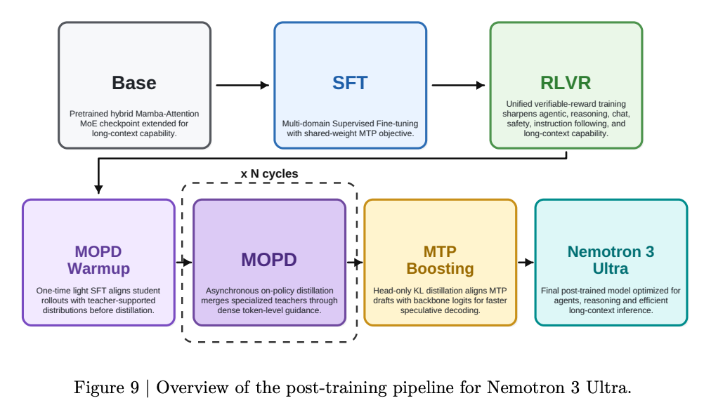
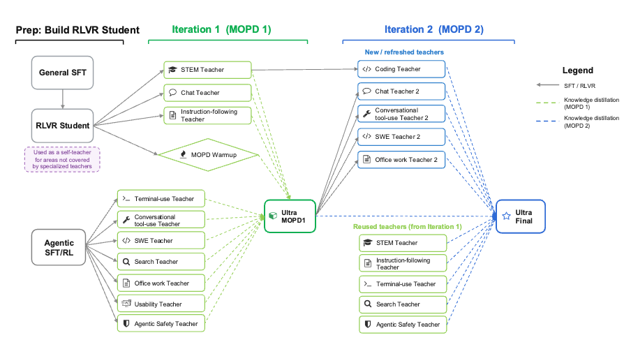

# Nemotron 3 Ultra Training Recipe

Pretraining and packed SFT support for Nemotron 3 Ultra through the Nemotron CLI and runspec/NeMo-Run.


## Quick start

### Prerequisites

- Slurm execution profile in `env.toml` (see [Execution through NeMo-Run](../../nemo_runspec/nemo-run.md))
- A Ray-capable profile for `data prep` (tokenizes the open pretrain/SFT mixture)
- SFT: the default config consumes an externally packed Ultra3 SFT data artifact
- Training container images: build stage squashfs images from `nvcr.io/nvidia/nemo:26.04.01` with `nemotron kit slurm build`
- Hugging Face model id/path: `nvidia/NVIDIA-Nemotron-3-Ultra-550B-A55B-BF16`

Example `env.toml` profile:

```toml
[YOUR-CLUSTER]
executor = "slurm"
account = "YOUR-ACCOUNT"
partition = "batch"
nodes = 48
ntasks_per_node = 8
gpus_per_node = 8
mounts = ["/lustre:/lustre"]
```

### Validate job configs

```bash
uv run nemotron ultra3 pretrain -c tiny --run YOUR-CLUSTER --dry-run
uv run nemotron ultra3 sft -c tiny --run YOUR-CLUSTER --dry-run
```

## Stages

| Stage | Purpose | Guide |
|-------|---------|-------|
| 0 | [Pretraining](./pretrain.md) | Data prep + pretraining with Megatron-Bridge |
| 1 | [SFT](./sft.md) | Paper-style packed-Parquet SFT with Megatron-Bridge |
| 2 | [MOPD](./mopd.md) | RLVR + teacher panel + Multi-Teacher On-Policy Distillation with NeMo RL (GB200) |
| 3 | [Quantization](./quantization.md) | NVFP4 post-training quantization for Blackwell |

The post-training pipeline is **Base → SFT → RLVR → MOPD warmup → MOPD (×N cycles) → MTP boosting**:



## RL post-training is not fully replicated

The Ultra technical report's RL stage is a large, multi-step pipeline: it builds
an RLVR student, then runs **two MOPD iterations** over an evolving panel of
specialised teachers (STEM, chat, instruction-following, terminal/tool use, SWE,
search, office work, usability, agentic safety, coding, …), introducing new and
refreshed teachers in the second iteration while reusing a subset from the first.



We do **not** reproduce that full pipeline here, **because the intermediate
checkpoints it depends on have not been open-sourced.** Each MOPD iteration
distills from specialised teacher checkpoints that were themselves produced by
separate RL runs, and those per-teacher checkpoints (and the iteration-1 MOPD
checkpoint that iteration 2 builds on) are not part of the public release — so
the full two-iteration chain cannot be reconstructed end-to-end from open
artifacts alone.

Instead, [MOPD](./mopd.md) walks through a **representative single pass** —
Student RLVR → a small teacher panel → one MOPD stage — so you can see *how* each
step is wired and launched on GB200 (NeMo RL, aarch64). Use it as a runnable
reference for the mechanics, not a 1:1 reproduction of the report's
multi-iteration recipe or its results.

## Data prep

Ultra3 exposes a Ray `data prep` CLI group (like super3/nano3) that tokenizes the open mixture:

- `nemotron ultra3 data prep pretrain` → Megatron `bin/idx` from the two-phase Figure 4 blend.
- `nemotron ultra3 data prep sft` → packed Parquet from the open SFT families.

Training consumes the result via `data.per_split_data_args_path`. New-for-Ultra pretrain data uses the
released `Nemotron-Pretraining-Specialized-v1.2` and `Nemotron-Pretraining-Legal-v1` repos.

### Long-context phase (not included)

The 1M-context LC phase is **not included** because its data (46% long-context document-QA reused from
Super & Nano + synthetic long-context SFT-style data) is not open-source. See
[pretrain.md](./pretrain.md#long-context-phase-not-included) for how to replicate it from the Phase 2
checkpoint with your own long-context corpus.

## Megatron-Bridge

The pretrain and SFT stages wrap the Megatron-Bridge Ultra recipes. For direct execution and the
upstream Slurm examples (conversion, inference, pretraining, packed SFT/PEFT), see the
[Ultra examples on the `nemotron_3_ultra` branch](https://github.com/NVIDIA-NeMo/Megatron-Bridge/tree/nemotron_3_ultra/examples/models/nemotron/nemotron_3/ultra).

## Execution options

| Option | Behavior |
|--------|----------|
| `--run <profile>` | Submit attached through NeMo-Run |
| `--batch <profile>` | Submit detached through NeMo-Run |
| `--dry-run` | Build and print the job config without submitting |
| `-c <config>` | Select a stage config such as `tiny` |

```{toctree}
:hidden:

pretrain.md
sft.md
mopd.md
quantization.md
```
