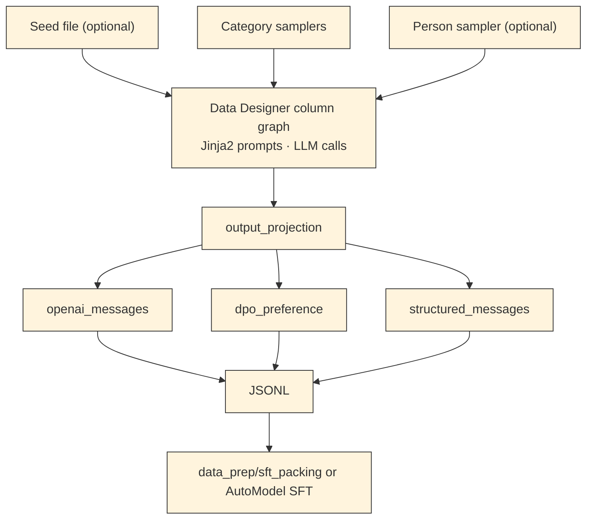

<!--
SPDX-FileCopyrightText: Copyright (c) 2026 NVIDIA CORPORATION & AFFILIATES. All rights reserved.
SPDX-License-Identifier: Apache-2.0

Licensed under the Apache License, Version 2.0 (the "License");
you may not use this file except in compliance with the License.
You may obtain a copy of the License at

http://www.apache.org/licenses/LICENSE-2.0

Unless required by applicable law or agreed to in writing, software
distributed under the License is distributed on an "AS IS" BASIS,
WITHOUT WARRANTIES OR CONDITIONS OF ANY KIND, either express or implied.
See the License for the specific language governing permissions and
limitations under the License.
-->

(sdg-index)=
# About Synthetic Data Generation

Generate synthetic training data with [NeMo Data Designer](https://nvidia-nemo.github.io/DataDesigner/) using a declarative YAML pipeline. Seed a generation run with your domain-specific topics, scenarios, or personas; define the column structure and prompts in YAML; and produce training-ready JSONL without writing Python.

Three output shapes ship out of the box: SFT chat data, tool-calling SFT data, and DPO preference pairs.

:::{tip}
New to SDG or new to model training? Read {doc}`using-skills` for a short guide to productive agent sessions, then start the {doc}`getting-started` tutorial to run the bundled pipeline and produce your first dataset in 5 to 10 minutes.
:::

## When to Use

Use SDG when you need training data that does not already exist in sufficient quantity or quality for your target domain or task.

- **SFT chat data** — Generate user/assistant conversation pairs grounded in domain-specific topics, scenarios, or personas. Use `default.yaml` as a starting point and adapt it to your domain.
- **Tool-calling SFT data** — Generate multi-turn conversations that include assistant tool calls and tool responses in OpenAI format. Use `customer_support_tools.yaml` as a starting point.
- **DPO preference data** — Generate prompt / chosen / rejected triples for preference learning. Use `rl_pref.yaml`.
- **Custom domains** — Swap the seed file, category columns, and prompts to target any domain. The pipeline is fully declarative; customisation does not require editing Python.
- **Cluster-scale generation** — Dispatch generation to Lepton or Slurm via env.toml profiles when local throughput is insufficient.

## Pipeline at a Glance



Each run is reproducible: the seed file, column specs, model alias, inference parameters, and projection rules are all version-controlled in a single YAML file.

## Documentation

::::{grid} 1 2 2 2
:gutter: 1 1 1 2

:::{grid-item-card} {octicon}`rocket;1.5em;sd-mr-1` Getting Started
:link: getting-started
:link-type: doc
Run the bundled pipeline end-to-end: preview two records, generate five, inspect the output JSONL.
+++
{bdg-success}`5–10 min` {bdg-secondary}`tutorial`
:::

:::{grid-item-card} {octicon}`heart;1.5em;sd-mr-1` Use the SDG Skill With Confidence
:link: using-skills
:link-type: doc
Prepare for a focused chat with a coding agent: opening brief, seed ideas, and how `SKILL.md` supports the session without memorization.
+++
{bdg-success}`10 min read` {bdg-secondary}`newcomer`
:::

:::{grid-item-card} {octicon}`checklist;1.5em;sd-mr-1` How-To Guides
:link: how-to/index
:link-type: doc
Task-focused guides: adapt the pipeline to a domain, generate preference pairs, dispatch to a cluster.
+++
{bdg-success}`5 guides` {bdg-secondary}`task-focused`
:::

:::{grid-item-card} {octicon}`list-unordered;1.5em;sd-mr-1` Reference
:link: reference/index
:link-type: doc
YAML config schema, CLI flags, output projection shapes, and troubleshooting.
+++
{bdg-success}`4 references` {bdg-secondary}`lookup`
:::

::::

## All Documentation

````{tab-set}

```{tab-item} Getting Started

| Guide | What You'll Do | Time |
|---|---|---|
| {doc}`getting-started` | Preview and generate your first synthetic SFT dataset | 5–10 min |
| {doc}`using-skills` | Run a productive agent session: brief, seeds, plain terms, and light use of `SKILL.md` | 10 min read |

```

```{tab-item} How-To Guides

| Guide | What You'll Do |
|---|---|
| {doc}`how-to/run` | Preview, generate, and customize output path and projection |
| {doc}`how-to/create-domain-dataset` | Adapt the pipeline to a custom domain with a seed file and multiple category dimensions |
| {doc}`how-to/tool-call-data` | Generate multi-turn tool-calling SFT data |
| {doc}`how-to/preference-data` | Generate DPO preference pairs from `rl_pref.yaml` |
| {doc}`how-to/dispatch-to-cluster` | Dispatch generation to Lepton or Slurm via env.toml |

```

```{tab-item} Reference

| Reference | What You'll Find |
|---|---|
| {doc}`reference/config-schema` | Full YAML column types, sampler parameters, and projection fields |
| {doc}`reference/cli-reference` | `nemotron steps run sdg/data_designer` flags and hydra overrides |
| {doc}`reference/output-projections` | The three projection shapes with annotated JSONL examples |
| {doc}`reference/troubleshooting` | Dispatch failures, image pull errors, API key issues, schema drift |

```

````

## Before You Start

- The `NVIDIA_API_KEY` environment variable is required for the default model, `nvidia/nemotron-3-nano-30b-a3b`, hosted on integrate.nvidia.com.

## Limitations and Considerations

- **Cost**: Generation calls a hosted LLM endpoint; each record incurs API cost.
- **Quality**: After generating records, review them before training.
- **Scale**: API rate limits apply. For large generation runs, dispatch to a cluster and consider batching across multiple nodes.
- **Reproducibility**: Seed files, column specs, model aliases, and inference parameters should all be version-controlled together. Changing any one of them changes the output distribution.
