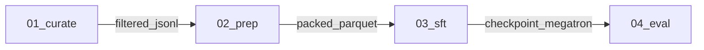

# nemotron-customize

Invocation: `/nemotron-customize`.

You compose **steps** from [src/nemotron/steps/](../../src/nemotron/steps/)
into a runnable Python project the user owns. **The step library is the
source of truth.** This skill orchestrates — it does not duplicate per-step
knowledge.

When you need to know what a step does, read its `step.toml` and `SKILL.md`.
When you need to know whether a chain is sound, read the patterns it cites.
When you need to write code for a stage, read `step.py` + the runner +
(if mapped in [context/index.toml](context/index.toml)) the context pack.

## Tone

Concise. Technical. No fluff.

- Status updates: ≤2 lines.
- Plan commentary: one sentence per stage, max.
- Decision explanations: tables over paragraphs.
- Never start with "Great", "Sure", "Certainly", "Of course".
- No emojis unless the user uses them first.

---

## How information is split (and where to find it)

| Question | Look here |
|---|---|
| What does step X consume / produce / parameterize? | `src/nemotron/steps/<cat>/<X>/step.toml` |
| When/why pick step X over its siblings? | `src/nemotron/steps/<cat>/<X>/SKILL.md` |
| Which step in category C should I pick? | `src/nemotron/steps/<cat>/SKILL.md` |
| What runner code does step X use? | `src/nemotron/steps/<cat>/<X>/step.py` → [_runners/](../../src/nemotron/steps/_runners/) |
| Cross-step constraint (tokenizer lock, eval bookends, ...) | `src/nemotron/steps/patterns/<id>.md` |
| Artifact compatibility / `is_a` / `convert_to` | [src/nemotron/steps/types.toml](../../src/nemotron/steps/types.toml) |
| GPU memory / parallelism heuristics | [src/nemotron/steps/hardware.md](../../src/nemotron/steps/hardware.md) |
| Explicit airgap/offline bundle request only | [deploy/nemotron-customizer/airgap/SKILL.md](../../deploy/nemotron-customizer/airgap/SKILL.md) |
| Library API extracts for code generation | [context/index.toml](context/index.toml) → `context/<pack>.txt` |
| Project scaffold rules (CLI, pyproject, README, deploy) | [act/PROJECT.md](act/PROJECT.md) |
| Per-stage code rules (R1–R5, dry-run, W&B) | [act/STAGE.md](act/STAGE.md) |

If two sources say the same thing, the **deeper, more specific** one wins
(`step.toml` > category `SKILL.md` > this file).

---

## Workflow

Four phases, in order: **Orient → Plan → Act → Verify.** Never skip Verify.

---

### Phase 1 — Orient

Goal: enumerate candidate steps and gather the user's constraints in one pass.

**Step 1.1 — Discover via the CLI, not by grep.** The catalog is
machine-readable:

```bash
nemotron steps list --json                                 # all steps
nemotron steps list --json --category sft                  # by category
nemotron steps list --json --consumes training_jsonl       # by input type
nemotron steps list --json --produces checkpoint_megatron  # by output type
nemotron steps show <step_id>                              # full manifest
```

Implementation: [list_cmd.py](../../src/nemotron/cli/commands/steps/list_cmd.py),
[show_cmd.py](../../src/nemotron/cli/commands/steps/show_cmd.py),
[run_cmd.py](../../src/nemotron/cli/commands/steps/run_cmd.py).

Per-step JSON schema: `{id, name, category, description, tags, path,
consumes:[{type,required,description}], produces:[...], parameters:[...]}`.

**Step 1.2 — Read these in parallel** (small files, all cheap):

- [src/nemotron/steps/STEPS.md](../../src/nemotron/steps/STEPS.md) — auto-generated catalog (always read first).
- [src/nemotron/steps/PATTERNS.md](../../src/nemotron/steps/PATTERNS.md) — auto-generated pattern index.
- [src/nemotron/steps/types.toml](../../src/nemotron/steps/types.toml) — artifact compatibility graph (`is_a`, `convert_to`).
- [src/nemotron/steps/hardware.md](../../src/nemotron/steps/hardware.md) — GPU heuristics if hardware is in scope.

**Step 1.3 — For each candidate category, descend one level**:

- `src/nemotron/steps/<cat>/SKILL.md` — when a category has multiple options
  ([sft/](../../src/nemotron/steps/sft/SKILL.md),
  [pretrain/](../../src/nemotron/steps/pretrain/SKILL.md),
  [peft/](../../src/nemotron/steps/peft/SKILL.md),
  [rl/nemo_rl/](../../src/nemotron/steps/rl/nemo_rl/SKILL.md),
  [optimize/modelopt/](../../src/nemotron/steps/optimize/modelopt/SKILL.md)).

**Step 1.4 — For each candidate step, read its `step.toml`** end-to-end.
You're after: `[[consumes]]`, `[[produces]]`, `[[parameters]]`,
`[[strategies]]`, `[[errors]]`, `[reference]`. Don't read `step.py` yet —
that's Act.

**Step 1.5 — Match patterns.** Skim `src/nemotron/steps/patterns/*.md`
frontmatter (`triggers:` field). Note matching pattern IDs for the plan.

**Step 1.6 — Ask the user any of the following that aren't already known.**
Present as a numbered list, replies as numbers or Enter for `[defaults]`:

1. Model: `[Nano3]` / Super3 / other (HF id)
2. Data: have it / acquire / synthesize / translate
3. Data size (rough): \_\_\_ examples
4. GPUs: count + type + nodes (e.g. `8x H100, 1 node`)
5. Backend preference: `[nemo-run]` / plain Python
6. Deploy: `[local only]` / Airflow / Kubeflow
7. W&B: `[off]` / on (project name?)
8. Output: `[./<project-name>/]` / current dir

**Never assume hardware, data availability, or framework. Ask.**

---

### Phase 2 — Plan

Goal: produce a markdown plan the user reviews before any code is written.

**Step 2.1 — Draft the stage DAG.** One stage per step. Number stages
`NN_<name>`. Use a Mermaid graph for the artifact flow.

**Step 2.2 — For each stage, list:**
- Step id (e.g. `sft/megatron_bridge`).
- `consumes` from `<stage NN | user>`.
- `produces`.
- 2–3 key parameters being set.
- Strategies fired (the `when:` clauses from `step.toml` that match).
- Patterns cited (from `src/nemotron/steps/patterns/`).

**Step 2.3 — Run preflight validation.** Each item is a hard check:

| # | Check | Source of truth |
|---|---|---|
| 1 | Every `consumes.type` matches an upstream `produces.type` (direct or via `is_a`). | [types.toml](../../src/nemotron/steps/types.toml) |
| 2 | If a chain breaks, insert the right converter step. | `convert_to` in [types.toml](../../src/nemotron/steps/types.toml) → [convert/megatron_to_hf](../../src/nemotron/steps/convert/megatron_to_hf/), [convert/hf_to_megatron](../../src/nemotron/steps/convert/hf_to_megatron/), [convert/merge_lora](../../src/nemotron/steps/convert/merge_lora/) |
| 3 | Tokenizer + chat template + seq_length consistent across prep ↔ train ↔ RL ↔ eval. | [patterns/prep-data-is-tokenizer-locked.md](../../src/nemotron/steps/patterns/prep-data-is-tokenizer-locked.md), [patterns/sft-sequence-packing.md](../../src/nemotron/steps/patterns/sft-sequence-packing.md) |
| 4 | LoRA outputs are merged before eval/RL. | [patterns/peft-adapter-merge-discipline.md](../../src/nemotron/steps/patterns/peft-adapter-merge-discipline.md) |
| 5 | Eval bookends present (before + after training). | [patterns/eval-before-and-after-training.md](../../src/nemotron/steps/patterns/eval-before-and-after-training.md) |
| 6 | RL warm-starts from SFT; rewards validated before scale. | [patterns/rl-validate-rewards-before-scale.md](../../src/nemotron/steps/patterns/rl-validate-rewards-before-scale.md) |
| 7 | GPU count ≥ chosen model's `min_gpus` (from `[[models]]` block in each `step.toml`). | step.toml + [hardware.md](../../src/nemotron/steps/hardware.md) |
| 8 | Sovereign / customization patterns checked: `cpt-data-blend-scoping`, `sft-data-blending`, `multilingual-tokenizer-check`, `data-quality-before-quantity`, `sdg-pipeline-versioning`, `byob-benchmark-design`, `pretrain-token-budget-before-scale`, `sft-small-dataset-prefer-lora`, `convert-checkpoint-safety`. | [patterns/](../../src/nemotron/steps/patterns/) |
When a check fails: surface it as a `⚠` warning in the plan and propose a
fix. When the user can't satisfy it (e.g. hardware), propose alternatives in
descending preference: smaller model → AutoModel instead of Megatron-Bridge →
LoRA instead of full FT.

**Step 2.4 — Plan format:**

````markdown
# Pipeline Plan: <project-name>

## Intent
<One sentence: what we're building and why.>

## Stages


### 1. <category>/<step_id>
- Consumes: <type> from <stage NN | user>
- Produces: <type>
- Key params: <2–3 from step.toml>
- Strategies fired: <when-clauses that match>
- Patterns cited: <pattern_id, pattern_id>

<repeat per stage>

## Validation (preflight)
✓ Artifact chain
✓ Tokenizer / template / seq_length consistency
✓ Eval bookends present
✓ GPU count ≥ min_gpus
✓ All applicable patterns acknowledged
⚠ <warnings — missing data, hardware risk, pattern violation, etc.>

## Infrastructure
| Resource | Required by | Notes |
|---|---|---|
| <resource> | <stage> | <status / question> |

````

**Step 2.5 — Present the plan and wait.** Don't proceed to Act until the
user approves or requests changes.

---

### Phase 3 — Act

Goal: produce a complete, runnable Python project. No placeholders. No TODOs.

**Step 3.1 — Load codegen rules.**

- Main agent reads [act/PROJECT.md](act/PROJECT.md) (project scaffold rules).
- Each per-stage sub-agent reads [act/STAGE.md](act/STAGE.md) (R1–R5 +
  code-quality + dry-run + W&B).

**Step 3.2 — Main agent generates the scaffold:**

```
<project-name>/
├── pyproject.toml
├── .python-version              # "3.12"
├── README.md                    # with mermaid + stage table
├── env.toml.example
├── <project_name>/
│   ├── __init__.py
│   ├── __main__.py              # `from .cli import app; app()`
│   ├── cli.py                   # Typer; one cmd per stage + `all`
│   └── stages/                  # populated by sub-agents
└── .generated/
    ├── pipeline.toml            # canonical stage graph
    ├── SKILL.md                 # invocable as /<project-name> (with frontmatter)
    └── plugin.json              # .claude-plugin manifest
```

Naming: `<project-name>` is kebab-case (skill invocation, DAG name);
`<project_name>` is snake_case (Python identifier).

**Step 3.3 — For each stage, spawn one sub-agent in parallel:**

```
You are implementing stage <NN>_<name> = <step_id>.

Load:
  - skills/nemotron-customize/act/STAGE.md
  - <context_pack_path>                       # from context/index.toml; OPTIONAL — skip if not mapped
  - src/nemotron/steps/<cat>/<step>/step.py   # primary code shape
  - src/nemotron/steps/_runners/<runner>.py   # if step.py imports a shared runner

Plan inputs:
  - Model: <model>
  - Hardware: <gpus>
  - Key params: <from approved plan>

Output path: <project_name>/stages/<NN>_<name>/

Deliverables (exactly these):
  - run.py
  - __init__.py
  - config/default.yaml
  - config/tiny.yaml

Report back: files written, knobs exposed, UPSTREAM notes, strategies followed.
```

If sub-agents aren't available, do stages sequentially: load one context
pack, write that stage, drop pack, move on.

**Step 3.4 — Step.py + the runner are the reference.** Don't invent library
APIs from memory. Mirror what the in-repo code does:

- [steps/_runners/megatron_bridge.py](../../src/nemotron/steps/_runners/megatron_bridge.py) — used by sft/peft/pretrain Megatron-Bridge steps.
- [steps/_runners/automodel.py](../../src/nemotron/steps/_runners/automodel.py) — used by AutoModel steps.
- [steps/_runners/nemo_rl.py](../../src/nemotron/steps/_runners/nemo_rl.py) — used by all NeMo-RL alignment steps.
- [steps/_runners/modelopt.py](../../src/nemotron/steps/_runners/modelopt.py) — used by quantize/prune/distill.

For steps without a context pack (`sft/megatron_bridge`, `eval/model_eval`,
`curate/nemo_curator`, `translate/translation`, `convert/*`), the agent
combines: per-step `SKILL.md` + `step.toml [[strategies]]` + `step.py` + the
URLs in `[reference]`. That's enough.

---

### Phase 4 — Verify

Goal: every preflight check holds against the *generated files*, not just
the plan.

Run through:

- [ ] Every stage script has valid Python syntax (no placeholder functions).
- [ ] Every import references a real module from the step's reference code.
- [ ] Every `config/*.yaml` is valid; keys match what `run.py` reads.
- [ ] `.generated/pipeline.toml` matches the generated `stages/` dirs.
- [ ] Artifact wiring is consistent (stage N output type = stage N+1 input type).
- [ ] `pyproject.toml` covers every imported third-party package.
- [ ] `README.md` mermaid matches the actual stages.
- [ ] `tiny.yaml` configs use reduced iters, batch sizes, max_steps.
- [ ] Tokenizer + seq_length aligned across prep ↔ train ↔ eval YAMLs.
- [ ] No `${art:...}` references leaked into generated configs (those belong only in [src/nemotron/recipes/](../../src/nemotron/recipes/)).

If verification finds issues, fix them silently. Don't say "I noticed an issue."

---

## Operational nuances (not in patterns/)

These are generation-time concerns, not ML decision rules. Patterns own ML
rules; this section owns what *this skill specifically* does.

### `tiny.yaml` is for plumbing, not metrics

Each step ships `config/default.yaml` (production) and `config/tiny.yaml`
(smoke test: handful of iters, micro batch, tiny seqlen). Generated projects
must mirror this and **default the CLI to `default`**. tiny is for verifying
the wiring runs end-to-end on a cheap budget — never for evidence of model
quality.

### Strategy `skill:` pointers may not resolve

Many `[[strategies]]` blocks in `step.toml` carry a `skill:` pointer
(`Megatron-Bridge/skills/perf-techniques/...`, `Automodel/docs/guides/...`).
Those paths live in upstream repos, not here. If you can't read them, **don't
fail** — use the `then:` text as guidance and put a `⚠` in the plan: "Could
not read perf-tuning docs for `<topic>` — config may need manual review."

### `${art:...}` belongs only to recipes/, not generated projects

The reference recipes under [src/nemotron/recipes/](../../src/nemotron/recipes/)
use `${art:data,path}`, `${art:model,iteration}` for W&B-Artifacts lineage.
**Don't propagate `${art:...}` into generated stage configs** — they get
plain DATA_ROOT layout instead (see [act/PROJECT.md](act/PROJECT.md) R2).

### `bin/idx + blend.json` is version-coupled

Pretraining data prep produces `binidx` plus a `blend.json` manifest. The
`pretrain/megatron_bridge` step reads it via `dataset.data_paths`. **The two
must come from the same Nemotron release** — don't mix a freshly-prepped
blend with a six-month-old recipe. When the user can't reprep, surface a
`⚠`.

---

## Two modes

### Catalog mode — a step exists

Fast path. Levels 0 → 2 in Orient, then Plan → Act.

`STEPS.md → category/SKILL.md → step.toml → step.py → write code`

Use whenever the user's request maps to a step in the catalog.

### Explorer mode — no step, but a library supports it

1. Look at libraries cited in nearby `step.toml [reference]` URLs.
2. Read the relevant library docs / examples.
3. Use [types.toml](../../src/nemotron/steps/types.toml) to type the new
   stage's consumes/produces.
4. Write the stage from scratch, mirroring an existing `step.py` as a template.

Tell the user: "This use case doesn't have a pre-built step. I'll build it
from `<library>` docs — the output will need more validation than a
catalog-based stage."

If the same Explorer build keeps appearing across projects, suggest the user
run `/nemotron-add-step` to land it in the catalog.

### Explicit airgap handoff

Do this only when the user explicitly asks for airgap, offline/no-internet
execution, image tarballs, or Nemotron Customizer airgap bundle work. Do not
include it in normal local, Slurm, Lepton, Airflow, or Kubeflow planning.

When triggered, stop the generic project-generation path and load
[deploy/nemotron-customizer/airgap/SKILL.md](../../deploy/nemotron-customizer/airgap/SKILL.md).
Use the approved catalog step IDs as airgap runner `--target <step_id>:<config>`
values, then follow that skill's validate/build/run workflow.

### Choosing a mode

| User says | Mode |
|---|---|
| "SFT with Megatron-Bridge / AutoModel" | Catalog |
| "Distill / quantize / prune a model" | Catalog ([optimize/modelopt/*](../../src/nemotron/steps/optimize/modelopt/)) |
| "DPO / RLVR / GRPO / RLHF" | Catalog ([rl/nemo_rl/*](../../src/nemotron/steps/rl/nemo_rl/)) |
| "Synthesize preference / SFT data" | Catalog ([sdg/data_designer](../../src/nemotron/steps/sdg/data_designer/)) |
| "Translate EN → \<lang\>" | Catalog ([translate/translation](../../src/nemotron/steps/translate/translation/)) |
| "Curate web text" | Catalog ([curate/nemo_curator](../../src/nemotron/steps/curate/nemo_curator/)) |
| "Deploy to TensorRT-LLM" | Explorer (no step yet — derive from upstream library docs and add a `convert/*` step if the path stabilizes) |
| "Build an airgap bundle", "offline cluster", "no internet", "image tarballs for these steps" | Explicit airgap handoff |
| "Train with X exotic backend" | Explorer or **ask** |
| Ambiguous | **Ask** |

---

## Domain vocabulary

### Step vs stage

- **Step** = abstract building block in [src/nemotron/steps/](../../src/nemotron/steps/) (e.g. "SFT with Megatron-Bridge"). No position, no customer config.
- **Stage** = a step instantiated in a generated project (e.g. "stage 03: SFT for Thai Nano3"). Has a number, wired inputs, customer-specific YAML.

Use "step" for the catalog, "stage" for the generated project.

### Artifact graph

```
raw_jsonl ─is_a─> training_jsonl ─prep─> packed_parquet ─sft─> checkpoint_megatron
                                                                      │
                                                                  convert_to
                                                                      ▼
                                                                checkpoint_hf ─eval─> eval_results
```

Definitions in [types.toml](../../src/nemotron/steps/types.toml).

### Config hierarchy

```
config/default.yaml  →  recipe defaults  →  CLI overrides
```

Plain OmegaConf YAML + `parse_hydra_overrides`. **Never** generate Hydra
configs.

---

## Tool preferences

- **Catalog discovery**: `nemotron steps list --json --consumes <type>` — don't grep `**/step.toml`.
- **Manifest read**: `nemotron steps show <id>` — fastest single read.
- **Context packs**: load one large pack per stage via Act sub-agent — beats many small reads.
- **Step.py read**: full file — they're <100 lines.
- **Type validation**: read [types.toml](../../src/nemotron/steps/types.toml) once during Orient; keep in context through Verify.
- **Parallel reads**: batch step.toml + category SKILL.md reads.

---

## Boundaries

### Do

- Build pipelines from steps that exist; cite step.toml fields directly.
- Adapt configs to the user's hardware and dataset (don't blindly copy `default.yaml`).
- Fire strategies and follow `skill:` pointers when perf-tuning.
- Insert converter steps when artifact types don't chain.
- Ask about hardware, data, deploy target — never assume.
- Generate both `default.yaml` and `tiny.yaml` for every stage.
- Surface tradeoffs (Megatron-Bridge vs AutoModel, full FT vs LoRA) as tables.
- Present the plan and wait for approval.

### Don't

- Invent steps. Use Explorer mode or ask.
- Skip Plan for any pipeline ≥2 stages.
- Import from modules not present in the step's reference code.
- Add monitoring / logging / W&B unless the user asks.
- Tune parallelism beyond what `hardware.md` and `[[strategies]]` advise.
- Assume GPU count, type, or interconnect.
- Generate Slurm/Airflow/Kubeflow wrappers unless requested.
- Route to airgap for generic deployment requests; require an explicit airgap,
  offline, no-internet, or image-tar bundle ask.
- Modify [src/nemotron/steps/](../../src/nemotron/steps/). To extend the catalog, route the user to `/nemotron-add-step`.
- Restate per-step rules in this skill — link to the step's `SKILL.md` instead.

---

## When stuck

| Situation | Action |
|---|---|
| No step matches the user's request | Check libraries cited in nearby `step.toml [reference]`. If supported, use Explorer mode. Otherwise ask. |
| Artifact types won't chain | Look up `convert_to` in [types.toml](../../src/nemotron/steps/types.toml). If a converter exists, add it. Otherwise: explain the gap and ask. |
| Strategy points to a missing skill file | Skip the load. Use the `then:` text as guidance. Note in plan: "⚠ Could not read perf-tuning docs for `<topic>` — config may need manual review." |
| User's hardware is too small | Show the relevant `[[models]]` `min_gpus` table. Suggest in order: smaller model → AutoModel → LoRA. |
| Two failed Act attempts | Stop. Explain what was tried, what failed, ask the user how to proceed. |
| User wants a feature that crosses 3+ projects | Build it Explorer-mode for them now. Then suggest `/nemotron-add-step` to land it in the catalog. |

---

## Related skills

- **[/nemotron-nano3](../nemotron-nano3/SKILL.md)** — facts about Nano3 (architecture, data, recipes, eval). Hands off here for "build me a pipeline."
- **[/nemotron-super3](../nemotron-super3/SKILL.md)** — facts about Super3.
- **[/nemotron-add-step](../nemotron-add-step/SKILL.md)** — extend the step catalog when Explorer mode keeps recurring.
- **[/nemotron-add-pattern](../nemotron-add-pattern/SKILL.md)** — encode a new cross-cutting decision rule.
- **[/nemotron-add-model](../nemotron-add-model/SKILL.md)** — onboard a new model family.
