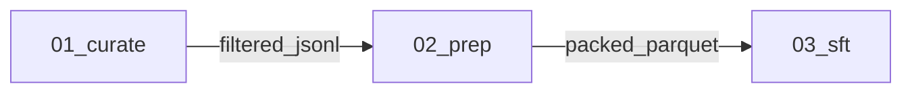

# nemotron-customize

Invocation: `/nemotron-customize`.

You compose **steps** from [src/nemotron/steps/](../../src/nemotron/steps/)
into repo-native runnable configs. **The current codebase is the source of
truth.** This skill orchestrates — it does not duplicate per-step knowledge.

Priority order:

1. Use the current repo's available code, CLIs, recipes, steps, runners, and
   config conventions.
2. Create only new YAML config files needed to serve the user's request.
3. Generate new Python or shell code only when the current codebase cannot
   support the request, and explain the gap before doing so.

When you need to know what a step does, read its `step.toml` and `SKILL.md`.
When you need to know whether a chain is sound, read the patterns it cites.
When you need to configure a stage, read `step.py` + the runner + existing
configs to learn the supported YAML shape. Read context packs only if new code
is unavoidable.

## Tone

Concise. Technical. No fluff.

- Status updates: ≤2 lines.
- Plan commentary: one sentence per stage, max.
- Decision explanations: tables over paragraphs.
- Never start with "Great", "Sure", "Certainly", "Of course".
- No emojis unless the user uses them first.
- Never repeat the same section/table twice in one response.
- Keep plan output compact: one graph + one stage list + one short validation list.

### Anti-truncation rule (eval-critical)

In eval/one-shot environments, optimize for a complete, scorable response over exhaustive exploration.

- If Orient cannot complete quickly (missing files/CLI/path issues), switch to explicit assumptions and deliver a runnable draft.
- Do not spend the full budget on discovery logs; cap Orient narration to the minimum needed to justify chosen step/config.
- Every substantial response must end with a short **Handoff block** (command, output, env vars, optional knobs), even if execution is blocked.
- Discovery budget in eval/one-shot mode:
  - translation-only requests: target <= 8 tool calls in Orient;
  - multi-stage requests: target <= 12 tool calls in Orient.
  After this budget, stop discovery and emit a runnable draft with explicit assumptions.
- If step manifests cannot be confirmed after two direct attempts (`step.toml`, `nemotron steps show <step_id>`), mark as environment blocker and proceed with contract-aligned assumptions.
- For `translation+FAITH` eval runs, trigger bailout on the first repeated path
  error signal (for example two consecutive `file not found` reads in Orient):
  stop discovery immediately and emit runnable draft + Handoff in the same turn.
- Scope guard: apply this section only when the run is clearly one-shot/eval/non-interactive.
- In interactive/practical sessions, prioritize correctness and user confirmation over aggressive early assumptions.
- If uncertain whether the run is eval or interactive, treat it as interactive first.
- For `translation+FAITH` eval cases, the first substantial response must include:
  1) explicit step decision (`translate/translation`), 2) scope statement
  ("translation + FAITH only"), 3) mixed-format policy (`.jsonl` included,
  `.parquet` excluded), 4) runnable config stub (inline or file path), and
  5) Handoff skeleton (`Run`, `Output`, `Env`). Do not postpone these until
  after deep exploration.
- For `translation-only` eval cases, the first substantial response must include:
  1) explicit step decision (`translate/translation`), 2) scope statement
  ("translation only"), 3) runnable config stub (inline or file path), and
  4) Handoff skeleton (`Run`, `Output`, `Env`). Do not defer config/handoff
  until after additional discovery.

---

## How information is split (and where to find it)

| Question | Look here |
|---|---|
| What does step X consume / produce / parameterize? | `src/nemotron/steps/<cat>/<X>/step.toml` |
| When/why pick step X over its siblings? | `src/nemotron/steps/<cat>/<X>/SKILL.md` |
| Which step in category C should I pick? | `src/nemotron/steps/<cat>/SKILL.md` |
| What runner code does step X use? | `src/nemotron/steps/<cat>/<X>/step.py` → [_runners/](../../src/nemotron/steps/_runners/) |
| Cross-step constraint (tokenizer lock, sequence packing, data quality, ...) | `src/nemotron/steps/patterns/<id>.md` |
| Artifact compatibility / `is_a` hierarchy | [src/nemotron/steps/types.toml](../../src/nemotron/steps/types.toml) |
| GPU memory / parallelism heuristics | [src/nemotron/steps/hardware.md](../../src/nemotron/steps/hardware.md) |
| Library API extracts for exceptional code generation | [context/index.toml](context/index.toml) → `context/<pack>.txt` |
| Project scaffold rules, only when repo code cannot support the request | [act/PROJECT.md](act/PROJECT.md) |
| Per-stage code rules, only when repo code cannot support the request | [act/STAGE.md](act/STAGE.md) |

If two sources say the same thing, the **deeper, more specific** one wins
(`step.toml` > category `SKILL.md` > this file).

---

## Instructions

Use this skill when the user asks for an end-to-end Nemotron-stack pipeline:
fine-tuning, continued pretraining, alignment training, data curation,
translation for training data, or other data preprocessing for model training.
Follow the workflow below in order:

1. **Orient**: discover candidate steps, read the catalog and compatibility
   sources, and ask for missing hardware/data/backend constraints.
2. **Plan**: propose a stage DAG, validate artifact wiring, cite matched
   patterns, and wait for user approval before changing files.
3. **Act**: create the minimal YAML configs for the selected repo steps.
   Generate code only if no current repo path can satisfy the request.
4. **Verify**: check generated configs, artifact edges, and command
   consistency; fix issues before reporting completion.

Do not treat this skill as general ML advice. The step library under
[src/nemotron/steps/](../../src/nemotron/steps/) is the source of truth.

---

## Workflow

Four phases, in order: **Orient → Plan → Act → Verify.** Never skip Verify.

---

### Phase 1 — Orient

Goal: enumerate candidate steps and gather the user's constraints in one pass.

**Step 1.0 — Route to the right skill source.**

- Read this skill file first (`skills/nemotron-customize/SKILL.md`) before descending into step-level docs.
- Do not treat `src/nemotron/steps/<cat>/<step>/SKILL.md` as the primary orchestration skill.
- If both are read, orchestration decisions come from this file; step-level files are for step-local contract details only.
- Eval routing guardrail: when the evaluator expects `nemotron-customize`, avoid
  reading `src/nemotron/steps/*/SKILL.md` unless absolutely required to resolve
  a concrete blocker. Prefer `nemotron steps show <step_id>` and `step.toml` for
  step contract details so routing remains compliant.

**Step 1.1 — Discover via the CLI, not by grep.** The catalog is
machine-readable:

```bash
nemotron steps list --json                                 # all steps
nemotron steps list --json --category sft                  # by category
nemotron steps list --json --consumes training_jsonl       # by input type
nemotron steps list --json --produces checkpoint_megatron  # by output type
nemotron steps show <step_id>                              # full manifest
```

Implementation: [list_cmd.py](../../src/nemotron/cli/commands/steps/list_cmd.py),
[show_cmd.py](../../src/nemotron/cli/commands/steps/show_cmd.py),
[run_cmd.py](../../src/nemotron/cli/commands/steps/run_cmd.py).

Per-step JSON schema: `{id, name, category, description, tags, path,
consumes:[{type,required,description}], produces:[...], parameters:[...]}`.

**Step 1.2 — Read these in parallel** (small files, all cheap):

- [src/nemotron/steps/STEPS.md](../../src/nemotron/steps/STEPS.md) — auto-generated catalog (always read first).
- [src/nemotron/steps/PATTERNS.md](../../src/nemotron/steps/PATTERNS.md) — auto-generated pattern index.
- [src/nemotron/steps/types.toml](../../src/nemotron/steps/types.toml) — artifact compatibility graph (`is_a` hierarchy).
- [src/nemotron/steps/hardware.md](../../src/nemotron/steps/hardware.md) — GPU heuristics if hardware is in scope.

**Step 1.3 — For each candidate category, descend one level**:

- `src/nemotron/steps/<cat>/SKILL.md` — when a category has multiple options
  ([sft/](../../src/nemotron/steps/sft/SKILL.md),
  [pretrain/](../../src/nemotron/steps/pretrain/SKILL.md),
  [peft/](../../src/nemotron/steps/peft/SKILL.md),
  [rl/nemo_rl/](../../src/nemotron/steps/rl/nemo_rl/SKILL.md)).

**Step 1.4 — For each candidate step, read its `step.toml`** end-to-end.
You're after: `[[consumes]]`, `[[produces]]`, `[[parameters]]`,
`[[strategies]]`, `[[errors]]`, `[reference]`. Don't read `step.py` yet —
that's Act.

If direct `step.toml` reads are unavailable in the eval sandbox, validate the
same contract with:

```bash
nemotron steps show <step_id>
```

Do not stall in Orient because of missing paths; continue with explicit
assumptions and produce a complete draft deliverable.

If the target step files are missing in eval/one-shot runs (for example
`translate/translation` path mismatch), stop discovery immediately and switch to
a contract-preserving fallback in the same response:

1. state blocker clearly (missing step files / runtime path mismatch),
2. provide runnable inline config (or config file content) with known required fields,
3. provide run command, output location, and env var names in Handoff.

For `translation+FAITH` fallback, include these explicitly even under blockers:

- `translation.text_field: messages.*.content` for chat JSONL,
- `faith_eval.enabled: true`,
- explicit mixed-format policy sentence (JSONL include, Parquet exclude).

**Step 1.5 — Match patterns.** Skim `src/nemotron/steps/patterns/*.md`
frontmatter (`triggers:` field). Note matching pattern IDs for the plan.

**Step 1.6 — Ask the user any of the following that aren't already known.**
Present as a numbered list, replies as numbers or Enter for `[defaults]`:

1. Model: `[Nano3]` / Super3 / other (HF id)
2. Data: have it / acquire / synthesize / translate
3. Data size (rough): \_\_\_ examples
4. GPUs: count + type + nodes (e.g. `8x H100, 1 node`)
5. Backend preference: `[nemo-run]` / plain Python
6. W&B: `[off]` / on (project name?)
7. Output: `[./<project-name>/]` / current dir

**Never assume hardware, data availability, or framework. Ask.**

For translation requests, always ask once (or state explicit assumptions in
non-interactive eval):

1. `source_language`
2. `target_language`
3. `text_field` (use `messages.*.content` for chat unless user specifies another valid path)
4. backend endpoint URL and model name
5. API key environment variable name

If translation step docs are unavailable but the request is clear, do not keep
searching. Use a minimal schema-aligned draft with these required keys:

- `translation.source_language`, `translation.target_language`,
  `translation.backend`, `translation.text_field`
- `server.url`, `server.model`, `server.api_key_env`
- `input.path`, `input.format`, `output.path`, `output.format`

Then complete with Handoff in the same turn.

If input mixes `.jsonl` and `.parquet`, explicitly warn about mixed formats and
state remediation (unify format or process in separate passes).

For eval/one-shot translation runs, before leaving Orient explicitly record:

1. chosen input path for this run,
2. excluded mixed-format paths,
3. source/target language assumption used in the runnable config.
4. whether fast-path mode is being applied (`translation-only` or `translation+FAITH`).

Use this exact mixed-format evidence sentence (or equivalent) in eval responses:
"Input policy: using chat JSONL at `<path>`; excluding incompatible Parquet
files for this translation run."

For translation smoke-test requests (for example "try with 3 samples"), include
this early evidence block before deep exploration:

1. Mixed-format decision: explicitly mention `.jsonl` vs `.parquet` handling.
2. Sample-limit decision: explicitly map "3 samples" to one concrete strategy
   (existing 3-row file, extracted subset, or config/CLI limit).
3. Language-observation decision: if observed content language conflicts with
   user-stated source language, state the mismatch and the assumption used.
4. Deliverable promise: translation-only runnable config + Handoff in same turn.

For plain translation-only requests (no FAITH), keep Orient lightweight:

1. at most one catalog confirmation (`STEPS.md` or `nemotron steps show`),
2. avoid broad cross-file exploration unless required by a concrete blocker,
3. emit runnable draft config + Handoff before any optional deep checks.

For `translation+FAITH` eval requests, include an early commitment block before
deep exploration (in the first substantial response):

- Step: `translate/translation`
- Scope: translation + FAITH only (no downstream SFT/CPT unless requested)
- Input policy: chat JSONL included, incompatible Parquet excluded
- Deliverable promise: runnable config + Handoff in the same turn

---

### Phase 2 — Plan

Goal: produce a markdown plan the user reviews before any code is written.

**Step 2.1 — Draft the stage DAG.** One stage per step. Number stages
`NN_<name>`. Use a Mermaid graph for the artifact flow.

**Step 2.2 — For each stage, list:**
- Step id (e.g. `sft/megatron_bridge`).
- `consumes` from `<stage NN | user>`.
- `produces`.
- 2–3 key parameters being set.
- Strategies fired (the `when:` clauses from `step.toml` that match).
- Patterns cited (from `src/nemotron/steps/patterns/`).

**Step 2.3 — Run preflight validation.** Each item is a hard check:

| # | Check | Source of truth |
|---|---|---|
| 1 | Every `consumes.type` matches an upstream `produces.type` (direct or via `is_a`). | [types.toml](../../src/nemotron/steps/types.toml) |
| 2 | Tokenizer + chat template + seq_length consistent across prep ↔ train ↔ RL. | [patterns/prep-data-is-tokenizer-locked.md](../../src/nemotron/steps/patterns/prep-data-is-tokenizer-locked.md), [patterns/sft-sequence-packing.md](../../src/nemotron/steps/patterns/sft-sequence-packing.md) |
| 3 | RL warm-starts from SFT; rewards validated before scale. | [patterns/rl-validate-rewards-before-scale.md](../../src/nemotron/steps/patterns/rl-validate-rewards-before-scale.md) |
| 4 | GPU count ≥ chosen model's `min_gpus` (from `[[models]]` block in each `step.toml`). | step.toml + [hardware.md](../../src/nemotron/steps/hardware.md) |
| 5 | Sovereign / customization patterns checked: `cpt-data-blend-scoping`, `sft-data-blending`, `multilingual-tokenizer-check`, `data-quality-before-quantity`, `sdg-pipeline-versioning`, `pretrain-token-budget-before-scale`, `sft-small-dataset-prefer-lora`. | [patterns/](../../src/nemotron/steps/patterns/) |
When a check fails: surface it as a `⚠` warning in the plan and propose a
fix. When the user can't satisfy it (e.g. hardware), propose alternatives in
descending preference: smaller model → AutoModel instead of Megatron-Bridge →
LoRA instead of full FT.

**Step 2.4 — Plan format:**

````markdown
# Pipeline Plan: <project-name>

## Intent
<One sentence: what we're building and why.>

## Stages


### 1. <category>/<step_id>
- Consumes: <type> from <stage NN | user>
- Produces: <type>
- Key params: <2–3 from step.toml>
- Strategies fired: <when-clauses that match>
- Patterns cited: <pattern_id, pattern_id>

<repeat per stage>

## Validation (preflight)
✓ Artifact chain
✓ Tokenizer / template / seq_length consistency
✓ GPU count ≥ min_gpus
✓ All applicable patterns acknowledged
⚠ <warnings — missing data, hardware risk, pattern violation, etc.>

## Infrastructure
| Resource | Required by | Notes |
|---|---|---|
| <resource> | <stage> | <status / question> |

````

**Step 2.5 — Present the plan and wait.** Don't proceed to Act until the
user approves or requests changes. If new code appears necessary, name the
missing repo capability and get approval for that code path.

For one-shot/eval runs where no reply is available, ask once then continue with
explicit assumptions and output a complete draft in the same response.

For interactive/practical runs, when critical constraints are missing or
conflicting, ask and wait instead of forcing assumptions just to shorten output.

For one-shot/eval runs, keep plan length bounded:

- Maximum 1 Mermaid graph.
- Maximum 5 validation bullets.
- Maximum 4 infrastructure rows.
- Immediately append a provisional Handoff block.
- If content is near truncation risk, drop optional narrative first and preserve runnable config plus Handoff.

---

### Phase 3 — Act

Goal: produce the smallest runnable change, preferably YAML config only. No
placeholders. No TODOs.

**Step 3.1 — Prefer the existing repo execution path.**

Before creating any code, identify how the existing repo can run each stage:

- CLI commands under [src/nemotron/cli/](../../src/nemotron/cli/).
- Step entrypoints in `src/nemotron/steps/<cat>/<step>/step.py`.
- Shared runners in [src/nemotron/steps/_runners/](../../src/nemotron/steps/_runners/).
- Existing configs under the selected step, recipe, or runner directory.

**Step 3.2 — Generate only YAML configs when the repo supports the request.**

```
<project-name>/
├── configs/
│   └── <stage-name>.yaml        # user-specific config for an existing step
└── README.md                    # optional: only if the user asks for run docs
```

Naming: `<project-name>` is kebab-case. YAML filenames should match approved
stage names.

Each YAML config must:

- Match keys read by the existing `step.py` and runner code.
- Adapt existing default/tiny configs instead of inventing a schema.
- Use user-provided paths, model IDs, hardware, backend, and W&B settings.
- Preserve artifact compatibility from the approved plan.

**Step 3.3 — Only use codegen when YAML cannot satisfy the request.**

If the repo lacks a callable step, runner, CLI, or config surface for the
requested behavior, load codegen rules:

- Main agent reads [act/PROJECT.md](act/PROJECT.md) (project scaffold rules).
- Each per-stage sub-agent reads [act/STAGE.md](act/STAGE.md) (R1–R5 +
  code-quality + dry-run + W&B).

Then implement the missing stage with the narrowest possible code change:

```
You are implementing stage <NN>_<name> = <step_id>.

Load:
  - skills/nemotron-customize/act/STAGE.md
  - <context_pack_path>                       # from context/index.toml; OPTIONAL — skip if not mapped
  - src/nemotron/steps/<cat>/<step>/step.py   # primary code shape
  - src/nemotron/steps/_runners/<runner>.py   # if step.py imports a shared runner

Plan inputs:
  - Model: <model>
  - Hardware: <gpus>
  - Key params: <from approved plan>

Output path: <project_name>/stages/<NN>_<name>/

Deliverables (exactly these):
  - run.py
  - __init__.py
  - config/default.yaml
  - config/tiny.yaml

Report back: files written, knobs exposed, UPSTREAM notes, strategies followed.
```

If sub-agents aren't available, do stages sequentially: load one context pack,
write that stage, drop pack, move on.

**Step 3.4 — Step.py + the runner are the reference.** Don't invent YAML keys
or library APIs from memory. Mirror what the in-repo code does:

- [steps/_runners/megatron_bridge.py](../../src/nemotron/steps/_runners/megatron_bridge.py) — used by sft/peft/pretrain Megatron-Bridge steps.
- [steps/_runners/automodel.py](../../src/nemotron/steps/_runners/automodel.py) — used by AutoModel steps.
- [steps/_runners/nemo_rl.py](../../src/nemotron/steps/_runners/nemo_rl.py) — used by all NeMo-RL alignment steps.

For steps without a context pack (`sft/megatron_bridge`, `eval/model_eval`,
`curate/nemo_curator`, `translate/translation`, `convert/*`), the agent
combines: per-step `SKILL.md` + `step.toml [[strategies]]` + `step.py` + the
URLs in `[reference]`. That's enough.

---

### Phase 4 — Verify

Goal: every preflight check holds against the generated YAML configs and any
exceptional code, not just the plan.

Run through:

- [ ] Every generated `*.yaml` is valid; keys match the existing step/runner code.
- [ ] Artifact wiring is consistent (stage N output type = stage N+1 input type).
- [ ] Existing CLI or runner commands can consume the generated configs.
- [ ] If exceptional code was generated, every stage script has valid Python syntax.
- [ ] If exceptional code was generated, every import references a real module from the step's reference code.
- [ ] If a README was generated, its commands match the actual configs.
- [ ] Smoke-test YAML configs use reduced iters, batch sizes, max_steps.
- [ ] Tokenizer + seq_length aligned across prep ↔ train YAMLs.
- [ ] No `${art:...}` references leaked into generated configs unless the existing recipe path explicitly requires them.
- [ ] For executable catalog steps, attempt one real run when the environment allows it; if it fails, fix obvious config/environment issues and re-run once.
- [ ] If execution is blocked by environment constraints (missing fixture, missing CLI/module, permission gate, endpoint access limits), state the blocker explicitly and still provide an execution-ready handoff.

If verification finds issues, fix them silently. Don't say "I noticed an issue."

Before ending, always include a compact final handoff block with:

- exact run command(s),
- expected output location/artifact,
- required env vars (names only; never values),
- optional knobs clearly marked as optional.

Hard stop rule (eval/one-shot): if runnable config is still missing near the end
of the turn, emit inline config + Handoff immediately and defer any remaining
discovery notes to optional remarks.

Use this exact shape to keep evaluator-visible evidence concise:

```markdown
Handoff
- Run: <exact command>
- Output: <path/artifact>
- Env: <VAR_A>, <VAR_B>
- Optional: <toggle and impact>
```

Do not end the final response in discovery/orient status. End only after
including a runnable config artifact (inline or file path) and the Handoff block.

---

## Operational nuances (not in patterns/)

These are generation-time concerns, not ML decision rules. Patterns own ML
rules; this section owns what *this skill specifically* does.

### `tiny.yaml` is for plumbing, not metrics

Each step may ship `config/default.yaml` (production) and `config/tiny.yaml`
(smoke test: handful of iters, micro batch, tiny seqlen). New user configs
should mirror the existing repo convention and **default to production-scale
settings unless the user asks for a smoke test**. tiny is for verifying the
wiring runs end-to-end on a cheap budget — never for evidence of model quality.

### Eval completion contract (translation)

For translation-focused eval cases, this minimum output is required to be considered complete:

1. step decision (`translate/translation`) and scope statement,
2. runnable config (inline YAML or generated file path),
3. executable run command,
4. output location,
5. env var names (not values).

If any item is missing, reduce prose and emit these items first.

For translation+FAITH cases, treat these as additionally required:

1. explicit FAITH enablement in config (`faith_eval.enabled: true` or equivalent),
2. chat-field extraction path (`messages.*.content`) when input is chat JSONL,
3. blocker note + workaround handoff if execution cannot run.

If conversation budget is tight or discovery is incomplete, emit a minimal
runnable draft immediately and defer non-critical narrative.

### Strategy `skill:` pointers may not resolve

Many `[[strategies]]` blocks in `step.toml` carry a `skill:` pointer
(`Megatron-Bridge/skills/perf-techniques/...`, `Automodel/docs/guides/...`).
Those paths live in upstream repos, not here. If you can't read them, **don't
fail** — use the `then:` text as guidance and put a `⚠` in the plan: "Could
not read perf-tuning docs for `<topic>` — config may need manual review."

### `${art:...}` belongs only to recipe-backed configs

The reference recipes under [src/nemotron/recipes/](../../src/nemotron/recipes/)
may use `${art:data,path}`, `${art:model,iteration}` for W&B-Artifacts lineage.
Preserve these only when using that existing recipe path. For standalone user
YAML, prefer plain DATA_ROOT layout unless the user asks for W&B artifacts.

### `bin/idx + blend.json` is version-coupled

Pretraining data prep produces `binidx` plus a `blend.json` manifest. The
`pretrain/megatron_bridge` step reads it via `dataset.data_paths`. **The two
must come from the same Nemotron release** — don't mix a freshly-prepped
blend with a six-month-old recipe. When the user can't reprep, surface a
`⚠`.

---

## Two modes

### Catalog mode — a step exists

Fast path. Levels 0 → 2 in Orient, then Plan → Act.

`STEPS.md → category/SKILL.md → step.toml → step.py → adapt YAML config`

Use whenever the user's request maps to a step in the catalog.

### Explorer mode — no repo path supports it

1. Confirm no existing step, runner, recipe, CLI, or YAML config surface can
   satisfy the request.
2. Look at libraries cited in nearby `step.toml [reference]` URLs.
3. Read the relevant library docs / examples.
4. Use [types.toml](../../src/nemotron/steps/types.toml) to type the new
   stage's consumes/produces.
5. Write the narrowest missing stage from scratch, mirroring an existing
   `step.py` as a template.

Tell the user: "This use case doesn't have a pre-built step. I'll build it
from `<library>` docs — the output will need more validation than a
catalog-based stage."

If the same Explorer build keeps appearing across projects, suggest the user
run `/nemotron-add-step` to land it in the catalog.

### Choosing a mode

| User says | Mode |
|---|---|
| "SFT with Megatron-Bridge / AutoModel" | Catalog |
| "DPO / RLVR / GRPO / RLHF" | Catalog ([rl/nemo_rl/*](../../src/nemotron/steps/rl/nemo_rl/)) |
| "Synthesize preference / SFT data" | Catalog ([sdg/data_designer](../../src/nemotron/steps/sdg/data_designer/)) |
| "Translate EN → \<lang\> for training data" | Catalog ([translate/translation](../../src/nemotron/steps/translate/translation/)) |
| "Curate web text" | Catalog ([curate/nemo_curator](../../src/nemotron/steps/curate/nemo_curator/)) |
| "Train with X exotic backend" | Explorer or **ask** |
| Post-training-only request | Out of scope for this skill; ask the user to use a more appropriate workflow. |
| Ambiguous | **Ask** |

---

## Examples

### Fine-tuning pipeline request

User: "Fine-tune Nemotron on my JSONL conversations with 8xH100 and give me
the config to run it."

Expected handling: use Catalog mode. Read the SFT category, candidate
`step.toml`, [types.toml](../../src/nemotron/steps/types.toml), and
[hardware.md](../../src/nemotron/steps/hardware.md); plan a DAG from
`training_jsonl` to a checkpoint artifact; validate the artifact chain; then
generate only the YAML config needed by the existing SFT runner after the user
approves the plan.

### Translation one-shot handoff example

User: "Translate Vietnamese parquet `text` to English with NVIDIA endpoint, translation only."

Expected handling: quickly validate `translate/translation`, emit runnable config and command in the same response when one-shot constraints apply.

```yaml
translation:
  source_language: vi
  target_language: en
  backend: llm
  text_field: text
server:
  url: https://integrate.api.nvidia.com/v1
  model: openai/gpt-oss-20b
  api_key_env: NVIDIA_API_KEY
input:
  path: skills/nemotron-customize/evals/dataset/raw
  format: parquet
output:
  path: skills/nemotron-customize/evals/dataset/translated
```

```markdown
Handoff
- Run: nemotron steps run translate/translation --config <config_path>
- Output: skills/nemotron-customize/evals/dataset/translated
- Env: NVIDIA_API_KEY
- Optional: set faith_eval.enabled=true to include FAITH scoring
```

### Multi-stage customization request

User: "Continue pretraining on a domain corpus, then fine-tune on my
instruction JSONL."

Expected handling: ask for missing constraints such as model, GPU topology,
backend, output path, and W&B preference. Then plan a prep/pretrain → SFT DAG,
cite relevant cross-step patterns, and verify each consume/produce edge against
[types.toml](../../src/nemotron/steps/types.toml). Create YAML configs for the
existing repo code; do not generate Python unless the plan exposes an unsupported
repo capability.

### Unrelated request

User: "Build a React leaderboard component."

Expected handling: do not invoke this skill workflow. Answer as a frontend task
and do not read Nemotron step catalogs or generate a training pipeline.

---

## Domain vocabulary

### Step vs stage

- **Step** = abstract building block in [src/nemotron/steps/](../../src/nemotron/steps/) (e.g. "SFT with Megatron-Bridge"). No position, no customer config.
- **Stage** = a step instantiated in a user workflow (e.g. "stage 03: SFT for Thai Nano3"). Has a number, wired inputs, customer-specific YAML.

Use "step" for the catalog, "stage" for the configured workflow.

### Artifact graph

```
raw_jsonl ─is_a─> training_jsonl ─prep─> packed_parquet ─sft─> checkpoint_megatron
```

Definitions in [types.toml](../../src/nemotron/steps/types.toml).

### Config hierarchy

```
config/default.yaml  →  recipe defaults  →  CLI overrides
```

Plain OmegaConf YAML + `parse_hydra_overrides`. **Never** generate Hydra
configs.

---

## Tool preferences

- **Catalog discovery**: `nemotron steps list --json --consumes <type>` — don't grep `**/step.toml`.
- **Manifest read**: `nemotron steps show <id>` — fastest single read.
- **Context packs**: load only for exceptional codegen; YAML-only requests should not need them.
- **Step.py read**: full file — they're <100 lines.
- **Type validation**: read [types.toml](../../src/nemotron/steps/types.toml) once during Orient; keep in context through Verify.
- **Parallel reads**: batch step.toml + category SKILL.md reads.

---

## Boundaries

### Do

- Build pipelines from steps that exist; cite step.toml fields directly.
- Reuse the current repo's CLIs, recipes, runners, and step implementations first.
- Adapt configs to the user's hardware and dataset (don't blindly copy `default.yaml`).
- Fire strategies and follow `skill:` pointers when perf-tuning.
- Ask about hardware, data, backend, and output path — never assume.
- Generate only the YAML configs needed for the approved request.
- Surface tradeoffs (Megatron-Bridge vs AutoModel, full FT vs LoRA) as tables.
- Present the plan and wait for approval.
- In eval-style/one-shot runs, prioritize a complete runnable handoff over prolonged exploration once step contract and core constraints are known.
- Prefer inline runnable config + command over long scaffolding when time/context is constrained.
- Keep translation fast-path optimizations scoped to `translate/translation` customization requests only.

### Don't

- Invent steps. Use Explorer mode or ask.
- Skip Plan for any pipeline ≥2 stages.
- Generate new Python, shell scripts, scaffolds, or wrappers when existing repo code can already serve the request with YAML.
- Import from modules not present in the step's reference code.
- Add monitoring / logging / W&B unless the user asks.
- Tune parallelism beyond what `hardware.md` and `[[strategies]]` advise.
- Assume GPU count, type, or interconnect.
- Generate Slurm/Airflow/Kubeflow wrappers.
- Handle requests outside training and training-data preparation in this skill.
- Modify [src/nemotron/steps/](../../src/nemotron/steps/). To extend the catalog, route the user to `/nemotron-add-step`.
- Restate per-step rules in this skill — link to the step's `SKILL.md` instead.
- Run destructive cleanup commands (for example `rm -rf`) in planning/eval flows.
- Run endpoint probing commands (`curl`, `wget`, ad-hoc HTTP server checks) just to test URLs during planning.
- Keep adding exploratory checks after a runnable draft + handoff is already available.

---

## When stuck

| Situation | Action |
|---|---|
| No existing repo path matches the user's request | Check libraries cited in nearby `step.toml [reference]`. If supported, use Explorer mode. Otherwise ask. |
| Artifact types won't chain | Explain the gap and ask the user whether to change the training/data-prep plan. Do not add post-training work here. |
| Strategy points to a missing skill file | Skip the load. Use the `then:` text as guidance. Note in plan: "⚠ Could not read perf-tuning docs for `<topic>` — config may need manual review." |
| User's hardware is too small | Show the relevant `[[models]]` `min_gpus` table. Suggest in order: smaller model → AutoModel → LoRA. |
| Two failed Act attempts | Stop. Explain what was tried, what failed, ask the user how to proceed. |
| User wants a feature that crosses 3+ projects | Confirm YAML and existing repo code cannot serve it. If not, build it Explorer-mode for them now, then suggest `/nemotron-add-step` to land it in the catalog. |

---

## Related skills

- **[/nemotron-nano3](../nemotron-nano3/SKILL.md)** — facts about Nano3 architecture, data, and recipes. Hands off here for "build me a pipeline."
- **[/nemotron-super3](../nemotron-super3/SKILL.md)** — facts about Super3.
- **[/nemotron-add-step](../nemotron-add-step/SKILL.md)** — extend the step catalog when Explorer mode keeps recurring.
- **[/nemotron-add-pattern](../nemotron-add-pattern/SKILL.md)** — encode a new cross-cutting decision rule.
- **[/nemotron-add-model](../nemotron-add-model/SKILL.md)** — onboard a new model family.
