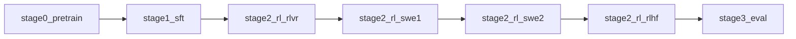

# Super3 Recipe Overview

This directory bridges the **paper methodology** to the **released Nemotron repo**.

Use it when the question is:

- “How do I run Super3 from this repo?”
- “Which file/config corresponds to the paper’s phase?”
- “What is actually open-source vs only described in the paper?”

---

## Stage map



The released repo follows the paper’s top-level stage order closely:

1. **Stage 0 — Pretraining**
2. **Stage 1 — SFT**
3. **Stage 2 — RL**
   - RLVR
   - SWE1
   - SWE2
   - RLHF
4. **Stage 3 — Evaluation**

The one paper detail that is not surfaced as a comparably explicit recipe stage is the final **MTP-healing** pass.

---

## Question → recipe file

| Question | Open this file |
|---|---|
| How does the whole repo map to the paper? | `overview.md` |
| How do I run pretraining / long-context continuation? | `stage0_pretrain.md` |
| How do I run SFT? | `stage1_sft.md` |
| How do I run RL end to end? | `stage2_rl.md` |
| What is the RLVR config? | `stage2_rl_rlvr.md` |
| What is SWE pivot? | `stage2_rl_swe1.md` |
| What is full SWE-bench RL? | `stage2_rl_swe2.md` |
| What is the RLHF config? | `stage2_rl_rlhf.md` |
| How does evaluation work? | `stage3_eval.md` |

---

## Top-level source layout

| Repo path | Role |
|---|---|
| `src/nemotron/recipes/super3/README.md` | top-level recipe overview |
| `src/nemotron/recipes/super3/stage0_pretrain/` | pretraining and long-context continuation |
| `src/nemotron/recipes/super3/stage1_sft/` | SFT data prep and training |
| `src/nemotron/recipes/super3/stage2_rl/` | RL hub, data prep, and sub-stages |
| `src/nemotron/recipes/super3/stage3_eval/` | evaluator config |
| `docs/nemotron/super3/` | human-readable release docs |

---

## Stage-by-stage map

| Paper stage | Released recipe entry | Main script/config surface | Output artifact |
|---|---|---|---|
| Phase 1 pretrain | `stage0_pretrain` | `train.py`, `config/phase1.yaml` | phase1 checkpoint |
| Phase 2 pretrain | `stage0_pretrain` | `train.py`, `config/phase2.yaml` | phase2 checkpoint |
| LC 1M | `stage0_pretrain` | `config/long_context_1m.yaml` | lc1 checkpoint |
| LC mixed | `stage0_pretrain` | `config/long_context_mixed.yaml` | lc2 checkpoint |
| SFT | `stage1_sft` | `data_prep.py`, `train.py`, `config/default.yaml` | SFT model |
| RLVR | `stage2_rl/stage1_rlvr` | `train.py`, `config/default.yaml` | RLVR checkpoint |
| SWE1 | `stage2_rl/stage2_swe1` | `train.py`, `config/default.yaml` | SWE1 checkpoint |
| SWE2 | `stage2_rl/stage2_swe2` | `train.py`, `config/default.yaml` | SWE2 checkpoint |
| RLHF | `stage2_rl/stage3_rlhf` | `train.py`, `config/default.yaml` | final RL checkpoint |
| Eval | `stage3_eval` | `config/default.yaml`, CLI eval command | benchmark results |

---

## Data flow by stage

| Stage | Input form | Output form |
|---|---|---|
| Stage 0 data prep | raw text datasets | Megatron `bin/idx` + `blend.json` |
| Stage 1 data prep | OpenAI chat-format datasets | packed Parquet splits + `blend.json` |
| Stage 2 data prep | HF RL blends with placeholders | resolved JSONL train/val splits |
| Stage 3 eval | model artifact + evaluator config | benchmark scores / W&B export |

---

## CLI shape

The top-level docs expose a consistent CLI family:

```bash
uv run nemotron super3 data prep pretrain --run <profile>
uv run nemotron super3 pretrain -c phase1 --run <profile>

uv run nemotron super3 data prep sft --run <profile>
uv run nemotron super3 sft --run <profile>

uv run nemotron super3 data prep rl rlvr --run <profile>
uv run nemotron super3 rl rlvr -c rlvr1 --run <profile>
uv run nemotron super3 rl swe1 --run <profile>
uv run nemotron super3 rl swe2 --run <profile>
uv run nemotron super3 rl rlhf --run <profile>

uv run nemotron super3 eval --run <profile>
```

That is the quickest “how do I run it?” answer unless the user asks for raw script paths instead.

---

## Artifact handoff story

The release docs frame the pipeline through artifact lineage.

| From | To | Artifact idea |
|---|---|---|
| Stage 0 data prep | Stage 0 train | pretrain data blend artifact |
| Stage 0 train | Stage 1 train | pretrain model artifact |
| Stage 1 data prep | Stage 1 train | SFT data artifact |
| Stage 1 train | Stage 2 RL | SFT model artifact |
| Stage 2 data prep | Stage 2 RL | RL data blend artifact |
| Stage 2 RL | Stage 3 eval | RL model artifact |

If a user asks how the stages are chained, answer in terms of artifacts first and file paths second.

---

## Important reproduction caveats

1. **Paper parity is not guaranteed.**
   The docs explicitly say the open data only covers part of the internal training corpus.

2. **Stage 2 is really a chain.**
   The repo makes this visible; do not answer as if `nemotron super3 rl` were one homogeneous training run.

3. **Evaluation is operationally special.**
   It does not submit a standard runspec training script; the CLI compiles config and calls `nemo-evaluator-launcher`.

4. **Quantization is documented but not implemented as a stage in this recipe tree.**
   Quantization instructions live in docs and Megatron-Bridge tooling rather than a dedicated `stage4_quantize/` recipe folder.

---

## Best next file

| If the user now asks… | Open… |
|---|---|
| “Start from the beginning” | `stage0_pretrain.md` |
| “How does SFT map to the paper?” | `stage1_sft.md` |
| “Show me the RL chain” | `stage2_rl.md` |
| “How is eval wired?” | `stage3_eval.md` |
