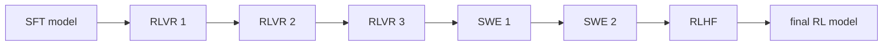

# Stage 2 Recipe Summary — RL Hub

This file is the **hub** for Super3 RL.

Use it before opening any RL sub-stage file.

---

## Stage 2 is a chain, not one run

The paper’s RL pipeline is reflected in the repo as a sequence of sub-stages:



This is the most important thing to preserve when answering questions.

---

## Main source layout

| Path | Role |
|---|---|
| `src/nemotron/recipes/super3/stage2_rl/README.md` | human hub doc |
| `.../data_prep.py` | resolves released RL blend placeholders into JSONL |
| `.../stage1_rlvr/` | RLVR sub-stage |
| `.../stage2_swe1/` | SWE pivot sub-stage |
| `.../stage2_swe2/` | full SWE-bench sub-stage |
| `.../stage3_rlhf/` | RLHF sub-stage |

---

## Data preparation for RL

Unlike stage 0 and stage 1, RL data prep is not a tokenizer/packing pass. Instead it:

- downloads the released RL blends,
- resolves `_hf_placeholder` records,
- reconstructs data pulled from external HF datasets,
- writes resolved train/val JSONL splits for each sub-stage.

### Output layout

```text
output/stage2_rl_resolved/
  rlvr1/train-split.jsonl
  rlvr1/val-split.jsonl
  rlvr2/...
  rlvr3/...
  swe1/...
  swe2/...
  rlhf/...
  manifest.json
```

This is why `data_prep.py` is the first file to cite when someone asks “where do the RL datasets come from in the repo?”

---

## Sub-stage map

| Sub-stage | Summary file | Upstream folder |
|---|---|---|
| RLVR | `stage2_rl_rlvr.md` | `stage2_rl/stage1_rlvr/` |
| SWE1 | `stage2_rl_swe1.md` | `stage2_rl/stage2_swe1/` |
| SWE2 | `stage2_rl_swe2.md` | `stage2_rl/stage2_swe2/` |
| RLHF | `stage2_rl_rlhf.md` | `stage2_rl/stage3_rlhf/` |

---

## Commands exposed by the repo

### Data prep

```bash
uv run nemotron super3 data prep rl rlvr --run <profile>
uv run nemotron super3 data prep rl swe1 --run <profile>
uv run nemotron super3 data prep rl swe2 --run <profile>
uv run nemotron super3 data prep rl rlhf --run <profile>
```

### Training chain

```bash
uv run nemotron super3 rl rlvr -c rlvr1 --run <profile>
uv run nemotron super3 rl rlvr -c rlvr2 --run <profile>
uv run nemotron super3 rl rlvr -c rlvr3 --run <profile>
uv run nemotron super3 rl swe1 --run <profile>
uv run nemotron super3 rl swe2 --run <profile>
uv run nemotron super3 rl rlhf --run <profile>
```

That is the operational skeleton of the full stage.

---

## Artifact flow

```text
SFT model artifact
  + RL data blends
  → RLVR 1
  → RLVR 2
  → RLVR 3
  → SWE1
  → SWE2
  → RLHF
  → final RL model artifact
```

The repo README describes this through W&B artifact lineage, so when users ask how the stages hand off, answer in artifact terms first.

---

## Infrastructure expectations

The released RL docs are explicit that stage 2 depends on a substantial support stack:

| Component | Why it matters |
|---|---|
| NeMo-RL | GRPO training loop |
| Ray | orchestration across workers and services |
| NeMo Gym | rollout environments and judge/resource servers |
| vLLM | policy and judge-model serving |
| Sandbox container | needed for code execution environments |
| SWE container | needed for SWE1/SWE2 with prefetched venvs |
| Apptainer `.sif` images | needed for full SWE2 |

That means stage 2 is usually the least turnkey part of the released pipeline.

---

## Paper-vs-recipe caveats

1. **The paper mentions MTP healing after RLHF; the released RL recipe tree mainly surfaces RLVR, SWE, and RLHF.**
2. **RLVR in the paper is described in capability terms; the repo exposes the systems wiring needed to run it.**
3. **SWE stages require extra containers and images that are not part of the base recipe surface.**

---

## Best next file

| If the user wants… | Open… |
|---|---|
| the broad RL stage | `stage2_rl_rlvr.md` |
| the first SWE stage | `stage2_rl_swe1.md` |
| the full SWE-bench harness | `stage2_rl_swe2.md` |
| the final preference stage | `stage2_rl_rlhf.md` |
