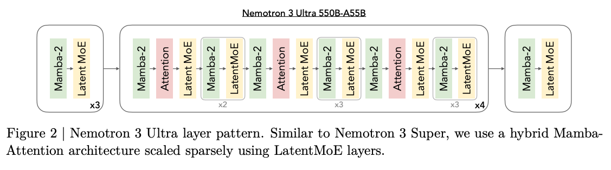

# Scope
Answers:
- What architecture does Nemotron 3 Ultra use, and how does it relate to Nemotron 3 Super?
- What are the exact model dimensions (layers, heads, experts, MoE config)?
- How is MTP configured?
- What is the layer pattern (Figure 2)?

# Architecture Lineage (§2.1)
- Reuses the **same hybrid Mamba-Attention Mixture-of-Experts architecture as Nemotron 3 Super** (NVIDIA, 2026), extended to 550B total / 55B active parameters per token.
- **LatentMoE** (Elango et al., 2026) for MoE layers — same as Super3, scaled to 550B/55B.
- **Native MTP** for inference acceleration with **two heads during pre-training**; both MTP heads **share the same parameters** for robust autoregressive drafting (as in NVIDIA 2026). Each MTP head = one attention layer + one MoE layer.

# Table 1 — Architecture Dimensions

| Configuration | Nemotron 3 Ultra |
|---|---|
| Total Layers | 108 |
| Model Dimension | 8192 |
| Q-Heads (n_q) | 64 |
| KV-Heads (n_kv) | 2 |
| Head Dimension | 128 |
| Mamba State Dimension | 128 |
| Mamba Groups | 8 |
| Mamba Heads | 256 |
| Mamba Head Dimension | 64 |
| Expert Hidden Dimension | 5120 |
| Shared Expert Intermediate Size | 10240 |
| Total Experts per Layer | 512 |
| Top-k (Activated Experts) | 22 |
| MoE Latent Size | 2048 |
| MTP layers (shared weight) | 2 |

# Figure 2 — Layer Pattern
Hybrid Mamba-Attention architecture scaled sparsely with LatentMoE layers, similar to Nemotron 3 Super. The interleaved block sequence shown (with repeat multipliers x3, x2, x3, x3, x4) is built from Mamba-2, Attention, and Latent MoE blocks:

Mamba-2 / Latent MoE (x3) -> Mamba-2 / Attention / Latent MoE (x2) -> Mamba-2 / LatentMoE (x3) -> Mamba-2 / Attention / Latent MoE / Mamba-2 / Latent MoE (x3) -> ... (x4), as depicted in Figure 2.

(The exact per-segment block order is a figure rendering; the load-bearing facts are: hybrid Mamba-2 + Attention + LatentMoE, total 108 layers per Table 1.)

# Caveats
- The precise Figure 2 block ordering and repeat-multiplier grouping is reconstructed from a figure; treat the 108 total-layer count (Table 1) as authoritative, not a hand-counted figure traversal.
- MaxVio_max = 23.27 for Ultra and Super (E/k = 512/22) is a derived stability metric; it lives in pretraining.md (§2.7), not here.
- LatentMoE and MTP internals are documented in the Nemotron 3 Super report (NVIDIA, 2026) and cited references; this chunk only states Ultra's reuse and dimensions.
