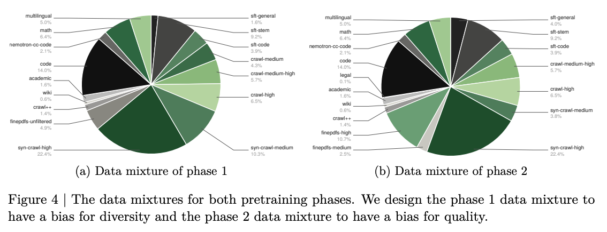

# Scope
Answers:
- What new/refreshed datasets were added for Ultra pretraining since Super?
- What did each dataset's validation ablation show?
- How is the two-phase data mixture/curriculum structured, and what are the category shares?

# §2.3 New Datasets (added since Nemotron 3 Super)

| Dataset | Description | Ablation result |
|---|---|---|
| Nemotron-Pretraining-Code-v3 (§2.3.1) | 173B new tokens of GitHub source code, cut-off Sept 30, 2025 | (refresh; no separate ablation reported) |
| Nemotron-Pretraining-Multiple-Choice / -Generative (§2.3.2) | Large-scale task-seeded synthetic Q&A across STEM, factual, commonsense, logical reasoning, math, code, reading comprehension, multilingual QA; seeded from public training splits (held-out tests excluded); formatting/schema/dedup/task filtering | 100B-token phase-3 CPT on a Nemotron-family checkpoint (see table below) |
| Nemotron-Pretraining-Fact-Seeking (§2.3.3) | Fact-seeking Q from Finewiki; 2-stage (extract factual statements, then Qwen3-30B-A3B-Instruct-2507 generates short-answer or MC) | Nano intermediate checkpoint, inject in final 100B tokens: SimpleQA (MC-converted) 40.24->50.16 |
| Nemotron-Pretraining-Moral-Scenarios (§2.3.4) | MC moral-scenario Q from Moral Stories (situations/norms) + Social Chemistry (actions); CoT version via Qwen3-235B-A22B-Thinking-2507 | (no separate metric reported) |
| Nemotron-Pretraining-Legal (§2.3.5) | Legal-domain collection (see below) | Nano ablation: LegalBench average 64.6->74.7 |

## §2.3.2 Synthetic Q&A ablation (100B-token phase-3 CPT)

| Benchmark | Before | After |
|---|---|---|
| MMLU-Pro | 64.8 | 66.6 |
| Average code | 73.2 | 75.1 |
| Commonsense understanding | 72.9 | 74.5 |
| GPQA | 30.8 | 41.9 |
| Average math | 87.6 | 87.9 (stable) |

## §2.3.5 Legal sub-datasets
- HTML-extracted: Legal-California-Code-Of-Regulations (excl. Title 6 & 24), Legal-NYCourts-Judicial-Ethics-Opinions, Legal-eCFR (Code of Federal Regulations).
- LLM-cleaned: Legal-Case-Law-Summary — 5.4M summaries from a filtered Caselaw via Qwen3-235B-A22B-Instruct-2507.
- Reformatted: Legal-CaseHOLD (-> MC format), Legal-Contract-NLI (ContractNLI hypotheses/answers/evidence appended to source).
- Synthetic (all via Qwen3-235B-A22B-Instruct-2507 unless noted): Legal-Canadian-Case-Law-Outcome (CHRT/RPD/RAD/RLLR subsets), Legal-Definition-Classification (from Caselaw), Legal-Diversity-Jurisdiction (templates + Nemotron Persona names), Legal-Function-Of-Decision (7 categories: facts, procedural history, issue, rule, analysis, conclusion, decree), Legal-GlobalCit (GLOBALCIT, rephrased x3), Legal-LegalBench-CUAD-v2 (CUAD clauses, contracts < 8k tokens), Legal-ToS-Clause-Understanding (TOS Dataset), Legal-ToSDR-QA (ToSDR Yes/No), Legal-eCFR-QA (DiverseQA-like from CFR).
- Legal ablation: Nemotron 3 Nano (30B total / 3B active MoE), from 14.9T-token checkpoint + 100B tokens of a phase-2 blend, evaluated on >100 LegalBench subtasks; average accuracy 64.6 -> 74.7.

# §2.3.6 Data Mixture and Ordering
- Adaptation of Nemotron 3 Super and Nano data mixtures (NVIDIA, 2025b, 2026), with new/refreshed datasets; balances diversity and quality per Feng et al. (2024).
- Two-phase curriculum: phase 1 biases diversity, phase 2 biases quality. Transition after ~15 trillion tokens (~75% of pretraining).
- Corpus spans 19 high-level categories.
- Largest component = quality-filtered + synthetic web crawl (crawl-medium, crawl-medium-high, crawl-high, syn-crawl-medium, syn-crawl-high): ~49% of phase 1 tokens, ~42% of phase 2 tokens.
- Other categories: finepdfs (quality-filtered, upweighted into phase 2), math, code, Nemotron-CC-Code, Wikipedia, academic, legal, multilingual (11 languages), Crawl++ (OpenWebText, BigScience, Reddit), and synthetic SFT-style data (sft-code, sft-stem, sft-general, per Akter et al. 2026).
- Multilingual 11 languages: Arabic, Chinese, French, German, Hebrew, Hindi, Italian, Japanese, Korean, Portuguese, Spanish.

## Figure 4 — Phase mixture breakdown (high-level category shares)

| Category | Phase 1 | Phase 2 |
|---|---|---|
| syn-crawl-high | 22.4% | 23.6% |
| syn-crawl-medium | 10.3% | 6.2% |
| crawl-high | 6.5% | 6.5% |
| crawl-medium-high | 5.7% | 5.7% |
| crawl-medium | 4.3% | (not listed) |
| code | 14.0% | 14.0% |
| sft-stem | 9.2% | 9.2% |
| sft-code | 3.9% | 3.9% |
| sft-general | 1.6% | 3.9% |
| math | 6.4% | 6.4% |
| multilingual | 5.0% | 5.0% |
| finepdfs-unfiltered | 4.9% | (not listed) |
| finepdfs-high | (not listed) | 7.6% |
| finepdfs-medium | (not listed) | 2.1% |
| nemotron-cc-code | 2.1% | 2.1% |
| academic | 1.6% | 1.6% |
| crawl++ | 1.4% | 1.4% |
| wiki | 0.6% | 0.6% |
| legal | (not listed) | 0.1% |

# Caveats
- All ablation gains (synthetic Q&A, fact-seeking, legal) were measured on Nemotron-family / Nano checkpoints, NOT on Ultra itself — they validate dataset usefulness, not Ultra's scores.
- SimpleQA 40.24->50.16 used a multiple-choice-converted SimpleQA; not directly comparable to original SimpleQA scores.
- Figure 4 percentages are read from a pie-chart figure; categories shown only in one phase are marked "(not listed)" and should not be assumed zero.
- The 173B code tokens are "new" tokens added in the refresh, not the total code corpus.
