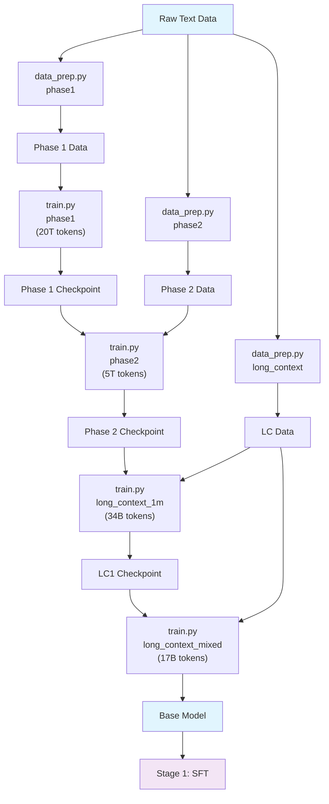

# Stage 0: Pretraining

Pretrain Nemotron 3 Super on a large text corpus using Megatron-Bridge.

## Overview

This stage tokenizes raw text data and trains the base language model from scratch. It produces a pretrained checkpoint that serves as the foundation for subsequent instruction tuning (SFT) and alignment (RL) stages.

| Component | Description |
|-----------|-------------|
| `data_prep.py` | Tokenizes raw text into Megatron bin/idx format |
| `train.py` | Runs pretraining using Megatron-Bridge |
| `config/` | Configuration files for data prep and training |

## Training Pipeline

Pretraining follows a **4-phase curriculum** from the tech report:

| Phase | Config | Internal Scale | Focus |
|-------|--------|----------------|-------|
| Phase 1 | `phase1` | 20T (80%) | Diversity — broad coverage, WSD warmup + stable LR |
| Phase 2 | `phase2` | 5T (20%) | Quality — high-quality sources, WSD minus_sqrt decay |
| LC Stage 1 | `long_context_1m` | 34B | 1M context extension, constant LR 4.5e-6 |
| LC Stage 2 | `long_context_mixed` | 17B | Alternating 1M/4K to recover math benchmarks |

> **Note**: The open-sourced data covers an estimated 8–10T tokens (~40–50% of the
> internal 25T blend). Missing categories (code, nemotron-cc-code, crawl++, academic)
> used internal-only data. Adjust `train_iters` and blend weights to match your data.

## Quick Start

### Using nemotron CLI (Recommended)

```bash
# 1. Prepare data for each phase
uv run nemotron super3 data prep pretrain -c phase1 --run YOUR-CLUSTER
uv run nemotron super3 data prep pretrain -c phase2 --run YOUR-CLUSTER
uv run nemotron super3 data prep pretrain -c long_context --run YOUR-CLUSTER

# 2. Run pretraining phases sequentially
uv run nemotron super3 pretrain -c phase1 --run YOUR-CLUSTER
uv run nemotron super3 pretrain -c phase2 --run YOUR-CLUSTER     # resumes from phase1 checkpoint
uv run nemotron super3 pretrain -c long_context_1m --run YOUR-CLUSTER  # resumes from phase2
uv run nemotron super3 pretrain -c long_context_mixed --run YOUR-CLUSTER  # resumes from lc1

# Quick test with tiny config
uv run nemotron super3 pretrain -c tiny --run YOUR-CLUSTER
```

### Direct Script Execution

Inside a container on a compute node:

```bash
# Data preparation
python data_prep.py --config config/data_prep/phase1.yaml

# Training (single node)
python train.py --config config/tiny.yaml

# Training (distributed)
torchrun --nproc_per_node=8 train.py --config config/phase1.yaml
```

## Data Preparation

The `data_prep.py` script tokenizes raw text datasets into Megatron's binary format using a 3-stage Ray pipeline: `PlanStage → DownloadStage → BinIdxTokenizationStage`.

### CLI Command

```bash
uv run nemotron super3 data prep pretrain [options]
```

| Option | Description |
|--------|-------------|
| `--run <profile>` | Execute on Slurm via NeMo-Run |
| `--sample N` | Limit rows per dataset (for testing) |
| `--force` | Force re-run, ignoring cache |

### Input

Dataset blend defined in `config/data_prep/data_blend_raw.json`:

```json
{
  "datasets": [
    {"name": "dataset-name", "weight": 1.0, "split": "train"},
    ...
  ]
}
```

### Output

```
output/super3/stage0_pretrain/
├── train/
│   ├── data_00000.bin
│   ├── data_00000.idx
│   └── ...
├── valid/
│   └── ...
├── test/
│   └── ...
└── blend.json          # Per-split data paths for Megatron-Bridge
```

The output is registered as a W&B Artifact (`PretrainBlendsArtifact-default`) for lineage tracking.

### Configuration

`config/data_prep/default.yaml`:

```yaml
blend_path: config/data_prep/data_blend_raw.json
output_dir: output/super3/stage0_pretrain
num_shards: 128
tokenizer:
  model: nvidia/NVIDIA-Nemotron-3-Nano-30B-A3B-BF16
  add_bos: false
  add_eos: true
text_field: text
```

## Training

The `train.py` script runs pretraining using Megatron-Bridge with the `nemotron_3_super_pretrain_config` recipe.

### CLI Command

```bash
uv run nemotron super3 pretrain [options] [overrides...]
```

| Option | Description |
|--------|-------------|
| `--run <profile>` | Attached execution on Slurm |
| `--batch <profile>` | Detached execution (submit and exit) |
| `-c <config>` | Config file (e.g., `-c tiny` for testing) |
| `--dry-run` | Preview execution plan |
| `key=value` | Override config values (Hydra-style) |

### Input

- **Data**: `PretrainBlendsArtifact-default` (from data prep)
- **Config**: `config/default.yaml` or `config/tiny.yaml`

### Output

- Model checkpoints saved to configured `checkpoint.save` path (default: `/nemo_run/pretrain`)
- Registered as W&B Artifact for downstream stages

### Configuration Files

**Training configs:**

| File | Purpose |
|------|---------|
| `config/phase1.yaml` | Phase 1 — diversity blend, 20T tokens |
| `config/phase2.yaml` | Phase 2 — quality blend, 5T tokens, resumes from phase1 |
| `config/long_context_1m.yaml` | LC Stage 1 — 1M context, 34B tokens |
| `config/long_context_mixed.yaml` | LC Stage 2 — alternating 1M/4K, 17B tokens |
| `config/default.yaml` | Alias for phase1 |
| `config/tiny.yaml` | Testing variant |

**Data prep configs:**

| File | Purpose |
|------|---------|
| `config/data_prep/phase1.yaml` | Phase 1 data blend |
| `config/data_prep/phase2.yaml` | Phase 2 data blend |
| `config/data_prep/long_context.yaml` | Long-context blend (80% phase2 + 20% doc QA) |
| `config/data_prep/data_blend_raw_phase1.json` | Phase 1 dataset weights (~13.06B rows) |
| `config/data_prep/data_blend_raw_phase2.json` | Phase 2 dataset weights (~10.53B rows) |
| `config/data_prep/data_blend_raw_long_context.json` | LC blend (phase2 + Nemotron-Pretraining-Long-Context-v1) |
| `config/data_prep/data_blend_raw_small.json` | Small blend for testing |


### Override Examples

```bash
# More training iterations
uv run nemotron super3 pretrain -c tiny train.train_iters=5000

# Larger batch size
uv run nemotron super3 pretrain -c tiny train.global_batch_size=64

# Different checkpoint location
uv run nemotron super3 pretrain -c tiny checkpoint.save=/path/to/checkpoints
```

## Running with NeMo-Run

The nemotron CLI uses [NeMo-Run](https://github.com/NVIDIA-NeMo/Run) for job orchestration.

### env.toml Setup

Configure execution profiles in `env.toml`:

```toml
[wandb]
project = "nemotron"
entity = "YOUR-TEAM"

[YOUR-CLUSTER]
executor = "slurm"
account = "YOUR-ACCOUNT"
partition = "batch"
nodes = 4
ntasks_per_node = 8
gpus_per_node = 8
mounts = ["/lustre:/lustre"]
```

> **Note**: Container images are specified in the recipe config files (e.g., `config/tiny.yaml`), not in env.toml.

### Execution Modes

```bash
# Attached (wait for completion)
uv run nemotron super3 pretrain -c tiny --run YOUR-CLUSTER

# Detached (submit and exit)
uv run nemotron super3 pretrain -c tiny --batch YOUR-CLUSTER

# Preview without executing
uv run nemotron super3 pretrain -c tiny --run YOUR-CLUSTER --dry-run
```

See [docs/nemo_runspec/nemo-run.md](../../../../../docs/nemo_runspec/nemo-run.md) for complete configuration options.

## Artifact Lineage



## Next Steps

After pretraining completes, proceed to [Stage 1: SFT](../stage1_sft/README.md) for instruction tuning.
