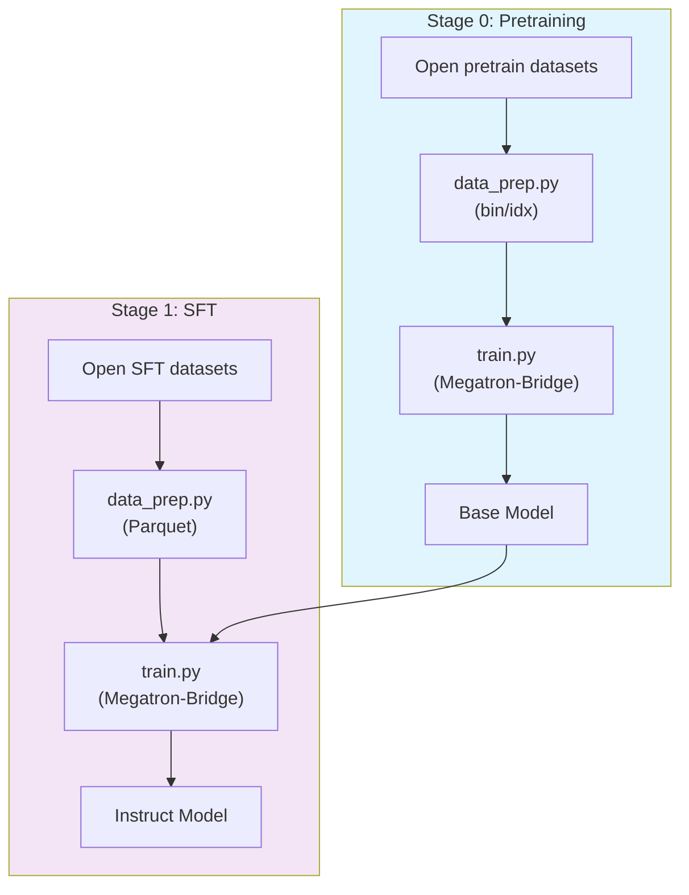
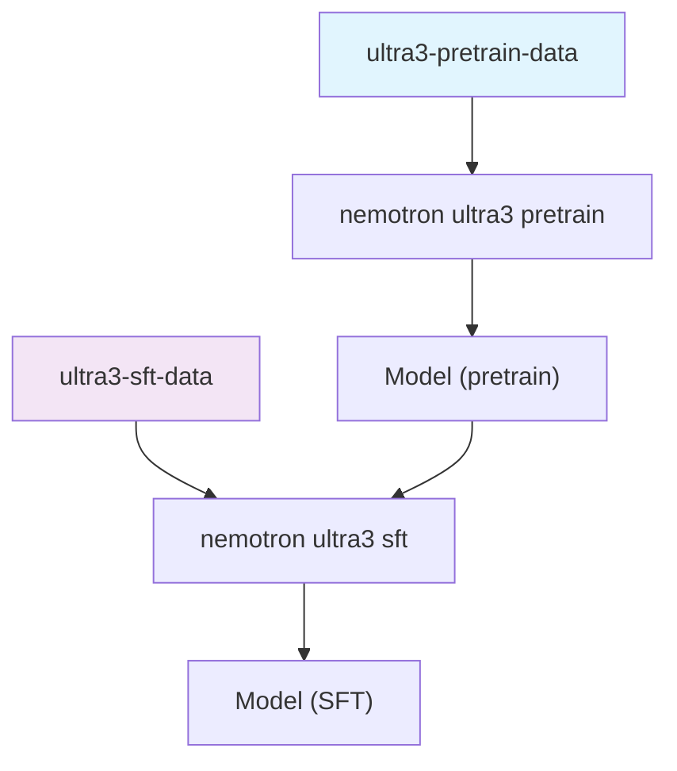

# Nemotron 3 Ultra Training Recipe

A data-prep + training pipeline for **Nemotron 3 Ultra 550B-A55B**, NVIDIA's largest
Nemotron 3 model: a hybrid Mamba-Transformer MoE with LatentMoE and multi-token
prediction (MTP), pretrained in NVFP4 and extended to 1M-token context.

## Model Overview

| Property | Value |
|----------|-------|
| Architecture | Hybrid Mamba-Attention MoE (Mamba-2 + Attention + LatentMoE) |
| Total / active params | 550B / 55B per token |
| Multi-Token Prediction | Yes (2 shared-weight MTP layers) |
| Context length | up to 1M (1,048,576) tokens |
| Pretraining | 20T text tokens (NVFP4), two-phase curriculum |
| Stages in this recipe | 2 (Pretrain → SFT) |

> The full Ultra program also includes RLVR, MOPD, and MTP Boosting (see
> `skills/nemotron-ultra/`). Only pretraining and SFT have public recipe stages here.
>
> **MOPD is not fully replicated.** The post-training MOPD pipeline (documented
> separately for NeMo RL on GB200) runs **two MOPD iterations** over an evolving
> panel of specialised teachers. The intermediate per-teacher checkpoints — and
> the Iteration-1 MOPD checkpoint that Iteration 2 builds on — are **not part of
> the public release**, so the full two-iteration pipeline cannot be reconstructed
> end-to-end from open artifacts. The MOPD guide instead walks through a
> **representative single pass** (Student RLVR → a small teacher panel → one MOPD
> stage) to show how each step is wired, not a 1:1 reproduction of the report.

## Training Pipeline



| Stage | Purpose | Framework | Output |
|-------|---------|-----------|--------|
| [Stage 0: Pretrain](./stage0_pretrain/) | Train on the open pretrain mixture | Megatron-Bridge | Base model checkpoint |
| [Stage 1: SFT](./stage1_sft/) | Instruction / agentic tuning | Megatron-Bridge | Instruction-following model |

## Prerequisites

- **Slurm cluster** with GPU nodes (GB200 / B200), plus a Ray-capable profile for data prep.
- **Weights & Biases** for experiment tracking and artifact lineage.
- **Container images**: data prep uses `anyscale/ray:2.49.2-py312`; Ultra3 training
  uses build-your-own squashfs images produced from `nvcr.io/nvidia/nemo:26.04.01`.

### env.toml Setup

```toml
[wandb]
project = "nemotron"
entity = "YOUR-TEAM"

[YOUR-CLUSTER]
executor = "slurm"
account = "YOUR-ACCOUNT"
partition = "batch"
nodes = 48
ntasks_per_node = 8
gpus_per_node = 8
mounts = ["/lustre:/lustre"]
```

> Container images are set in the recipe config files, not in `env.toml`. See
> [docs/nemo_runspec/nemo-run.md](../../../../docs/nemo_runspec/nemo-run.md).

## Container images

Ultra3 does **not** ship a released training container tag. The recipe stages
own only a `Dockerfile`; build the squashfs images with the shared, Slurm-only
`kit slurm build` command before launching training:

```bash
uv run nemotron kit slurm build dlw --recipe ultra3 --stage pretrain
uv run nemotron kit slurm build dlw --recipe ultra3 --stage sft
```

`kit slurm build` is env.toml / nemo_runspec driven: it resolves the build
partition, account, and cache dir from the named profile, ships the repo with
CodePackager, and runs `podman build → enroot import` on a compute node (as root
via `--container-remap-root` so the import can unpack). It writes artifacts under
`${build_cache_dir:-~/.cache/nemotron}/containers/` plus a `manifest.yaml`:

- `ultra3-pretrain.sqsh`
- `ultra3-sft.sqsh`

Only `MEGATRON_BRIDGE_BRANCH` is required: the Dockerfiles start from
`nvcr.io/nvidia/nemo:26.04.01` and `git clone --recurse-submodules` the MB
branch, which **pins its Megatron-LM submodule** — so no separate Megatron-Core
branch is needed (pass `--build-arg MEGATRON_CORE_BRANCH=<branch>` only to
override the pin).

Or build the Dockerfiles directly with Docker on any host:

```bash
docker build -t ultra3-pretrain src/nemotron/recipes/ultra3/stage0_pretrain
docker build -t ultra3-sft     src/nemotron/recipes/ultra3/stage1_sft
```

Training configs point at the resulting squashfs paths, for example
`/home/${USER}/.cache/nemotron/containers/ultra3-pretrain.sqsh`.

## Quick Start

```bash
# Build the training containers first (Slurm-only; builds the nemotron_3_ultra MB branch)
uv run nemotron kit slurm build dlw --recipe ultra3 --stage pretrain
uv run nemotron kit slurm build dlw --recipe ultra3 --stage sft

# Stage 0: Data prep + Pretraining
uv run nemotron ultra3 data prep pretrain --run YOUR-CLUSTER
uv run nemotron ultra3 pretrain --run YOUR-CLUSTER

# Stage 1: Data prep + SFT
uv run nemotron ultra3 data prep sft --run YOUR-CLUSTER
uv run nemotron ultra3 sft --run YOUR-CLUSTER
```

### Testing with Tiny Config

```bash
uv run nemotron ultra3 data prep pretrain --run YOUR-CLUSTER --sample 1000
uv run nemotron ultra3 pretrain -c tiny --run YOUR-CLUSTER
```

## CLI Commands

### Data Preparation

```bash
# Pretrain data: tokenize the open mixture to Megatron bin/idx format
uv run nemotron ultra3 data prep pretrain [-c <config>] [--run <profile>] [--sample N] [--force]

# SFT data: apply chat template, pack to Parquet
uv run nemotron ultra3 data prep sft [-c <config>] [--run <profile>] [--sample N] [--force]
```

### Container Build

```bash
uv run nemotron kit slurm build <profile> --recipe ultra3 --stage pretrain [--dry-run] [--build-arg K=V]
uv run nemotron kit slurm build <profile> --recipe ultra3 --stage sft      [--dry-run] [--build-arg K=V]
```

### Training

```bash
uv run nemotron ultra3 pretrain [-c <config>] [--run <profile>] [overrides...]
uv run nemotron ultra3 sft      [-c <config>] [--run <profile>] [overrides...]
```

### Execution Options

| Option | Description |
|--------|-------------|
| `--run <profile>` | **Attached** — submit and stream logs |
| `--batch <profile>` | **Detached** — submit and exit |
| `-c <config>` | Select a config (e.g. `-c tiny`, `-c phase2`) |
| `--dry-run` | Preview the compiled job config |
| `key=value` | Override config values (Hydra-style) |

## Configuration Files

| File | Purpose |
|------|---------|
| `stage0_pretrain/config/{default,tiny}.yaml` | Pretrain training configs (TP=2, PP=12, EP=32) |
| `stage0_pretrain/config/data_prep/{phase1,phase2,tiny}.yaml` | Pretrain data-prep configs |
| `stage0_pretrain/config/data_prep/data_blend_raw_*.json` | Pretrain dataset blends (Figure 4 mixture) |
| `stage1_sft/config/{default,tiny}.yaml` | SFT training configs (TP=2, PP=6, EP=32) |
| `stage1_sft/config/data_prep/{default,tiny}.yaml` + `data_blend_raw.json` | SFT data-prep config + blend |

### Pretrain data mixture

The pretrain blends encode the **two-phase curriculum from Figure 4** of the tech report
(`skills/nemotron-ultra/paper/data.md`): per-dataset `weight`s sum, per `category`, to the
paper's phase-1 / phase-2 category shares (e.g. `syn-crawl-high` 22.4%→23.6%, `code` 14.0%,
`math` 6.4%). New-for-Ultra datasets — **Multiple-Choice, Generative, Fact-Seeking,
Moral-Scenarios** (subsets of `Nemotron-Pretraining-Specialized-v1.2`) and **Legal/Case-Law-Summary**
(`Nemotron-Pretraining-Legal-v1`) — are tagged `"_new_in_ultra"`. The `code` category (14%) plus
`nemotron-cc-code`, `academic`, and `crawl++` are in `_missing_categories` to backfill — note
`Nemotron-Pretraining-Code-v3` is released as a **repo manifest (metadata), not tokenized text**, so
scraping/tokenizing it is out of scope here.
The long-context blend mixes 46% long-context data with 54% Phase 2 data.

### Long-context phase (not included)

The report's Long-Context (LC) phase extends Ultra to 1M-token context, but **we do not ship a
data-prep stage for it because its data is not open-source**. Per §2.5 the LC blend is 46%
long-context data + 54% Phase 2 data, where the long-context half is (a) document-QA data reused
from Nemotron 3 Super & Nano and (b) **synthetic long-context SFT-style data** — neither is part of
the Ultra dataset release. No RULER-style data is used.

**To replicate it yourself**, run a short continued-pretraining (CPT) phase from the Phase 2
checkpoint with your own long-context corpus:

- Blend ~46% long-context data + ~54% Phase 2 data (reuse `data_blend_raw_phase2.json`).
- Long-context data = long documents with document-QA pairs + synthetic long-context SFT-style
  samples (e.g. multi-document reasoning, retrieval/synthesis at 128K–1M tokens). Bring your own.
- Schedule: constant LR `2.5e-6`; ~33B tokens total; 92% of iterations at 1M (1,048,576) context,
  8% at 4K (4,096) using only math/code SFT-style data.
- Parallelism (GB200): CP=32, TP=8, EP=128, PP=2.
- Do **not** include RULER-style data (the report avoids training on the eval format).

> The new pretrain datasets use the report's released repos — `Nemotron-Pretraining-Legal-v1` and
> `Nemotron-Pretraining-Specialized-v1.2` (Multiple-Choice / Generative / Fact-Seeking / Moral-Scenarios
> subsets). `Nemotron-Pretraining-Code-v3` is metadata-only (repo list to scrape) and is therefore left
> in `_missing_categories`. Still `TODO(ultra3)`: the Ultra tokenizer repo id, the `ultra3` chat
> template, and the SFT `used_in_filter` tag.

## Artifact Flow



Data-prep registers tokenized data as a W&B artifact; training consumes it via
`data.per_split_data_args_path: ${art:data,path}/blend.json` and produces a model artifact,
giving full lineage from raw data to checkpoint.
