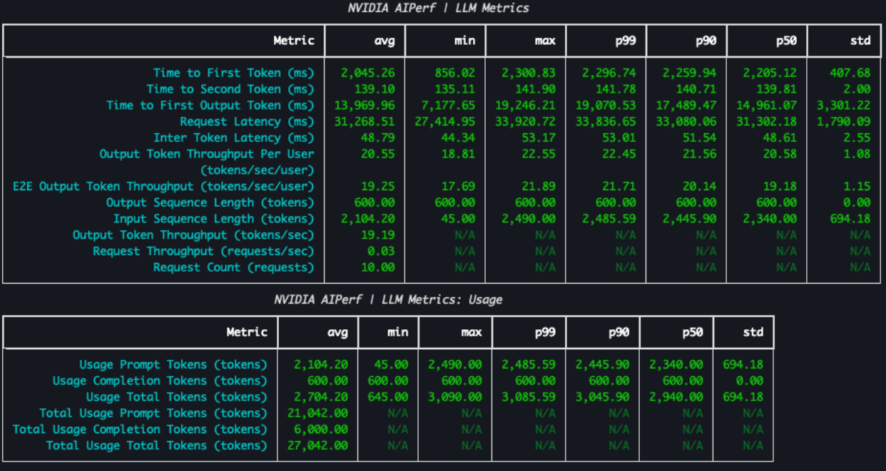

# Deploying Nemotron 3 Ultra on a 4× DGX Spark Cluster

A step-by-step guide to serving **NVIDIA Nemotron 3 Ultra** across four [DGX Spark](https://build.nvidia.com/spark) machines with [vLLM](https://docs.vllm.ai/), then benchmarking it with [NVIDIA AIPerf](https://github.com/ai-dynamo/aiperf).

**Jump to:**

- [vLLM Deployment (Manual)](#option-a--run-manually-with-the-official-vllm-container)  
- [Community Docker Deployment](#option-b--run-with-the-community-docker-easier-setup)  
- [AIPerf Benchmarking](#benchmarking-with-aiperf)

---

## What you're deploying

**Nemotron 3 Ultra** (`nvidia/NVIDIA-Nemotron-3-Ultra-550B-A55B-NVFP4`) is a large Mixture-of-Experts (MoE) model. A few things worth understanding before you start, since they explain most of the setup decisions below:

- **550B total / \~55B active** — the `550B-A55B` in the name. It holds 550 billion parameters total, but only \~55 billion are *active* per token (that's what MoE buys you: a big model that runs closer to the cost of a small one).  
- **NVFP4** — NVIDIA's 4-bit floating-point format. Quantizing the weights to 4 bits shrinks the memory footprint dramatically, which is the only reason a model this size has any hope of fitting on Spark-class hardware.  
- **256K context** — the deployment below serves a `--max-model-len` of 262,144 tokens.  
- **Hybrid architecture** — Nemotron 3 mixes Mamba (state-space) layers with attention, which is why you'll see `--mamba-cache-mode` and `--mamba_ssm_cache_dtype` flags that you wouldn't see on a pure-transformer model.  
- **MTP (Multi-Token Prediction)** — the model ships with a speculative-decoding head. Enabling it (`--speculative-config '{"method":"mtp",...}'`) lets the model draft several tokens at once for a nice throughput boost.

**Why four DGX Sparks?** Even compressed to 4-bit, 550B parameters plus KV cache and runtime overhead won't fit on a single Spark. So we pool four of them and split the model across all four with **tensor parallelism** (`--tensor-parallel-size 4`), one GPU per node. The nodes talk to each other over high-speed ConnectX / RoCE networking.

📄 Model card: [https://huggingface.co/nvidia/NVIDIA-Nemotron-3-Ultra-550B-A55B-NVFP4](https://huggingface.co/nvidia/NVIDIA-Nemotron-3-Ultra-550B-A55B-NVFP4)

---

## Prerequisites

Before anything below will work, your four Sparks need to be **networked together**. Follow NVIDIA's cluster setup guide first — this is not optional, and the later steps assume it's done:

➡️ [**Multi-Spark through a switch**](https://build.nvidia.com/spark/multi-sparks-through-switch/multi-sparks)

You'll also want:

- SSH access to all four nodes (passwordless `ssh` between them makes the `rsync` steps painless).  
- [Docker](https://docs.docker.com/engine/install/) installed on every node.  
- The ConnectX-7 (CX7) interface names for your machines — you'll plug these into the environment variables later.

Throughout this guide:

| Term | Meaning |
| :---- | :---- |
| **Head node** | `node1` — the machine you run downloads and orchestration from. Its node rank is **0**. |
| **Worker nodes** | `node2`, `node3`, `node4` — ranks **1, 2, 3**. They run in `--headless` mode. |

⚠️ Heads up on numbering: the nodes are called *node1–node4* in prose, but vLLM uses **zero-indexed ranks** (0–3). node1 \= rank 0, node4 \= rank 3\. Keep that mapping in mind every time you set `NODE_RANK`.

---

## Option A — Run manually with the official vLLM container

This is the "do every step yourself" path. It's more verbose but shows you exactly what's happening.

### 1\. Prepare the environment (on every node)

SSH into **each** node and run:

```shell
# Pull the official vLLM image used by the launch command below.
# DGX Spark uses an aarch64 environment. Use the nightly image here because
# vllm/vllm-openai:latest has known OOM-at-load and NCCL library mismatch
# issues with this Nemotron 3 Ultra deployment.
export IMAGE="vllm/vllm-openai:nightly-aarch64"
docker pull "$IMAGE"

# Create the cache directories vLLM and friends expect
export HF_CACHE_DIR="${HF_HOME:-$HOME/.cache/huggingface}"
mkdir -p "$HF_CACHE_DIR" "$HOME/.cache/vllm" "$HOME/.cache/flashinfer" "$HOME/.triton"
```

### 2\. Download the model and distribute it (head node only)

Run these on the **head node** (`node1`).

Install [uv](https://docs.astral.sh/uv/), the fast Python package manager:

```shell
curl -LsSf https://astral.sh/uv/install.sh | sh
```

Download the model from Hugging Face:

```shell
uvx hf download nvidia/NVIDIA-Nemotron-3-Ultra-550B-A55B-NVFP4
```

💡 This is a *large* download. Grab a coffee. Once it's on the head node, you copy it to the others rather than re-downloading four times.

Copy the model to the other three nodes (replace the `<nodeN_ip>` placeholders with your actual node IPs):

```shell
export HF_CACHE_DIR="${HF_HOME:-$HOME/.cache/huggingface}"
MODEL_DIR="models--nvidia--NVIDIA-Nemotron-3-Ultra-550B-A55B-NVFP4"

rsync -av "$HF_CACHE_DIR/hub/$MODEL_DIR" "$USER@<node2_ip>:$HF_CACHE_DIR/hub/"
rsync -av "$HF_CACHE_DIR/hub/$MODEL_DIR" "$USER@<node3_ip>:$HF_CACHE_DIR/hub/"
rsync -av "$HF_CACHE_DIR/hub/$MODEL_DIR" "$USER@<node4_ip>:$HF_CACHE_DIR/hub/"
```

### 3\. Launch vLLM (on every node)

Open a shell on each node. **Start the workers first** (node2, node3, node4), then the head (node1) last — the head node coordinates the others, so they need to be ready to connect when it comes up.

First set the **common** variables (identical on every node):

```shell
# COMMON variables — same on all nodes
export HEAD_IP="<node1-connectx-ip>"   # <-- the ConnectX IP of node1 (the head)
export ETH_IF="enp1s0f1np1"            # your assigned CX7 ethernet interface
export IB_IF="rocep1s0f1,roceP2p1s0f1" # BOTH matching RoCE interfaces
export MASTER_PORT=29501
export CONTAINER_NAME=vllm_node
export IMAGE="vllm/vllm-openai:nightly-aarch64" # same image pulled in step 1
export HF_CACHE_DIR="${HF_HOME:-$HOME/.cache/huggingface}"
```

Then set the **per-node** variables. **These differ on each machine** — this is the part people most often get wrong:

```shell
# PER-NODE variables — SET DIFFERENTLY ON EACH NODE!
# node1 (head):  NODE_RANK=0   RUN_HEADLESS=""
# node2:         NODE_RANK=1   RUN_HEADLESS="--headless"
# node3:         NODE_RANK=2   RUN_HEADLESS="--headless"
# node4:         NODE_RANK=3   RUN_HEADLESS="--headless"
export NODE_RANK=0
export RUN_HEADLESS=""
```

Now run the **same launch command on every node** (the per-node variables above are what make each one behave correctly):

```shell
docker run --privileged --ulimit nofile=1048576:1048576 --ipc=host \
  --gpus all --rm --network host --name "$CONTAINER_NAME" --entrypoint= \
  -e MN_IF_NAME="$ETH_IF" \
  -e UCX_NET_DEVICES="$ETH_IF" \
  -e NCCL_SOCKET_IFNAME="$ETH_IF" \
  -e NCCL_IB_HCA="$IB_IF" \
  -e NCCL_IB_DISABLE=0 \
  -e OMPI_MCA_btl_tcp_if_include="$ETH_IF" \
  -e GLOO_SOCKET_IFNAME="$ETH_IF" \
  -e TP_SOCKET_IFNAME="$ETH_IF" \
  -e NCCL_IGNORE_CPU_AFFINITY=1 \
  -e VLLM_FLOAT32_MATMUL_PRECISION=high \
  -e NODE_RANK="$NODE_RANK" \
  -e HEAD_IP="$HEAD_IP" \
  -e MASTER_PORT="$MASTER_PORT" \
  -e RUN_HEADLESS="${RUN_HEADLESS:-}" \
  -v "$HF_CACHE_DIR:/root/.cache/huggingface" \
  -v "$HOME/.cache/vllm:/root/.cache/vllm" \
  -v "$HOME/.cache/flashinfer:/root/.cache/flashinfer" \
  -v "$HOME/.triton:/root/.triton" \
  "$IMAGE" \
  bash -lc '
set -e
python3 -m pip install --no-cache-dir instanttensor
rm -f /usr/local/lib/python3.12/dist-packages/nvidia/nccl/lib/libnccl.so.2
ln -s /usr/lib/aarch64-linux-gnu/libnccl.so.2 \
  /usr/local/lib/python3.12/dist-packages/nvidia/nccl/lib/libnccl.so.2
exec vllm serve nvidia/NVIDIA-Nemotron-3-Ultra-550B-A55B-NVFP4 \
  --tensor-parallel-size 4 \
  --host 0.0.0.0 \
  --port 8000 \
  --dtype auto \
  --max-model-len 262144 \
  --gpu-memory-utilization 0.85 \
  --max-num-seqs 2 \
  --load-format instanttensor \
  --attention-backend TRITON_ATTN \
  --max-num-batched-tokens 16384 \
  --uvicorn-log-level warning \
  --disable-uvicorn-access-log \
  --kv-cache-dtype fp8 \
  --moe-backend marlin \
  --mamba-cache-mode align \
  --mamba_ssm_cache_dtype float32 \
  --generation-config vllm \
  --no-scheduler-reserve-full-isl \
  --max-parallel-loading-workers 1 \
  -cc.mode 0 \
  -cc.cudagraph_mode FULL_DECODE_ONLY \
  --cudagraph-capture-sizes 5 10 15 20 \
  --speculative-config "{\"method\":\"mtp\",\"num_speculative_tokens\":4,\"moe_backend\":\"triton\",\"attention_backend\":\"TRITON_ATTN\"}" \
  --enable-prefix-caching \
  --enable-flashinfer-autotune \
  --reasoning-parser nemotron_v3 \
  --enable-auto-tool-choice \
  --tool-call-parser qwen3_xml \
  --nnodes 4 \
  --node-rank "$NODE_RANK" \
  --master-addr "$HEAD_IP" \
  --master-port "$MASTER_PORT" \
  $RUN_HEADLESS
'
```

**What the more interesting flags do**, if you're new to this:

| Flag | Why it's here |
| :---- | :---- |
| `--tensor-parallel-size 4` | Splits the model across all 4 GPUs (one per node). |
| `--kv-cache-dtype fp8` | Stores the KV cache in 8-bit to save memory and fit longer context. |
| `--mamba-cache-mode` / `--mamba_ssm_cache_dtype` | Handle the Mamba (state-space) layers in the hybrid architecture. |
| `--speculative-config '{"method":"mtp",...}'` | Turns on Multi-Token Prediction for higher throughput. |
| `--reasoning-parser nemotron_v3` | Parses Nemotron's reasoning output format. |
| `--enable-auto-tool-choice` / `--tool-call-parser qwen3_xml` | Enable function/tool calling. |
| `--load-format instanttensor` | Enable faster model loading. When using manual route we install it at startup time; the community Docker includes it as part of the container |

Once the head node finishes loading, you'll have an OpenAI-compatible API at `http://<head-ip>:8000/v1`.

---

## Option B — Run with the community Docker (easier setup)

If the manual path feels like a lot, there's a community wrapper that automates building, distributing, downloading, and launching — and it uses **InstantTensor** for noticeably faster model loading.

Make sure your networking is configured (the [prerequisites](#prerequisites) above) before starting. Run everything here on the **head node only**.

Clone the repo and install uv:

```shell
git clone https://github.com/eugr/spark-vllm-docker.git
cd spark-vllm-docker

# Skip if uv is already installed
curl -LsSf https://astral.sh/uv/install.sh | sh
```

### The one-command path

```shell
./run-recipe.sh recipes/4x-spark-cluster/nemotron-3-ultra-nvfp4.yaml --no-ray --setup
```

This single command builds and distributes the container, downloads the model, and launches vLLM across the cluster.

### Or do each step separately

If you'd rather run the stages one at a time (handy for debugging):

```shell
# Build and distribute the container
./build-and-copy.sh -c --copy-parallel

# Download and distribute the model across the cluster
./hf-download.sh nvidia/NVIDIA-Nemotron-3-Ultra-550B-A55B-NVFP4 -c --copy-parallel

# Serve the model
./run-recipe.sh recipes/4x-spark-cluster/nemotron-3-ultra-nvfp4.yaml --no-ray
```

🔗 Repo: [https://github.com/eugr/spark-vllm-docker](https://github.com/eugr/spark-vllm-docker)

---

## Benchmarking with AIPerf

Once the server is up, measure its performance with [NVIDIA AIPerf](https://github.com/ai-dynamo/aiperf) ([docs](https://docs.nvidia.com/aiperf/)).

Because MTP is enabled, this example uses the **SpecBench-style** dataset (`speed_bench_throughput_2k`) to feed more realistic prompts — roughly 6,500 cached tokens, 2K-token prompts, and 600 output tokens per request:

```shell
uvx aiperf profile \
  --model nvidia/NVIDIA-Nemotron-3-Ultra-550B-A55B-NVFP4 \
  --endpoint-type chat \
  --streaming \
  --url localhost:8000 \
  --public-dataset speed_bench_throughput_2k \
  --osl 600 \
  --osl-stddev 0 \
  --extra-inputs 'max_tokens:600,min_tokens:600,ignore_eos:true' \
  --num-prefix-prompts 1 \
  --prefix-prompt-length 6500 \
  --warmup-request-count 1 \
  --concurrency 1 \
  --zmq-ipc-path '/tmp/aiperf_zmq' \
  --request-timeout-seconds 1200 \
  --use-server-token-count
```

**A few of these flags explained:**

| Flag | Meaning |
| :---- | :---- |
| `--osl 600` | Output sequence length: pin every response to 600 tokens for consistent measurement. |
| `--extra-inputs 'min_tokens:600,ignore_eos:true'` | Forces exactly 600 output tokens (ignores the end-of-sequence token) so every request does equal work. |
| `--prefix-prompt-length 6500` | The shared/cached prefix length, exercising prefix caching. |
| `--concurrency 1` | Number of simultaneous requests — bump this up to measure throughput under load. |
| `--use-server-token-count` | Trust the server's token counts rather than re-tokenizing client-side. |

AIPerf prints a metrics table (TTFT, request latency, throughput, etc.) when the run finishes.



---

## Quick troubleshooting

- **Cluster won't form / nodes can't see each other** → re-check `NODE_RANK` (0–3, unique per node), `HEAD_IP` (must be node1's ConnectX IP), and that your `ETH_IF` / `IB_IF` interface names match your hardware.  
- **Out-of-memory at load** → lower `--gpu-memory-utilization` or `--max-model-len`.  
- **Head comes up but hangs waiting** → make sure the three worker nodes were started *before* the head and are still running.

---
